# VectorForge — Evaluation Module Architecture

> **Version**: 0.1.0 (Draft)
> **Status**: Future — Phase 6, post-v1.0
> **Last Updated**: 2025
> **Related**: [Phase 6 Planning](../planning/phase-6-evaluation-module.md) · [Architecture Plan](../planning/architecture-plan-v0.1.md)

---

## Table of Contents

1. [Vision & Scope](#1-vision--scope)
2. [High-Level System Architecture](#2-high-level-system-architecture)
3. [Integration with Core RAG Pipeline](#3-integration-with-core-rag-pipeline)
4. [Data Flow — Evaluation Pipeline](#4-data-flow--evaluation-pipeline)
5. [Activity Flow — Evaluation Run Lifecycle](#5-activity-flow--evaluation-run-lifecycle)
6. [UML Domain Model — Evaluation Types](#6-uml-domain-model--evaluation-types)
7. [UML Service Layer — Orchestration & Scheduling](#7-uml-service-layer--orchestration--scheduling)
8. [Evaluator Hierarchy — Class Diagram](#8-evaluator-hierarchy--class-diagram)
9. [Retrieval Evaluators — Data Flow](#9-retrieval-evaluators--data-flow)
10. [Generation Evaluators — Data Flow](#10-generation-evaluators--data-flow)
11. [LLM-as-Judge Interaction — Sequence Diagram](#11-llm-as-judge-interaction--sequence-diagram)
12. [Recommendation Engine — Activity Flow](#12-recommendation-engine--activity-flow)
13. [Reporting & Trends — Data Flow](#13-reporting--trends--data-flow)
14. [Database Schema — ER Diagram](#14-database-schema--er-diagram)
15. [Configuration Model — Class Diagram](#15-configuration-model--class-diagram)
16. [Module & Package Structure](#16-module--package-structure)
17. [API Surface — Endpoint Map](#17-api-surface--endpoint-map)
18. [Dashboard — Component Architecture](#18-dashboard--component-architecture)
19. [Development Timeline — Gantt Chart](#19-development-timeline--gantt-chart)
20. [Metrics & Scoring Reference](#20-metrics--scoring-reference)
21. [Design Principles & Constraints](#21-design-principles--constraints)

---

## 1. Vision & Scope

The **Evaluation Module** is a fully decoupled, background system that continuously monitors VectorForge's RAG pipeline quality. It measures retrieval accuracy and generation faithfulness, detects degradation over time, and produces concrete, ranked recommendations for improvement.

### Key Properties

| Property | Description |
|----------|-------------|
| **Decoupled** | Never blocks or slows the live query pipeline |
| **Non-destructive** | Read-only access to production data; writes only to evaluation-specific tables |
| **Background** | Runs as a scheduled asyncio worker or on-demand via CLI/API |
| **Actionable** | Every evaluation produces ranked, concrete recommendations |
| **Reproducible** | Same config + same data = same scores |
| **Extensible** | New evaluators added without modifying existing code |

### Scope Boundaries


---

## 2. High-Level System Architecture

This diagram shows how the Evaluation Module sits alongside the core VectorForge engine. The module operates as an independent subsystem that reads production data but never modifies the live pipeline.


---

## 3. Integration with Core RAG Pipeline

The Evaluation Module integrates with the core system through a strict **read-only boundary**. This diagram shows exactly which tables it reads and which it writes.

```mermaid
flowchart LR
    subgraph "Core Tables (Read-Only Access)"
        QL["query_logs\n• query_text\n• retrieved_chunk_ids\n• generated_response\n• latency_ms"]
        CH["chunks\n• content\n• chunk_index\n• metadata"]
        EM["embeddings\n• embedding vector\n• model_name\n• dimensions"]
        DOC["documents\n• source_uri\n• content_type\n• metadata"]
        COL["collections\n• embedding_config\n• chunking_config"]
    end

    subgraph "Evaluation Module"
        ES["EvaluationService"]
    end

    subgraph "Evaluation Tables (Read-Write)"
        ER["evaluation_runs\n• status\n• summary_scores\n• config snapshot"]
        ERES["evaluation_results\n• evaluator_name\n• score\n• reasoning"]
        EREC["recommendations\n• category\n• severity\n• evidence"]
    end

    QL -->|query samples| ES
    CH -->|chunk content| ES
    EM -->|embedding vectors| ES
    DOC -->|document metadata| ES
    COL -->|config reference| ES

    ES -->|creates/updates| ER
    ES -->|writes| ERES
    ES -->|writes| EREC

    style QL fill:#f9f,stroke:#333
    style CH fill:#f9f,stroke:#333
    style EM fill:#f9f,stroke:#333
    style DOC fill:#f9f,stroke:#333
    style COL fill:#f9f,stroke:#333
    style ES fill:#e6f3ff,stroke:#333
    style ER fill:#bfb,stroke:#333
    style ERES fill:#bfb,stroke:#333
    style EREC fill:#bfb,stroke:#333
```



### Isolation Guarantees

| Guarantee | Enforcement |
|-----------|-------------|
| No writes to core tables | Repository layer enforced — evaluation repos have no write methods for core tables |
| No live pipeline impact | Separate DB connection pool; runs in background asyncio task |
| No shared locks | Read queries use `SELECT` only; no `FOR UPDATE` |
| Independent failure | Evaluation errors never propagate to QueryService or IngestionService |
| Separate config | `EvaluationConfig` is independent from `VectorForgeConfig` |

---

## 4. Data Flow — Evaluation Pipeline

### 4a. End-to-End Evaluation Data Flow

This flowchart shows the complete data journey from trigger to final report.


### 4b. Sample Enrichment Data Flow

Shows how raw query log entries are enriched into full evaluation samples with associated chunks and embeddings.

```mermaid
flowchart TD
    QL["query_logs\n(recent N entries)"]
    PARSE["Parse\nretrieved_chunk_ids\nfrom JSONB"]
    FETCH_C["Fetch Chunks\nby chunk IDs"]
    FETCH_E["Fetch Embeddings\nfor chunks"]
    BUILD["Build\nEvaluationSample"]

    QL --> PARSE --> FETCH_C --> BUILD
    PARSE --> FETCH_E --> BUILD

    BUILD --> SAMPLE["EvaluationSample\n• query_log_id\n• query text\n• chunks with scores\n• generated answer\n• ground truth (optional)"]

    style QL fill:#f9f,stroke:#333
    style SAMPLE fill:#bfb,stroke:#333
```



### 4c. Per-Sample Evaluation Flow

Each evaluation sample flows through all active evaluators, producing independent scores.

```mermaid
flowchart TD
    SAMPLE["EvaluationSample\n(query + chunks + answer)"]

    SAMPLE --> RR["RetrievalRelevance\n→ per-chunk scores\n→ precision@k"]
    SAMPLE --> CC["ChunkCoverage\n→ aspect extraction\n→ coverage ratio"]
    SAMPLE --> ED["EmbeddingDrift\n→ distribution shift\n→ KS test"]
    SAMPLE --> FE["Faithfulness\n→ claim extraction\n→ claim verification"]
    SAMPLE --> AR["AnswerRelevance\n→ reverse query\n→ direct judgment"]
    SAMPLE --> HD["Hallucination\n→ span detection\n→ severity scoring"]

    RR --> RES1["EvaluationResult\nscore: 0.0-1.0"]
    CC --> RES2["EvaluationResult\nscore: 0.0-1.0"]
    ED --> RES3["EvaluationResult\nscore: 0.0-1.0"]
    FE --> RES4["EvaluationResult\nscore: 0.0-1.0"]
    AR --> RES5["EvaluationResult\nscore: 0.0-1.0"]
    HD --> RES6["EvaluationResult\nscore: 0.0-1.0"]

    RES1 & RES2 & RES3 & RES4 & RES5 & RES6 --> COLLECT["Collect &\nPersist Results"]

    style SAMPLE fill:#f9f,stroke:#333
    style COLLECT fill:#bbf,stroke:#333
```



---

## 5. Activity Flow — Evaluation Run Lifecycle

### 5a. Evaluation Run State Machine


### 5b. Background Scheduler State Machine


### 5c. Single Evaluator Activity Flow

Shows the internal activity of any evaluator processing a batch of samples.


---

## 6. UML Domain Model — Evaluation Types

All data types used across the evaluation module, showing relationships between domain objects.


---

## 7. UML Service Layer — Orchestration & Scheduling

The service layer manages the full evaluation lifecycle: scheduling, orchestration, result persistence, recommendation generation, and report building.


---

## 8. Evaluator Hierarchy — Class Diagram

The full evaluator class hierarchy showing the abstract base, all six concrete evaluators, and their dependencies.

```mermaid
classDiagram
    class BaseEvaluator {
        <<abstract>>
        +name: str*
        +category: str*
        +description: str*
        +evaluate(query, chunks, answer, ground_truth) EvaluationResult*
        +evaluate_batch(samples) list~EvaluationResult~
    }

    class RetrievalRelevanceEvaluator {
        +name = "retrieval_relevance"
        +category = "retrieval"
        -llm_judge: LLMProvider
        +evaluate(query, chunks, answer) EvaluationResult
        -_judge_chunk_relevance(query, chunk) tuple~float, str~
    }

    class ChunkCoverageEvaluator {
        +name = "chunk_coverage"
        +category = "retrieval"
        -llm_judge: LLMProvider
        +evaluate(query, chunks, answer) EvaluationResult
        -_extract_aspects(query) list~str~
        -_check_aspect_coverage(aspect, chunks) bool
    }

    class EmbeddingDriftDetector {
        +name = "embedding_drift"
        +category = "retrieval"
        -query_log_repo: QueryLogRepository
        +evaluate(query, chunks, answer) EvaluationResult
        -_fetch_score_distributions() tuple~list, list~
        -_compute_ks_test(recent, historical) tuple~float, float~
    }

    class FaithfulnessEvaluator {
        +name = "faithfulness"
        +category = "generation"
        -llm_judge: LLMProvider
        +evaluate(query, chunks, answer) EvaluationResult
        -_extract_claims(answer) list~str~
        -_verify_claim(claim, context) str
    }

    class AnswerRelevanceEvaluator {
        +name = "answer_relevance"
        +category = "generation"
        -llm_judge: LLMProvider
        -embedding_service: EmbeddingProvider
        +evaluate(query, chunks, answer) EvaluationResult
        -_generate_reverse_queries(answer) list~str~
        -_direct_relevance_check(query, answer) float
    }

    class HallucinationDetector {
        +name = "hallucination"
        +category = "generation"
        -llm_judge: LLMProvider
        +evaluate(query, chunks, answer) EvaluationResult
        -_detect_hallucinations(context, query, answer) dict
        -_compute_severity_score(hallucinations) float
    }

    BaseEvaluator <|-- RetrievalRelevanceEvaluator
    BaseEvaluator <|-- ChunkCoverageEvaluator
    BaseEvaluator <|-- EmbeddingDriftDetector
    BaseEvaluator <|-- FaithfulnessEvaluator
    BaseEvaluator <|-- AnswerRelevanceEvaluator
    BaseEvaluator <|-- HallucinationDetector

    EvaluatorRegistry --> BaseEvaluator : manages

    note for BaseEvaluator "All evaluators return\nscores normalized to 0.0-1.0.\nHigher = better quality."

    note for EmbeddingDriftDetector "Operates on distributions,\nnot individual query-answer pairs.\nUses Kolmogorov-Smirnov test."
```



### Evaluator Category Map

| Evaluator | Category | Method | External Dependency |
|-----------|----------|--------|---------------------|
| `RetrievalRelevanceEvaluator` | retrieval | LLM-as-judge (per chunk) | LLM Provider |
| `ChunkCoverageEvaluator` | retrieval | Aspect extraction + coverage check | LLM Provider |
| `EmbeddingDriftDetector` | retrieval | Statistical distribution analysis | None (scipy optional) |
| `FaithfulnessEvaluator` | generation | Claim extraction + verification | LLM Provider |
| `AnswerRelevanceEvaluator` | generation | Reverse-query + direct scoring | LLM Provider + Embedding Provider |
| `HallucinationDetector` | generation | Comprehensive hallucination scan | LLM Provider |

---

## 9. Retrieval Evaluators — Data Flow

### 9a. RetrievalRelevanceEvaluator Flow

```mermaid
flowchart LR
    Q["Query"]
    CK["Retrieved\nChunks"]

    subgraph "Per-Chunk Judgment"
        J1["Chunk 1 → LLM Judge\n→ score: 0.85"]
        J2["Chunk 2 → LLM Judge\n→ score: 0.42"]
        J3["Chunk 3 → LLM Judge\n→ score: 0.91"]
        JN["Chunk N → LLM Judge\n→ score: 0.xx"]
    end

    AGG["Aggregate\nmean(scores)\nprecision@k"]
    RES["EvaluationResult\nscore: 0.73\nprecision@k: 0.67"]

    Q --> J1 & J2 & J3 & JN
    CK --> J1 & J2 & J3 & JN
    J1 & J2 & J3 & JN --> AGG --> RES

    style Q fill:#f9f,stroke:#333
    style CK fill:#f9f,stroke:#333
    style RES fill:#bfb,stroke:#333
```



### 9b. ChunkCoverageEvaluator Flow

```mermaid
flowchart TD
    Q["Query"]
    CK["Retrieved Chunks"]

    EXT["1. Extract Key Aspects\n(LLM extracts what info\nis needed to answer)"]
    ASP["Aspects:\n• aspect A\n• aspect B\n• aspect C\n• aspect D"]

    subgraph "Coverage Check (per aspect)"
        C1["Aspect A covered?\n→ chunk 2: YES"]
        C2["Aspect B covered?\n→ chunk 1: YES"]
        C3["Aspect C covered?\n→ NO CHUNK"]
        C4["Aspect D covered?\n→ chunk 3: YES"]
    end

    SCORE["Coverage Score\n= covered / total\n= 3 / 4 = 0.75"]
    RES["EvaluationResult\nscore: 0.75\nuncovered: [aspect C]"]

    Q --> EXT --> ASP
    ASP --> C1 & C2 & C3 & C4
    CK --> C1 & C2 & C3 & C4
    C1 & C2 & C3 & C4 --> SCORE --> RES

    style Q fill:#f9f,stroke:#333
    style CK fill:#f9f,stroke:#333
    style C3 fill:#fdd,stroke:#333
    style RES fill:#bfb,stroke:#333
```



### 9c. EmbeddingDriftDetector Flow


---

## 10. Generation Evaluators — Data Flow

### 10a. FaithfulnessEvaluator Flow

```mermaid
flowchart TD
    ANS["Generated Answer"]
    CTX["Combined Context\n(all retrieved chunks)"]

    EXTRACT["1. Extract Claims\n(LLM parses factual\nstatements from answer)"]
    CLAIMS["Claims:\n• claim 1\n• claim 2\n• claim 3\n• claim 4\n• claim 5"]

    ANS --> EXTRACT --> CLAIMS

    subgraph "Verify Each Claim Against Context"
        V1["Claim 1 → supported ✅"]
        V2["Claim 2 → supported ✅"]
        V3["Claim 3 → unsupported ❌"]
        V4["Claim 4 → supported ✅"]
        V5["Claim 5 → ambiguous ⚠️"]
    end

    CLAIMS --> V1 & V2 & V3 & V4 & V5
    CTX --> V1 & V2 & V3 & V4 & V5

    SCORE["Faithfulness Score\n= supported / total\n= 3 / 5 = 0.60"]
    V1 & V2 & V3 & V4 & V5 --> SCORE

    RES["EvaluationResult\nscore: 0.60\nsupported: 3\nunsupported: 1\nambiguous: 1"]
    SCORE --> RES

    style ANS fill:#f9f,stroke:#333
    style CTX fill:#f9f,stroke:#333
    style V3 fill:#fdd,stroke:#333
    style V5 fill:#ff9,stroke:#333
    style RES fill:#bfb,stroke:#333
```



### 10b. AnswerRelevanceEvaluator Flow


### 10c. HallucinationDetector Flow


### Severity Penalty Weights

| Severity | Penalty per Instance | Example |
|----------|---------------------|---------|
| **Minor** | 0.1 | Embellishment, slight exaggeration |
| **Major** | 0.3 | Incorrect fact, wrong attribution |
| **Critical** | 0.5 | Fabricated citation, invented source |

---

## 11. LLM-as-Judge Interaction — Sequence Diagram

### 11a. Single Chunk Relevance Judgment


### 11b. Faithfulness Claim Verification


### 11c. Full Evaluation Run Sequence

```mermaid
sequenceDiagram
    participant SCHED as Scheduler
    participant ES as EvaluationService
    participant DB as PostgreSQL
    participant REG as EvaluatorRegistry
    participant EVALS as Evaluators (6x)
    participant LLM as LLM Judge
    participant REC as RecommendationEngine
    participant RPT as ReportBuilder

    SCHED->>ES: trigger_evaluation(config)
    ES->>DB: CREATE evaluation_run<br/>(status=RUNNING)

    Note over ES,DB: Sample & Enrich
    ES->>DB: SELECT query_logs<br/>(recent N)
    DB-->>ES: query samples
    ES->>DB: SELECT chunks, embeddings<br/>(by chunk IDs)
    DB-->>ES: enriched samples

    Note over ES,EVALS: Execute Evaluators
    ES->>REG: list_available()
    REG-->>ES: [6 evaluator names]

    loop For each evaluator
        ES->>REG: get(evaluator_name)
        REG-->>ES: evaluator instance
        ES->>EVALS: evaluate_batch(samples)
        EVALS->>LLM: judge prompts (batch)
        LLM-->>EVALS: judgment scores
        EVALS-->>ES: list[EvaluationResult]
        ES->>DB: INSERT evaluation_results (batch)
    end

    Note over ES,RPT: Analyze & Report
    ES->>ES: compute summary_scores
    ES->>REC: analyze(summary, results, config)
    REC-->>ES: list[Recommendation]
    ES->>DB: INSERT recommendations
    ES->>RPT: build(run, results, recommendations)
    RPT->>DB: SELECT previous runs (for trends)
    DB-->>RPT: historical data
    RPT-->>ES: EvaluationReport
    ES->>DB: UPDATE evaluation_run<br/>(status=COMPLETED, summary)
    ES-->>SCHED: EvaluationRun (completed)
```

---

## 12. Recommendation Engine — Activity Flow

### 12a. Recommendation Generation Flow

```mermaid
flowchart TD
    INPUT["Summary Scores\n+ All Results\n+ Config Thresholds"]

    INPUT --> CHK_RR{"Retrieval Relevance\navg < threshold?"}
    INPUT --> CHK_CC{"Chunk Coverage\navg < threshold?"}
    INPUT --> CHK_ED{"Embedding Drift\navg < 0.5?"}
    INPUT --> CHK_FE{"Faithfulness\navg < threshold?"}
    INPUT --> CHK_HD{"Hallucination\nrate > threshold?"}
    INPUT --> CHK_AR{"Answer Relevance\navg < threshold?"}

    CHK_RR -->|Yes| R_RR["📋 Recommendation:\nLow Retrieval Relevance\n→ Switch embedding model\n→ Adjust chunk size\n→ Add re-ranking"]
    CHK_CC -->|Yes| R_CC["📋 Recommendation:\nIncomplete Coverage\n→ Reduce chunk size\n→ Increase top_k\n→ Add hybrid search"]
    CHK_ED -->|Yes| R_ED["📋 Recommendation:\nEmbedding Drift Detected\n→ Re-embed documents\n→ Upgrade model"]
    CHK_FE -->|Yes| R_FE["📋 Recommendation:\nLow Faithfulness\n→ Strengthen prompt\n→ Reduce temperature\n→ Add citations"]
    CHK_HD -->|Yes| R_HD["📋 Recommendation:\nHallucination Alert\n→ Add grounding instruction\n→ Temp = 0\n→ Fact-checking step"]
    CHK_AR -->|Yes| R_AR["📋 Recommendation:\nLow Answer Relevance\n→ Improve system prompt\n→ Add query classification"]

    CHK_RR -->|No| PASS1["✅ Pass"]
    CHK_CC -->|No| PASS2["✅ Pass"]
    CHK_ED -->|No| PASS3["✅ Pass"]
    CHK_FE -->|No| PASS4["✅ Pass"]
    CHK_HD -->|No| PASS5["✅ Pass"]
    CHK_AR -->|No| PASS6["✅ Pass"]

    R_RR & R_CC & R_ED & R_FE & R_HD & R_AR --> CROSS{"Cross-Cutting\nCheck"}

    CROSS --> CHK_BOTH{"Retrieval < 0.5\nAND\nFaithfulness < 0.5?"}
    CHK_BOTH -->|Yes| R_SYS["🔴 CRITICAL:\nSystemic Quality Issue\nPoor retrieval cascading\nto poor generation.\nFix retrieval FIRST."]
    CHK_BOTH -->|No| SKIP["No cross-cutting issue"]

    R_SYS --> SORT
    SKIP --> SORT
    PASS1 & PASS2 & PASS3 & PASS4 & PASS5 & PASS6 --> SORT

    SORT["Sort by Severity\ncritical → high → medium → low"]
    SORT --> FINAL["Final Recommendations\n(ranked list)"]

    style INPUT fill:#f9f,stroke:#333
    style R_SYS fill:#fdd,stroke:#333
    style FINAL fill:#bfb,stroke:#333
```

### 12b. Severity Classification

```mermaid
flowchart LR
    GAP["Score Gap\n= threshold - actual"]

    GAP --> G1{"> 0.30"}
    G1 -->|Yes| CRIT["🔴 critical"]
    G1 -->|No| G2{"> 0.15"}
    G2 -->|Yes| HIGH["🟠 high"]
    G2 -->|No| G3{"> 0.05"}
    G3 -->|Yes| MED["🟡 medium"]
    G3 -->|No| LOW["🟢 low"]

    style CRIT fill:#fdd,stroke:#333
    style HIGH fill:#fed,stroke:#333
    style MED fill:#ff9,stroke:#333
    style LOW fill:#bfb,stroke:#333
```

---

## 13. Reporting & Trends — Data Flow

### 13a. Report Building Data Flow

```mermaid
flowchart TD
    RUN["Current EvaluationRun\n(summary_scores)"]
    RESULTS["All EvaluationResults\nfor this run"]
    RECS["Generated\nRecommendations"]
    HIST["Previous 5 Runs\n(from DB)"]

    RUN --> HEADER["Build Header\n• run_id, timestamp\n• sample_size, duration\n• config snapshot"]

    RUN --> TABLE["Build Score Table\n| evaluator | avg | min | max | p50 | status |"]

    HIST --> TRENDS["Build Trends\n• Per-evaluator score history\n• Direction: ↑ improving / → stable / ↓ degrading\n• % change over window"]

    RECS --> REC_SUMMARY["Group Recommendations\n• By severity\n• By category"]

    RESULTS --> WORST["Find Worst Queries\n• Sort by composite score\n• Extract bottom 10\n• Include per-evaluator detail"]

    HEADER & TABLE & TRENDS & REC_SUMMARY & WORST --> REPORT["EvaluationReport\n(complete)"]

    style RUN fill:#f9f,stroke:#333
    style RESULTS fill:#f9f,stroke:#333
    style RECS fill:#f9f,stroke:#333
    style HIST fill:#bbf,stroke:#333
    style REPORT fill:#bfb,stroke:#333
```

### 13b. Trend Analysis

```mermaid
flowchart LR
    subgraph "Run History (Last 5)"
        R1["Run 1\nfaithfulness: 0.85\nrelevance: 0.72"]
        R2["Run 2\nfaithfulness: 0.83\nrelevance: 0.74"]
        R3["Run 3\nfaithfulness: 0.80\nrelevance: 0.76"]
        R4["Run 4\nfaithfulness: 0.78\nrelevance: 0.77"]
        R5["Run 5\nfaithfulness: 0.75\nrelevance: 0.79"]
    end

    R1 & R2 & R3 & R4 & R5 --> ANALYZE["Trend Analysis"]

    ANALYZE --> T1["faithfulness: ↓ degrading\n-11.8% over 5 runs"]
    ANALYZE --> T2["relevance: ↑ improving\n+9.7% over 5 runs"]

    style T1 fill:#fdd,stroke:#333
    style T2 fill:#bfb,stroke:#333
```

---

## 14. Database Schema — ER Diagram

The complete database schema showing both the evaluation-specific tables and their relationships to core VectorForge tables.

```mermaid
erDiagram
    COLLECTIONS {
        uuid id PK
        varchar name UK
        varchar description
        jsonb embedding_config
        jsonb chunking_config
        timestamp created_at
        timestamp updated_at
    }

    DOCUMENTS {
        uuid id PK
        uuid collection_id FK
        varchar source_uri
        varchar content_type
        text raw_content
        varchar storage_backend
        varchar s3_key
        int content_size_bytes
        jsonb metadata
        varchar status
        timestamp created_at
        timestamp updated_at
    }

    CHUNKS {
        uuid id PK
        uuid document_id FK
        text content
        int chunk_index
        int start_char
        int end_char
        jsonb metadata
        timestamp created_at
    }

    EMBEDDINGS {
        uuid id PK
        uuid chunk_id FK
        varchar model_name
        int dimensions
        vector embedding
        timestamp created_at
    }

    QUERY_LOGS {
        uuid id PK
        uuid collection_id FK
        text query_text
        jsonb retrieved_chunk_ids
        text generated_response
        float latency_ms
        timestamp created_at
    }

    EVALUATION_RUNS {
        uuid id PK
        varchar status "PENDING RUNNING COMPLETED FAILED"
        timestamp started_at
        timestamp completed_at
        int sample_size
        jsonb config "Frozen EvaluationConfig snapshot"
        jsonb summary_scores "Per-evaluator aggregates"
        text error_message
        timestamp created_at
    }

    EVALUATION_RESULTS {
        uuid id PK
        uuid run_id FK
        uuid query_log_id FK
        varchar evaluator_name
        float score "0.0 to 1.0"
        jsonb details "Evaluator-specific payload"
        text reasoning "LLM judge explanation"
        timestamp created_at
    }

    RECOMMENDATIONS {
        uuid id PK
        uuid run_id FK
        varchar category "retrieval generation chunking embedding"
        varchar severity "critical high medium low"
        varchar title
        text description
        jsonb evidence "Supporting metrics"
        varchar status "pending acknowledged resolved dismissed"
        timestamp created_at
    }

    COLLECTIONS ||--o{ DOCUMENTS : "has many"
    DOCUMENTS ||--o{ CHUNKS : "has many"
    CHUNKS ||--|| EMBEDDINGS : "has one"
    COLLECTIONS ||--o{ QUERY_LOGS : "has many"

    EVALUATION_RUNS ||--o{ EVALUATION_RESULTS : "produces"
    EVALUATION_RUNS ||--o{ RECOMMENDATIONS : "generates"
    QUERY_LOGS ||--o{ EVALUATION_RESULTS : "is evaluated by"
```

### Table Sizing Estimates

| Table | Rows per Run | Growth Rate | Index Strategy |
|-------|-------------|-------------|----------------|
| `evaluation_runs` | 1 | 1/day (if daily) | PK only, recent query by `created_at` |
| `evaluation_results` | sample_size × 6 evaluators = ~300 | ~300/day | Composite index on `(run_id, evaluator_name)` |
| `recommendations` | 0-7 per run | ~3/day (avg) | Index on `(run_id, status)` |

---

## 15. Configuration Model — Class Diagram

```mermaid
classDiagram
    class VectorForgeConfig {
        +database: DatabaseConfig
        +embedding: EmbeddingConfig
        +chunking: ChunkingConfig
        +llm: LLMConfig
        +monitoring: MonitoringConfig
        +evaluation: EvaluationConfig
    }

    class EvaluationConfig {
        <<Pydantic BaseSettings>>
        +enabled: bool = False
        +schedule_interval_hours: int = 24
        +sample_size: int = 50
        +sample_strategy: str = "recent"
        +max_concurrent_evaluators: int = 3
        +evaluation_timeout_seconds: int = 300
        +judge_provider: str = "openai"
        +judge_model: str = "gpt-4o-mini"
        +faithfulness_threshold: float = 0.7
        +relevance_threshold: float = 0.6
        +hallucination_threshold: float = 0.3
        +coverage_threshold: float = 0.5
    }

    class EvaluatorConfig {
        <<Per-Evaluator Overrides>>
        +enabled: bool = True
        +timeout_seconds: int = 60
        +custom_params: dict
    }

    VectorForgeConfig --> EvaluationConfig : contains
    EvaluationConfig "1" --> "*" EvaluatorConfig : per evaluator

    note for EvaluationConfig "ENV_PREFIX:\nVECTORFORGE_EVALUATION_\n\nExample:\nVECTORFORGE_EVALUATION_ENABLED=true\nVECTORFORGE_EVALUATION_SAMPLE_SIZE=100\nVECTORFORGE_EVALUATION_JUDGE_MODEL=gpt-4o"
```

### Configuration Environment Variables

| Variable | Default | Description |
|----------|---------|-------------|
| `VECTORFORGE_EVALUATION_ENABLED` | `false` | Master toggle |
| `VECTORFORGE_EVALUATION_SCHEDULE_INTERVAL_HOURS` | `24` | Auto-run frequency |
| `VECTORFORGE_EVALUATION_SAMPLE_SIZE` | `50` | Queries per evaluation |
| `VECTORFORGE_EVALUATION_SAMPLE_STRATEGY` | `recent` | `recent` / `random` / `worst_performing` |
| `VECTORFORGE_EVALUATION_MAX_CONCURRENT_EVALUATORS` | `3` | Parallel evaluator limit |
| `VECTORFORGE_EVALUATION_TIMEOUT_SECONDS` | `300` | Per-run timeout |
| `VECTORFORGE_EVALUATION_JUDGE_PROVIDER` | `openai` | LLM provider for judging |
| `VECTORFORGE_EVALUATION_JUDGE_MODEL` | `gpt-4o-mini` | Cost-effective judge model |
| `VECTORFORGE_EVALUATION_FAITHFULNESS_THRESHOLD` | `0.7` | Min acceptable faithfulness |
| `VECTORFORGE_EVALUATION_RELEVANCE_THRESHOLD` | `0.6` | Min acceptable relevance |
| `VECTORFORGE_EVALUATION_HALLUCINATION_THRESHOLD` | `0.3` | Max acceptable hallucination rate |
| `VECTORFORGE_EVALUATION_COVERAGE_THRESHOLD` | `0.5` | Min acceptable chunk coverage |

---

## 16. Module & Package Structure

```
vectorforge/
├── evaluation/                              # Evaluation module root
│   ├── __init__.py                          # Package re-exports
│   ├── config.py                            # EvaluationConfig (BaseSettings)
│   ├── base.py                              # BaseEvaluator ABC
│   ├── registry.py                          # EvaluatorRegistry (auto-discovery)
│   ├── service.py                           # EvaluationService (orchestrator)
│   ├── scheduler.py                         # BackgroundScheduler (asyncio)
│   ├── types.py                             # EvaluationSample, EvaluationResult, etc.
│   ├── recommendation.py                    # RecommendationEngine
│   ├── report.py                            # EvaluationReportBuilder
│   └── evaluators/                          # Concrete evaluator implementations
│       ├── __init__.py                      # Auto-registers all evaluators
│       ├── retrieval_relevance.py           # RetrievalRelevanceEvaluator
│       ├── chunk_coverage.py                # ChunkCoverageEvaluator
│       ├── embedding_drift.py               # EmbeddingDriftDetector
│       ├── faithfulness.py                  # FaithfulnessEvaluator
│       ├── answer_relevance.py              # AnswerRelevanceEvaluator
│       └── hallucination.py                 # HallucinationDetector
├── db/
│   └── repositories/
│       └── evaluation_repo.py               # Evaluation DB repositories
├── models/
│   └── db.py                                # Extended with evaluation ORM models
├── cli/
│   └── evaluate.py                          # CLI: vectorforge evaluate *
└── api/
    └── routes/
        └── evaluations.py                   # REST API endpoints

migrations/
└── versions/
    └── xxx_add_evaluation_tables.py         # Alembic migration

tests/
├── unit/
│   ├── test_evaluation_infra.py             # Config, registry, scheduler tests
│   ├── test_retrieval_evaluators.py         # 3 retrieval evaluator tests
│   ├── test_generation_evaluators.py        # 3 generation evaluator tests
│   ├── test_recommendation_engine.py        # Recommendation logic tests
│   └── test_report_builder.py              # Report builder tests
└── integration/
    └── test_evaluation_e2e.py               # End-to-end evaluation tests

frontend/
└── src/
    ├── pages/
    │   └── EvaluationPage.tsx               # Dashboard page
    ├── components/features/
    │   ├── ScoreRadar.tsx                    # Radar chart (6 axes)
    │   ├── TrendChart.tsx                    # Multi-line trend chart
    │   ├── RecommendationList.tsx            # Recommendations list
    │   └── WorstQueries.tsx                 # Worst-performing queries table
    ├── hooks/
    │   └── useEvaluations.ts                # React Query hooks
    └── api/
        └── evaluations.ts                   # API client functions
```

**Total: 34 files** across infrastructure, evaluators, repositories, CLI, API, frontend, and tests.

---

## 17. API Surface — Endpoint Map

```mermaid
flowchart LR
    subgraph "Evaluation API (/api/evaluations)"
        direction TB
        POST_RUN["POST /run\nTrigger evaluation\n→ 202 Accepted"]
        GET_RUNS["GET /runs\nList runs\n→ 200 paginated"]
        GET_RUN["GET /runs/:id\nGet full report\n→ 200 EvaluationReport"]
        GET_RESULTS["GET /runs/:id/results\nGet detailed results\n→ 200 paginated"]
        GET_RECS["GET /recommendations\nList recommendations\n→ 200 filtered"]
        PATCH_REC["PATCH /recommendations/:id\nUpdate status\n→ 200 updated"]
        GET_TRENDS["GET /trends\nScore over time\n→ 200 TrendData[]"]
    end

    CLIENT["Client\n(Dashboard / CLI / SDK)"]

    CLIENT --> POST_RUN
    CLIENT --> GET_RUNS
    CLIENT --> GET_RUN
    CLIENT --> GET_RESULTS
    CLIENT --> GET_RECS
    CLIENT --> PATCH_REC
    CLIENT --> GET_TRENDS
```

### Endpoint Reference

| Method | Path | Purpose | Status | Response |
|--------|------|---------|--------|----------|
| `POST` | `/api/evaluations/run` | Trigger evaluation run | `202` | `{"run_id": "...", "status": "RUNNING"}` |
| `GET` | `/api/evaluations/runs` | List runs | `200` | Paginated `EvaluationRun[]` |
| `GET` | `/api/evaluations/runs/{id}` | Get full report | `200` | `EvaluationReport` |
| `GET` | `/api/evaluations/runs/{id}/results` | Get individual results | `200` | Paginated `EvaluationResult[]` |
| `GET` | `/api/evaluations/recommendations` | List recommendations | `200` | Filtered `Recommendation[]` |
| `PATCH` | `/api/evaluations/recommendations/{id}` | Update rec status | `200` | Updated `Recommendation` |
| `GET` | `/api/evaluations/trends` | Score trends | `200` | `TrendData[]` |

### Query Parameters

| Endpoint | Parameter | Type | Description |
|----------|-----------|------|-------------|
| `GET /runs` | `limit` | int | Max results (default 10) |
| `GET /runs` | `status` | str | Filter by status |
| `GET /runs/{id}/results` | `evaluator` | str | Filter by evaluator name |
| `GET /runs/{id}/results` | `min_score` / `max_score` | float | Score range filter |
| `GET /recommendations` | `status` | str | `pending` / `acknowledged` / `resolved` / `dismissed` |
| `GET /recommendations` | `category` | str | `retrieval` / `generation` / `chunking` / `embedding` |
| `GET /recommendations` | `severity` | str | `critical` / `high` / `medium` / `low` |
| `GET /trends` | `evaluator` | str | Filter to specific evaluator |
| `GET /trends` | `limit` | int | Number of historical runs |

---

## 18. Dashboard — Component Architecture

### 18a. Page Layout

```mermaid
flowchart TD
    subgraph "EvaluationPage.tsx"
        direction TB
        subgraph "Summary Bar"
            LAST["Last Run\n📅 2h ago"]
            OVR["Overall Score\n📊 0.82"]
            RECS_COUNT["Recommendations\n⚠ 2 pending"]
            NEXT["Next Scheduled\n⏰ in 22h"]
        end

        subgraph "Charts Row"
            RADAR["ScoreRadar.tsx\n6-axis radar chart\n(one axis per evaluator)"]
            TREND["TrendChart.tsx\nMulti-line chart\n(score over last N runs)"]
        end

        subgraph "Details Section"
            REC_LIST["RecommendationList.tsx\nSorted by severity\nExpandable cards\nAction buttons"]
            WORST["WorstQueries.tsx\nSortable table\nExpandable rows\nPer-evaluator scores"]
        end

        TRIGGER_BTN["▶ Run Evaluation Now\n(POST /api/evaluations/run)"]
    end

    style RADAR fill:#e6f3ff,stroke:#333
    style TREND fill:#e6f3ff,stroke:#333
    style REC_LIST fill:#fff3e6,stroke:#333
    style WORST fill:#fff3e6,stroke:#333
    style TRIGGER_BTN fill:#bfb,stroke:#333
```

### 18b. Dashboard Data Flow

```mermaid
sequenceDiagram
    participant User
    participant Page as EvaluationPage
    participant Hook as useEvaluations
    participant API as /api/evaluations/*

    User->>Page: Navigate to Evaluation
    Page->>Hook: useLatestRun()
    Hook->>API: GET /runs?limit=1
    API-->>Hook: latest run
    Hook-->>Page: run data

    par Load Charts
        Page->>Hook: useRunReport(runId)
        Hook->>API: GET /runs/{id}
        API-->>Hook: EvaluationReport
        Hook-->>Page: scores → ScoreRadar

        Page->>Hook: useTrends()
        Hook->>API: GET /trends?limit=10
        API-->>Hook: TrendData[]
        Hook-->>Page: trends → TrendChart
    end

    par Load Details
        Page->>Hook: useRecommendations("pending")
        Hook->>API: GET /recommendations?status=pending
        API-->>Hook: Recommendation[]
        Hook-->>Page: recs → RecommendationList

        Page->>Hook: useWorstQueries(runId)
        Hook->>API: GET /runs/{id}
        API-->>Hook: worst_queries
        Hook-->>Page: queries → WorstQueries
    end

    User->>Page: Click "Run Evaluation Now"
    Page->>Hook: triggerRun()
    Hook->>API: POST /run
    API-->>Hook: {"run_id": "...", "status": "RUNNING"}
    Hook-->>Page: show progress indicator

    loop Poll until complete
        Hook->>API: GET /runs/{run_id}
        API-->>Hook: status update
    end

    Hook-->>Page: COMPLETED → refresh all components
```

---

## 19. Development Timeline — Gantt Chart

```mermaid
gantt
    title Phase 6 — Evaluation Module Development
    dateFormat YYYY-MM-DD
    axisFormat %b %d

    section 6A — Infrastructure
    EvaluationConfig model                     :p6a1, 2026-05-15, 0.5d
    EvaluationRun ORM + DB migration           :p6a2, after p6a1, 0.5d
    BaseEvaluator ABC + EvaluatorRegistry      :p6a3, after p6a2, 0.5d
    EvaluationService orchestrator             :p6a4, after p6a3, 1d
    BackgroundScheduler (asyncio)              :p6a5, after p6a4, 1d
    Infrastructure tests                       :p6a6, after p6a5, 0.5d

    section 6B — Retrieval Evaluators
    RetrievalRelevanceEvaluator                :p6b1, after p6a6, 1.5d
    ChunkCoverageEvaluator                     :p6b2, after p6b1, 1d
    EmbeddingDriftDetector                     :p6b3, after p6b2, 1.5d
    Retrieval evaluator tests                  :p6b4, after p6b3, 0.5d

    section 6C — Generation Evaluators
    FaithfulnessEvaluator                      :p6c1, after p6b4, 1.5d
    AnswerRelevanceEvaluator                   :p6c2, after p6c1, 1d
    HallucinationDetector                      :p6c3, after p6c2, 1.5d
    Generation evaluator tests                 :p6c4, after p6c3, 0.5d

    section 6D — Recommendations & Reporting
    RecommendationEngine                       :p6d1, after p6c4, 1.5d
    EvaluationReportBuilder                    :p6d2, after p6d1, 1d
    CLI + API surface                          :p6d3, after p6d2, 1d
    Dashboard integration                      :p6d4, after p6d3, 1d
    End-to-end evaluation tests                :p6d5, after p6d4, 1d
```

**Estimated Total Duration**: ~18 working days

| Stage | Days | Key Deliverables |
|-------|------|-----------------|
| 6A — Infrastructure | 4 | Config, DB schema, BaseEvaluator, Registry, Service, Scheduler |
| 6B — Retrieval Evaluators | 4.5 | 3 retrieval evaluators + tests |
| 6C — Generation Evaluators | 4.5 | 3 generation evaluators + tests |
| 6D — Recommendations & Reporting | 5 | Engine, reports, CLI, API, dashboard, E2E tests |

---

## 20. Metrics & Scoring Reference

### Evaluator Scoring Summary

All evaluators produce scores normalized to **0.0–1.0** where **higher = better quality**.

| Evaluator | Score = 1.0 | Score = 0.0 | Threshold Default |
|-----------|-------------|-------------|-------------------|
| **Retrieval Relevance** | All chunks highly relevant | All chunks irrelevant | 0.6 |
| **Chunk Coverage** | All aspects covered | No aspects covered | 0.5 |
| **Embedding Drift** | No distribution shift | Severe drift (>25% shift) | N/A (0.5 internal) |
| **Faithfulness** | All claims supported | No claims supported | 0.7 |
| **Answer Relevance** | Answer directly addresses query | Answer completely off-topic | 0.6 |
| **Hallucination** | No hallucinations found | Severe hallucinations | 0.3 (inverted: max rate) |

### Aggregate Statistics Per Evaluator

For each evaluator, the summary computes:

| Statistic | Description |
|-----------|-------------|
| `avg` | Mean score across all samples |
| `min` | Lowest score in the batch |
| `max` | Highest score in the batch |
| `p50` | Median score |
| `below_threshold` | Count of samples scoring below configured threshold |
| `sample_count` | Number of samples evaluated |

### Recommendation Severity Levels

| Severity | Gap (threshold - score) | Action Priority | Visual |
|----------|------------------------|-----------------|--------|
| **Critical** | > 0.30 | Immediate action required | 🔴 |
| **High** | > 0.15 | Address within current sprint | 🟠 |
| **Medium** | > 0.05 | Schedule for next sprint | 🟡 |
| **Low** | ≤ 0.05 | Monitor, no immediate action | 🟢 |

### Recommendation Categories

| Category | Triggered By | Example Actions |
|----------|-------------|-----------------|
| **retrieval** | Low relevance scores | Switch embedding model, adjust chunk size, add re-ranking |
| **chunking** | Low coverage scores | Reduce chunk size, use semantic chunking |
| **embedding** | Drift detected | Re-embed documents, upgrade model version |
| **generation** | Low faithfulness / high hallucination | Strengthen prompts, reduce temperature, add citations |

---

## 21. Design Principles & Constraints

### Architectural Constraints

| Constraint | Rationale |
|------------|-----------|
| **No writes to core tables** | Evaluation must never corrupt production data |
| **No pipeline latency impact** | Background execution only; separate connection pool |
| **No new external dependencies** | Uses existing LLM providers, embedding providers, and PostgreSQL |
| **asyncio-only scheduling** | No Celery, APScheduler, or external job runner |
| **Deterministic scoring** | Same config + same data = same results (temperature = 0 for judge) |
| **Graceful degradation** | Individual evaluator failures don't abort the entire run |

### Extension Points

New evaluators can be added without modifying existing code:

```
1. Create new file in vectorforge/evaluation/evaluators/
2. Subclass BaseEvaluator
3. Implement evaluate() method
4. Auto-discovered by EvaluatorRegistry on startup
5. No changes to EvaluationService, CLI, or API required
```

### Dependency Graph

```mermaid
flowchart BT
    BASE["base.py\n(BaseEvaluator ABC)"]
    REG["registry.py\n(EvaluatorRegistry)"]
    SVC["service.py\n(EvaluationService)"]
    SCHED["scheduler.py\n(BackgroundScheduler)"]
    CONFIG["config.py\n(EvaluationConfig)"]
    TYPES["types.py\n(Data Models)"]
    REC["recommendation.py\n(RecommendationEngine)"]
    RPT["report.py\n(ReportBuilder)"]

    E1["retrieval_relevance.py"]
    E2["chunk_coverage.py"]
    E3["embedding_drift.py"]
    E4["faithfulness.py"]
    E5["answer_relevance.py"]
    E6["hallucination.py"]

    E1 --> BASE
    E2 --> BASE
    E3 --> BASE
    E4 --> BASE
    E5 --> BASE
    E6 --> BASE

    REG --> BASE
    SVC --> REG
    SVC --> REC
    SVC --> RPT
    SVC --> CONFIG
    SVC --> TYPES
    SCHED --> SVC
    SCHED --> CONFIG
    REC --> TYPES
    REC --> CONFIG
    RPT --> TYPES

    style BASE fill:#e6f3ff,stroke:#333
    style SVC fill:#e6f3ff,stroke:#333
    style CONFIG fill:#fff3e6,stroke:#333
```

---

> **This document provides the architectural visualization for the VectorForge Evaluation Module. For implementation details, algorithms, and pseudocode, see [Phase 6 Planning](../planning/phase-6-evaluation-module.md).**
