# VectorForge — Initial Architecture Plan (DRAFT v0.1)

> **Status**: DRAFT — Under Discussion
> **Date**: 2026-02-14
> **Authors**: AI + Human (collaborative)

---

## 1. Vision & Scope

**VectorForge** is a high-performance, standalone RAG engine that:
- Ingests documents from multiple sources
- Chunks, embeds, and indexes them in PostgreSQL + pgvector
- Retrieves relevant context via semantic search
- Generates answers by combining retrieved context with LLM prompts
- Exposes functionality via a Python API (and later a REST API + React UI)

### What VectorForge IS
- A **standalone, self-contained** RAG engine
- A **library** you can import and use programmatically
- A **server** you can deploy and query via API
- **PostgreSQL-native** — leverages pgvector for vector storage

### What VectorForge is NOT
- Not a thin wrapper around LangChain/LlamaIndex
- Not cloud-provider-locked
- Not a general-purpose vector database

---

## 2. High-Level System Architecture

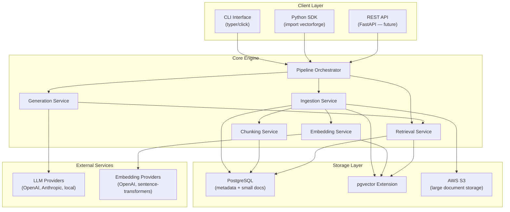

---

## 3. Data Flow — Ingestion Pipeline

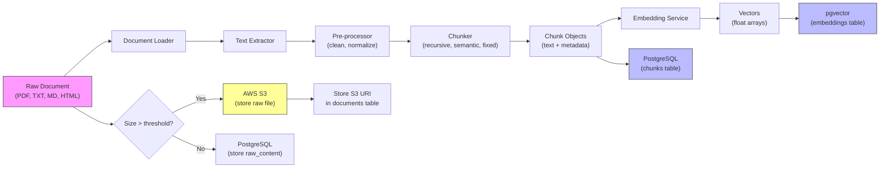

### Ingestion Activity Flow

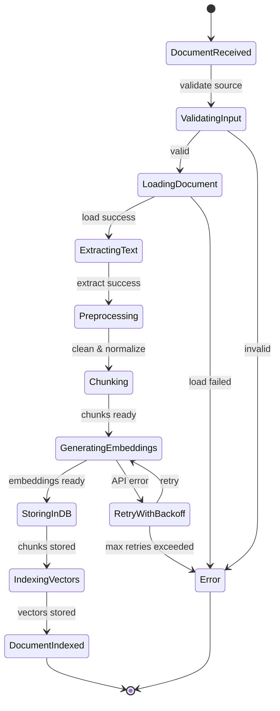

---

## 4. Data Flow — Query Pipeline

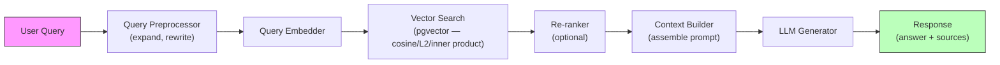

### Query Activity Flow

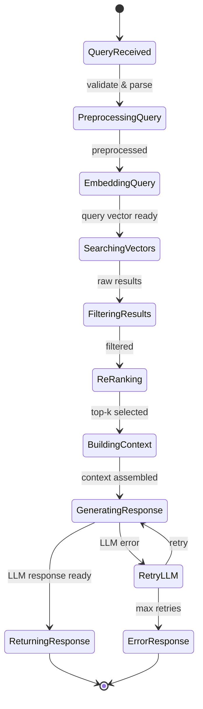

---

## 5. UML Class Diagram — Core Domain Model

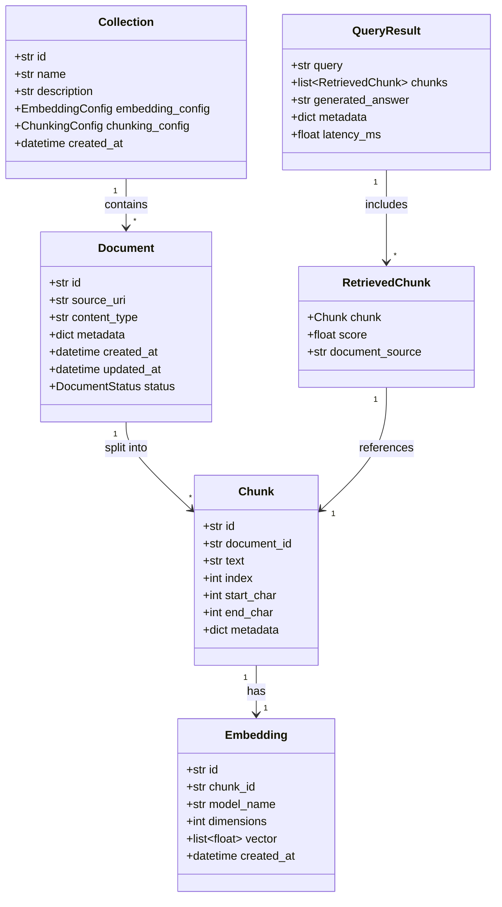

---

## 6. UML Class Diagram — Service Layer (Interfaces)

```mermaid
classDiagram
    class BaseChunker {
        <<abstract>>
        +chunk(text: str, config: ChunkingConfig) list~Chunk~
        +strategy_name() str
    }

    class RecursiveChunker {
        -_splitter: RecursiveCharacterTextSplitter
        +chunk(text: str, config: ChunkingConfig) list~Chunk~
    }

    class TokenChunker {
        -_splitter: TokenTextSplitter
        +chunk(text: str, config: ChunkingConfig) list~Chunk~
    }

    class SemanticChunker {
        -_splitter: SemanticChunker
        +chunk(text: str, config: ChunkingConfig) list~Chunk~
    }

    class MarkdownChunker {
        -_splitter: MarkdownHeaderTextSplitter
        +chunk(text: str, config: ChunkingConfig) list~Chunk~
    }

    class HTMLChunker {
        -_splitter: HTMLHeaderTextSplitter
        +chunk(text: str, config: ChunkingConfig) list~Chunk~
    }

    class ChunkerRegistry {
        -_chunkers: dict~str, BaseChunker~
        -_default: str
        +get(strategy: str) BaseChunker
        +get_default() BaseChunker
        +register(chunker: BaseChunker) None
    }

    BaseChunker <|-- RecursiveChunker
    BaseChunker <|-- TokenChunker
    BaseChunker <|-- SemanticChunker
    BaseChunker <|-- MarkdownChunker
    BaseChunker <|-- HTMLChunker
    ChunkerRegistry o-- BaseChunker : manages

    class BaseEmbeddingProvider {
        <<abstract>>
        +provider_name() str
        +embed(texts: list~str~) list~list~float~~
        +embed_query(query: str) list~float~
        +dimensions() int
        +model_name() str
        +validate_credentials() bool
    }

    class VoyageEmbeddingProvider {
        -_client: AsyncClient
        -_api_key: str
        +embed(texts: list~str~) list~list~float~~
        +embed_query(query: str) list~float~
        +dimensions() int
    }

    class CohereEmbeddingProvider {
        -_client: AsyncClient
        -_api_key: str
        +embed(texts: list~str~) list~list~float~~
        +embed_query(query: str) list~float~
        +dimensions() int
    }

    class OpenAIEmbeddingProvider {
        -_client: AsyncOpenAI
        +embed(texts: list~str~) list~list~float~~
        +embed_query(query: str) list~float~
        +dimensions() int
    }

    class SentenceTransformerProvider {
        -_model: SentenceTransformer
        +embed(texts: list~str~) list~list~float~~
        +embed_query(query: str) list~float~
        +dimensions() int
    }

    class OllamaEmbeddingProvider {
        -_base_url: str
        +embed(texts: list~str~) list~list~float~~
        +embed_query(query: str) list~float~
        +dimensions() int
    }

    class EmbeddingProviderRegistry {
        -_providers: dict~str, BaseEmbeddingProvider~
        -_default_provider: str
        +register(provider: BaseEmbeddingProvider) None
        +get(name: str) BaseEmbeddingProvider
        +get_default() BaseEmbeddingProvider
        +set_default(name: str) None
        +list_providers() list~str~
        +auto_discover() None
    }

    BaseEmbeddingProvider <|-- VoyageEmbeddingProvider
    BaseEmbeddingProvider <|-- CohereEmbeddingProvider
    BaseEmbeddingProvider <|-- OpenAIEmbeddingProvider
    BaseEmbeddingProvider <|-- SentenceTransformerProvider
    BaseEmbeddingProvider <|-- OllamaEmbeddingProvider
    EmbeddingProviderRegistry o-- BaseEmbeddingProvider : manages

    class DistanceMetric {
        <<enumeration>>
        COSINE
        L2
        INNER_PRODUCT
    }

    class BaseVectorStore {
        <<abstract>>
        +upsert(ids, chunks, embeddings) None
        +search(query_vector, top_k, filters, metric) list~RetrievedChunk~
        +delete(ids) None
    }

    class PgVectorStore {
        +upsert(ids, chunks, embeddings) None
        +search(query_vector, top_k, filters, metric) list~RetrievedChunk~
        +delete(ids) None
        -_build_filter_clause(filters) SQLAlchemy clause
        -_get_distance_op(metric: DistanceMetric) operator
        -_create_index(metric: DistanceMetric) None
    }

    BaseVectorStore <|-- PgVectorStore
    PgVectorStore --> DistanceMetric : uses

    class BaseLLMProvider {
        <<abstract>>
        +provider_name() str
        +generate(prompt: str, context: str, config: LLMRequestConfig) LLMResponse
        +generate_stream(prompt: str, context: str, config: LLMRequestConfig) AsyncIterator~str~
        +validate_credentials() bool
        +list_models() list~str~
    }

    class OpenAIProvider {
        -_client: AsyncOpenAI
        +provider_name() str
        +generate(...) LLMResponse
        +generate_stream(...) AsyncIterator~str~
        +validate_credentials() bool
        +list_models() list~str~
    }

    class AnthropicProvider {
        -_client: AsyncAnthropic
        +provider_name() str
        +generate(...) LLMResponse
        +generate_stream(...) AsyncIterator~str~
        +validate_credentials() bool
        +list_models() list~str~
    }

    class OllamaProvider {
        -_base_url: str
        +provider_name() str
        +generate(...) LLMResponse
        +generate_stream(...) AsyncIterator~str~
        +validate_credentials() bool
        +list_models() list~str~
    }

    class LLMProviderRegistry {
        -_providers: dict~str, BaseLLMProvider~
        -_default_provider: str
        +register(provider: BaseLLMProvider) None
        +get(name: str) BaseLLMProvider
        +get_default() BaseLLMProvider
        +set_default(name: str) None
        +list_providers() list~str~
        +auto_discover() None
    }

    BaseLLMProvider <|-- OpenAIProvider
    BaseLLMProvider <|-- AnthropicProvider
    BaseLLMProvider <|-- OllamaProvider
    LLMProviderRegistry o-- BaseLLMProvider : manages

    class BaseDocumentLoader {
        <<abstract>>
        +load(source: str) Document
        +supports(source: str) bool
    }

    class PDFLoader {
        +load(source: str) Document
        +supports(source: str) bool
    }

    class TextLoader {
        +load(source: str) Document
        +supports(source: str) bool
    }

    class MarkdownLoader {
        +load(source: str) Document
        +supports(source: str) bool
    }

    BaseDocumentLoader <|-- PDFLoader
    BaseDocumentLoader <|-- TextLoader
    BaseDocumentLoader <|-- MarkdownLoader
```

---

## 6b. Provider Pattern — LLM & Embedding Architecture (Detailed)

### How It Works

The Provider Pattern uses a **Registry** that auto-discovers available providers based on which ENV credentials are set. Users select which provider to use via config or per-request.

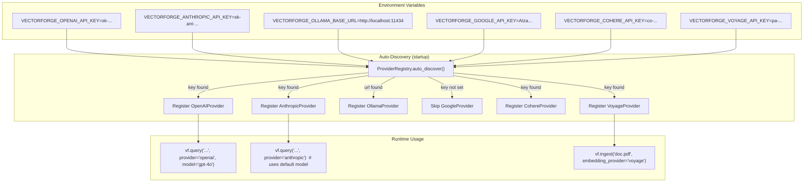

### ENV Variable Convention

All credentials follow a strict naming pattern:

```bash
# ═══════════════════════════════════════════════════════
# LLM Provider Credentials
# ═══════════════════════════════════════════════════════

# OpenAI (LLM + Embeddings)
VECTORFORGE_OPENAI_API_KEY=sk-...
VECTORFORGE_OPENAI_BASE_URL=https://api.openai.com/v1     # optional, for proxies/Azure
VECTORFORGE_OPENAI_ORG_ID=org-...                          # optional

# Anthropic (LLM only)
VECTORFORGE_ANTHROPIC_API_KEY=sk-ant-...
VECTORFORGE_ANTHROPIC_BASE_URL=                             # optional

# Ollama (LLM + Embeddings, local)
VECTORFORGE_OLLAMA_BASE_URL=http://localhost:11434          # no API key needed

# Google Gemini (LLM + Embeddings)
VECTORFORGE_GOOGLE_API_KEY=AIza...

# Cohere (LLM + Embeddings + Reranking)
VECTORFORGE_COHERE_API_KEY=co-...

# Voyage AI (Embeddings + Reranking)
VECTORFORGE_VOYAGE_API_KEY=pa-...
VECTORFORGE_VOYAGE_BASE_URL=https://api.voyageai.com/v1    # optional

# ═══════════════════════════════════════════════════════
# Default Selection
# ═══════════════════════════════════════════════════════

VECTORFORGE_DEFAULT_LLM_PROVIDER=openai                    # which provider to use by default
VECTORFORGE_DEFAULT_LLM_MODEL=gpt-4o                       # which model to use by default
VECTORFORGE_DEFAULT_EMBEDDING_PROVIDER=voyage               # Voyage AI as default embedding
VECTORFORGE_DEFAULT_EMBEDDING_MODEL=voyage-3                # Voyage 3 as default model

# ═══════════════════════════════════════════════════════
# S3 Storage (for large documents)
# ═══════════════════════════════════════════════════════

VECTORFORGE_S3_BUCKET=vectorforge-documents
VECTORFORGE_S3_REGION=us-east-1
VECTORFORGE_S3_ACCESS_KEY=AKIA...                          # optional if using IAM roles
VECTORFORGE_S3_SECRET_KEY=...                               # optional if using IAM roles
VECTORFORGE_S3_ENDPOINT_URL=                                # optional, for MinIO / LocalStack
VECTORFORGE_STORAGE_THRESHOLD_MB=10                         # docs > 10 MB go to S3 (default)

# ═══════════════════════════════════════════════════════
# Database
# ═══════════════════════════════════════════════════════

VECTORFORGE_DB_HOST=localhost
VECTORFORGE_DB_PORT=5432
VECTORFORGE_DB_NAME=vectorforge
VECTORFORGE_DB_USER=vectorforge
VECTORFORGE_DB_PASSWORD=secret
```

### Provider Registration Flow

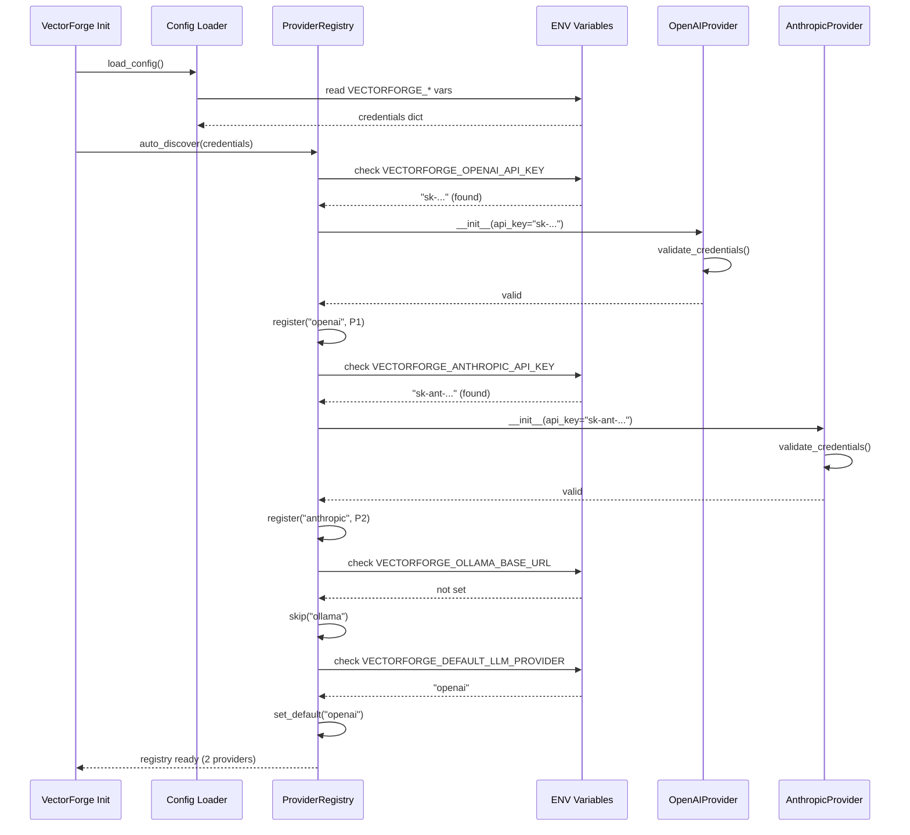

### Per-Request Provider Override

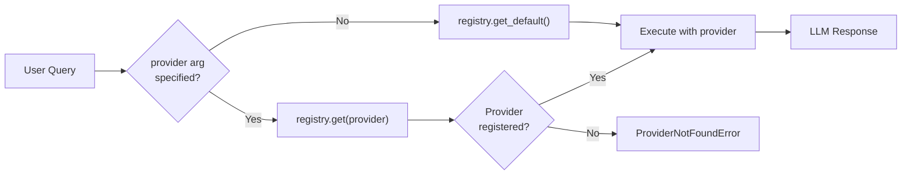

### UML — Full Provider Class Hierarchy

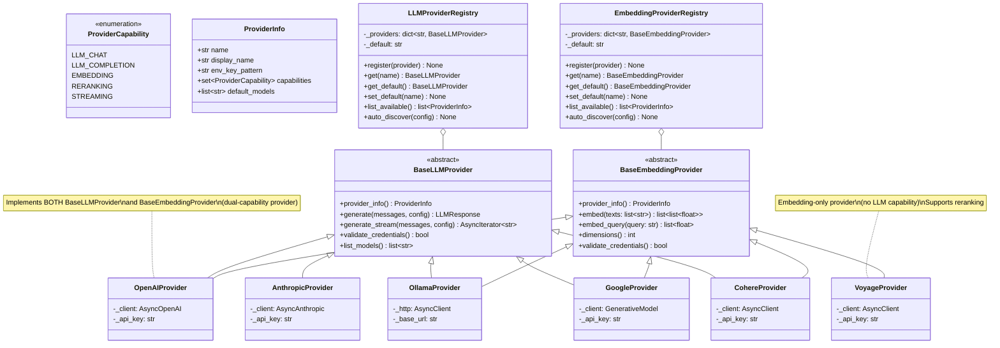

### Provider Capability Matrix

| Provider | LLM Chat | Embeddings | Streaming | Reranking | Auth Method |
|----------|----------|-----------|-----------|-----------|-------------|
| **OpenAI** | Yes | Yes | Yes | No | API Key |
| **Anthropic** | Yes | No | Yes | No | API Key |
| **Ollama** | Yes | Yes | Yes | No | None (local) |
| **Google Gemini** | Yes | Yes | Yes | No | API Key |
| **Cohere** | Yes | Yes | Yes | Yes | API Key |
| **Voyage AI** | No | Yes | No | Yes | API Key |
| *(Custom)* | *(extend BaseLLMProvider)* | *(extend BaseEmbeddingProvider)* | | | |

### Adding a New Provider (Developer Guide)

To add a new provider, a developer:

1. Creates a new file `vectorforge/llm/providers/my_provider.py`
2. Implements `BaseLLMProvider` and/or `BaseEmbeddingProvider`
3. Defines the ENV key pattern in `provider_info()`
4. Registers it in the provider manifest

```python
# vectorforge/llm/providers/my_provider.py

class MyProvider(BaseLLMProvider):
    \"\"\"Custom LLM provider implementation.\"\"\"

    def provider_info(self) -> ProviderInfo:
        return ProviderInfo(
            name="my_provider",
            display_name="My Provider",
            env_key_pattern="VECTORFORGE_MYPROVIDER_API_KEY",
            capabilities={ProviderCapability.LLM_CHAT, ProviderCapability.STREAMING},
            default_models=["my-model-v1"],
        )

    async def generate(self, messages, config) -> LLMResponse:
        # Implementation here
        ...

    async def validate_credentials(self) -> bool:
        # Check if API key works
        ...
```

### Module Structure for Providers

```
vectorforge/
├── llm/
│   ├── __init__.py
│   ├── base.py                    # BaseLLMProvider ABC
│   ├── registry.py                # LLMProviderRegistry
│   ├── types.py                   # LLMResponse, LLMRequestConfig, ProviderInfo
│   └── providers/
│       ├── __init__.py            # Provider manifest & auto-discovery
│       ├── openai.py              # OpenAI chat completions
│       ├── anthropic.py           # Anthropic Claude
│       ├── ollama.py              # Ollama (local)
│       ├── google.py              # Google Gemini
│       └── cohere.py              # Cohere
│
├── embedding/
│   ├── __init__.py
│   ├── base.py                    # BaseEmbeddingProvider ABC
│   ├── registry.py                # EmbeddingProviderRegistry
│   └── providers/
│       ├── __init__.py
│       ├── openai.py              # OpenAI embeddings
│       ├── voyage.py              # Voyage AI embeddings (default)
│       ├── cohere.py              # Cohere embeddings
│       ├── ollama.py              # Ollama embeddings
│       ├── google.py              # Google embeddings
│       └── sentence_transformer.py # Local sentence-transformers
```

### SDK Usage Examples

```python
from vectorforge import VectorForge

# Initialize — auto-discovers providers from ENV vars
vf = VectorForge()

# Use default provider (VECTORFORGE_DEFAULT_LLM_PROVIDER)
result = await vf.query("What is RAG?")

# Override provider per-request
result = await vf.query("What is RAG?", provider="anthropic", model="claude-sonnet-4-20250514")

# Override with a local model
result = await vf.query("What is RAG?", provider="ollama", model="llama3.2")

# List available providers
providers = vf.list_providers()
# >>> [ProviderInfo(name='openai', ...), ProviderInfo(name='anthropic', ...)]

# Ingest with specific embedding provider
await vf.ingest("doc.pdf", embedding_provider="openai", embedding_model="text-embedding-3-large")
```

---

## 6c. Hybrid Document Storage — PG + S3

Documents are stored using a **hybrid approach** based on file size:

- **Small / medium documents** (≤ threshold): raw content stored directly in the PostgreSQL `documents.raw_content` column.
- **Large documents** (> threshold): raw file uploaded to **AWS S3**; only the S3 key is stored in PG (`documents.s3_key`), and `raw_content` is set to `NULL`.

The threshold is configurable via `VECTORFORGE_STORAGE_THRESHOLD_MB` (default: **10 MB**).

### Storage Decision Flow

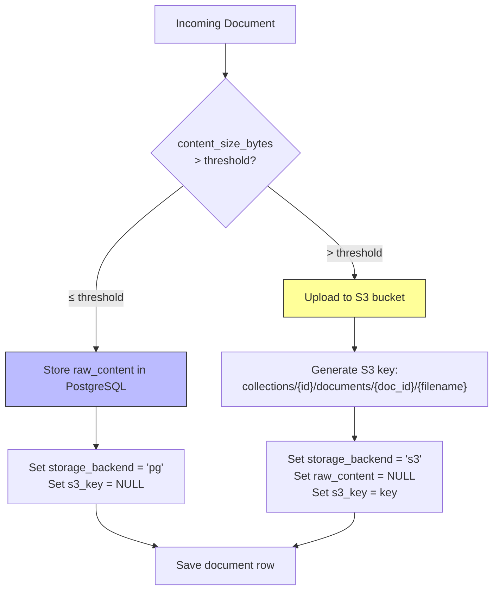

### Storage Backend Interface

```python
class BaseStorageBackend(ABC):
    """Abstract base for document content storage."""

    @abstractmethod
    async def store(self, document_id: UUID, content: bytes, metadata: dict) -> str:
        """Store content, return storage reference (PG row ID or S3 key)."""
        ...

    @abstractmethod
    async def retrieve(self, reference: str) -> bytes:
        """Retrieve content by storage reference."""
        ...

    @abstractmethod
    async def delete(self, reference: str) -> None:
        """Delete content by storage reference."""
        ...


class PostgresStorageBackend(BaseStorageBackend):
    """Stores document content directly in the documents table."""
    ...


class S3StorageBackend(BaseStorageBackend):
    """Stores document content in AWS S3 (or S3-compatible like MinIO)."""

    def __init__(self, bucket: str, region: str, endpoint_url: str | None = None):
        ...
```

### S3 Key Convention

```
s3://{bucket}/collections/{collection_id}/documents/{document_id}/{original_filename}
```

### Storage Retrieval Flow

When loading a document's raw content for re-chunking or export:

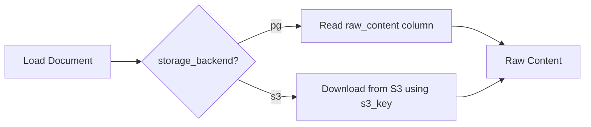

> **Note:** Chunks and embeddings are **always** stored in PostgreSQL / pgvector regardless of where the raw document lives. S3 is only for raw file preservation.

---

## 6d. Chunking Architecture — LangChain Text Splitters

VectorForge uses **LangChain's text splitters** (`langchain-text-splitters` package) as the chunking engine. Our `BaseChunker` ABC wraps each LangChain splitter, adding metadata tracking (chunk index, start/end char offsets) and Pydantic config integration.

### Why LangChain Text Splitters?

- Battle-tested in production across thousands of RAG systems
- Rich set of strategies out of the box (recursive, token, semantic, format-aware)
- Active maintenance and community
- We wrap — not inherit — so we can swap the underlying engine later if needed

### Chunking Strategy Comparison

| Strategy | LangChain Class | How It Works | Best For | Chunk Quality | Speed | Overlap Support |
|----------|----------------|-------------|----------|---------------|-------|-----------------|
| **Recursive Character** | `RecursiveCharacterTextSplitter` | Splits by hierarchy of separators (`\n\n` → `\n` → `. ` → ` `). Tries the largest separator first, falls back to smaller ones to hit target size. | **General-purpose** — prose, articles, generic text. Best default. | High — respects natural boundaries | Fast | Yes |
| **Token-based** | `TokenTextSplitter` | Splits based on token count (using `tiktoken` or model tokenizer). Ensures each chunk fits within a model's context window. | **LLM-constrained** — when you need exact token budgets per chunk. | Medium — may cut mid-sentence | Fast | Yes |
| **Semantic** | `SemanticChunker` | Embeds each sentence, groups consecutive sentences with high cosine similarity. Splits where similarity drops. | **Research, analytical docs** — content with distinct topic shifts. | Highest — topic-coherent chunks | Slow (requires embedding calls) | No |
| **Markdown Header** | `MarkdownHeaderTextSplitter` | Splits on Markdown headers (`#`, `##`, `###`). Preserves document structure. Each chunk = one section. | **Markdown docs** — READMEs, wikis, docs sites. | High — structure-aware | Fast | No |
| **HTML Header** | `HTMLHeaderTextSplitter` | Splits on HTML heading tags (`<h1>` – `<h6>`). Strips tags, preserves hierarchy. | **HTML content** — web pages, scraped content. | High — structure-aware | Fast | No |

### How the Chunker Registry Works

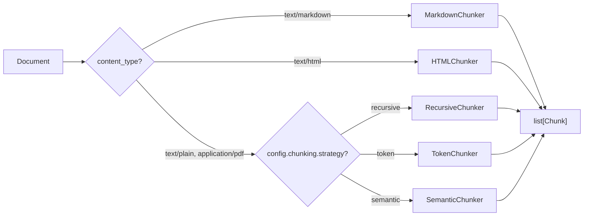

### Chunking Config Parameters

```python
class ChunkingConfig(BaseModel):
    """Chunking configuration — passed to BaseChunker implementations."""

    strategy: Literal["recursive", "token", "semantic"] = "recursive"
    chunk_size: int = 1000           # target chunk size (characters or tokens)
    chunk_overlap: int = 200         # overlap between consecutive chunks
    separators: list[str] | None = None  # custom separators (recursive only)
    model_name: str | None = None    # tokenizer model (token strategy only)

    # Semantic chunking params
    embedding_provider: str | None = None  # for semantic chunking
    breakpoint_threshold: float = 0.5      # similarity drop threshold
```

### Wrapper Pattern (How We Wrap LangChain)

```python
from langchain_text_splitters import RecursiveCharacterTextSplitter

class RecursiveChunker(BaseChunker):
    """Wraps LangChain's RecursiveCharacterTextSplitter."""

    def strategy_name(self) -> str:
        return "recursive"

    async def chunk(self, text: str, config: ChunkingConfig) -> list[Chunk]:
        splitter = RecursiveCharacterTextSplitter(
            chunk_size=config.chunk_size,
            chunk_overlap=config.chunk_overlap,
            separators=config.separators or ["\n\n", "\n", ". ", " ", ""],
        )
        lc_docs = splitter.create_documents([text])

        return [
            Chunk(
                id=generate_id(),
                text=doc.page_content,
                index=i,
                start_char=doc.metadata.get("start_index", 0),
                end_char=doc.metadata.get("start_index", 0) + len(doc.page_content),
                metadata=doc.metadata,
            )
            for i, doc in enumerate(lc_docs)
        ]
```

> **Dependency**: `langchain-text-splitters` (lightweight — no full LangChain install needed). For semantic chunking, also requires an embedding provider.

---

## 6e. Distance Metrics Architecture — Three Engines

VectorForge supports **three distance metrics** for vector similarity search. The metric is configurable **per collection**, so different collections can use different metrics depending on their embedding model's characteristics.

### The Three Metrics

| Metric | pgvector Operator | Index Type | Formula | Range | Best When |
|--------|------------------|------------|---------|-------|-----------|
| **Cosine Similarity** | `<=>` (cosine distance) | `ivfflat` / `hnsw` with `vector_cosine_ops` | $1 - \frac{\vec{a} \cdot \vec{b}}{\|\vec{a}\| \|\vec{b}\|}$ | 0 (identical) → 2 (opposite) | Embeddings are **not** normalized. Most common default. Works with OpenAI, Voyage, Cohere. |
| **Euclidean Distance (L2)** | `<->` (L2 distance) | `ivfflat` / `hnsw` with `vector_l2_ops` | $\sqrt{\sum_{i=1}^{n}(a_i - b_i)^2}$ | 0 (identical) → ∞ | When **magnitude matters** — e.g., comparing raw features, not just direction. Squared Euclidean is computed internally by pgvector for index performance. |
| **Inner Product (MIP)** | `<#>` (negative inner product) | `ivfflat` / `hnsw` with `vector_ip_ops` | $-(\vec{a} \cdot \vec{b})$ | -∞ → ∞ (lower = more similar) | Embeddings are **pre-normalized** (unit vectors). Fastest computation. Use with models that output normalized vectors. |

> **Note on pgvector**: pgvector returns *distance* (lower = more similar) for all three operators. For inner product, it negates the dot product so that ORDER BY ASC works consistently. VectorForge converts these to *similarity scores* for the user.

### How Metric Selection Works

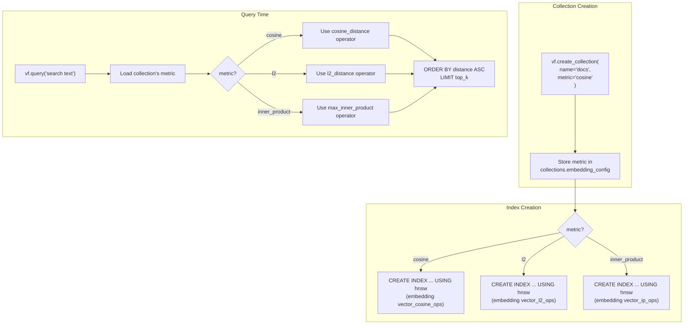

### pgvector Implementation Detail

```python
from pgvector.sqlalchemy import Vector
from sqlalchemy import Index

class DistanceMetric(str, Enum):
    """Supported distance metrics for vector search."""
    COSINE = "cosine"
    L2 = "l2"
    INNER_PRODUCT = "inner_product"


# Operator mapping for pgvector
METRIC_TO_OPERATOR = {
    DistanceMetric.COSINE: "cosine_distance",         # <=>
    DistanceMetric.L2: "l2_distance",                  # <->
    DistanceMetric.INNER_PRODUCT: "max_inner_product", # <#>
}

# Index ops mapping
METRIC_TO_INDEX_OPS = {
    DistanceMetric.COSINE: "vector_cosine_ops",
    DistanceMetric.L2: "vector_l2_ops",
    DistanceMetric.INNER_PRODUCT: "vector_ip_ops",
}
```

### Score Normalization

VectorForge normalizes all raw distances to a **0.0 – 1.0 similarity score** so users don't need to think about operator internals:

| Metric | Raw from pgvector | Conversion to Similarity |
|--------|-------------------|--------------------------|
| Cosine | 0 → 2 | `similarity = 1 - distance` |
| L2 | 0 → ∞ | `similarity = 1 / (1 + distance)` |
| Inner Product | -∞ → ∞ (negated) | `similarity = -distance` (then clamp 0–1 for normalized vectors) |

### Which Metric to Use? (Quick Guide)

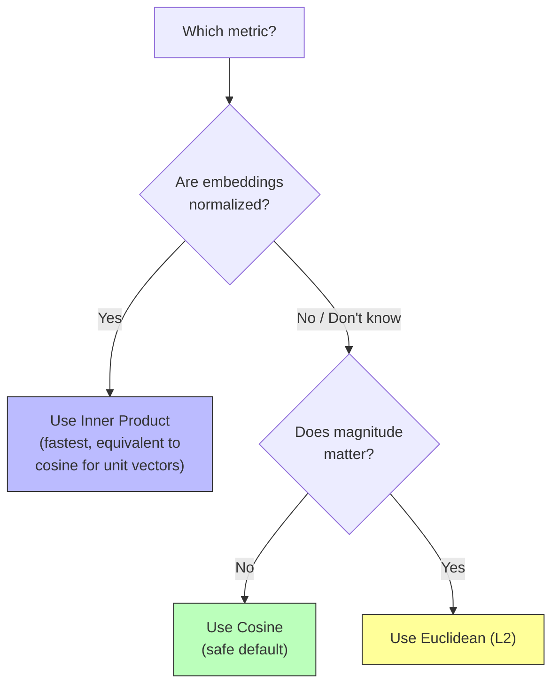

> **Default**: Cosine similarity — it works correctly regardless of whether vectors are normalized and is the most widely used metric in RAG systems.

---

## 7. UML Class Diagram — Configuration Models (Pydantic)

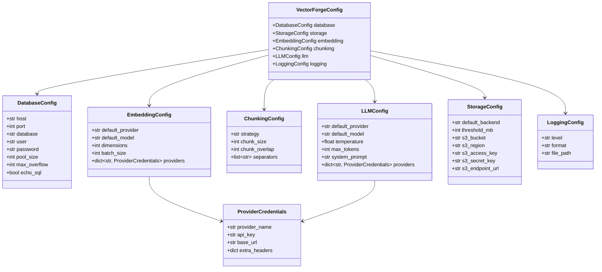

---

## 8. Database Schema (PostgreSQL + pgvector)

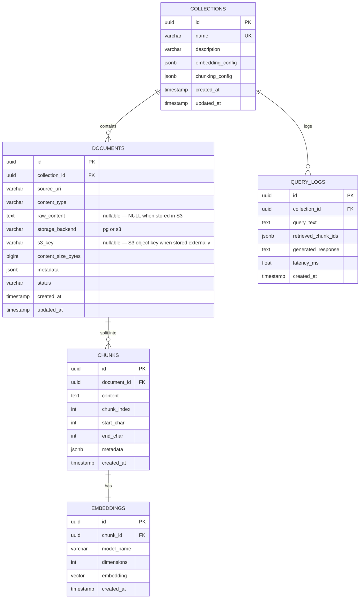

---

## 9. Module / Package Structure (Proposed)

```
vectorforge/
├── __init__.py                    # Public API re-exports
├── __main__.py                    # CLI entry point
│
├── config/                        # Configuration management
│   ├── __init__.py
│   ├── settings.py                # Pydantic settings models
│   └── defaults.py                # Default values & constants
│
├── models/                        # Domain models
│   ├── __init__.py
│   ├── domain.py                  # Pydantic domain models (Document, Chunk, etc.)
│   └── db.py                      # SQLAlchemy ORM models
│
├── db/                            # Database layer
│   ├── __init__.py
│   ├── engine.py                  # Async engine & session factory
│   ├── migrations/                # Alembic migrations
│   └── repositories/              # Repository pattern implementations
│       ├── __init__.py
│       ├── base.py                # Base repository ABC
│       ├── document_repo.py
│       ├── chunk_repo.py
│       ├── embedding_repo.py
│       └── collection_repo.py
│
├── ingestion/                     # Document ingestion pipeline
│   ├── __init__.py
│   ├── service.py                 # Ingestion orchestrator
│   └── loaders/                   # Document loaders
│       ├── __init__.py
│       ├── base.py                # BaseDocumentLoader ABC
│       ├── text_loader.py
│       ├── pdf_loader.py
│       ├── markdown_loader.py
│       └── html_loader.py
│
├── chunking/                      # Text chunking (LangChain-powered)
│   ├── __init__.py
│   ├── base.py                    # BaseChunker ABC (wraps LangChain splitters)
│   ├── recursive.py               # RecursiveCharacterTextSplitter wrapper
│   ├── token.py                   # TokenTextSplitter wrapper
│   ├── semantic.py                # SemanticChunker wrapper
│   ├── markdown.py                # MarkdownHeaderTextSplitter wrapper
│   ├── html.py                    # HTMLHeaderTextSplitter wrapper
│   └── registry.py                # ChunkerRegistry — strategy selection
│
├── embedding/                     # Embedding generation
│   ├── __init__.py
│   ├── base.py                    # BaseEmbedder ABC
│   ├── voyage.py                  # Voyage AI embeddings (default)
│   ├── cohere.py                  # Cohere embeddings
│   ├── openai.py                  # OpenAI embeddings
│   └── sentence_transformer.py    # Local sentence-transformers
│
├── storage/                       # Document storage backends
│   ├── __init__.py
│   ├── base.py                    # BaseStorageBackend ABC
│   ├── postgres.py                # PG raw_content storage (default)
│   └── s3.py                      # AWS S3 storage (large docs)
│
├── vectorstore/                   # Vector storage & search
│   ├── __init__.py
│   ├── base.py                    # BaseVectorStore ABC
│   └── pgvector.py                # pgvector implementation
│
├── retriever/                     # Retrieval strategies
│   ├── __init__.py
│   ├── base.py                    # BaseRetriever ABC
│   ├── dense.py                   # Dense vector retrieval
│   ├── hybrid.py                  # Hybrid search (vector + keyword)
│   └── reranker.py                # Re-ranking logic
│
├── llm/                           # LLM provider integrations
│   ├── __init__.py
│   ├── base.py                    # BaseLLM ABC
│   ├── openai.py                  # OpenAI chat completions
│   └── anthropic.py               # Anthropic Claude
│
├── pipeline/                      # RAG pipeline orchestration
│   ├── __init__.py
│   ├── rag.py                     # Main RAG pipeline
│   ├── query.py                   # Query preprocessing
│   └── context.py                 # Context assembly
│
├── api/                           # REST API (future)
│   ├── __init__.py
│   ├── app.py                     # FastAPI application
│   ├── routes/
│   └── middleware/
│
└── utils/                         # Shared utilities
    ├── __init__.py
    ├── hashing.py                 # Content hashing for dedup
    ├── text.py                    # Text normalization helpers
    └── retry.py                   # Retry with backoff

tests/
├── conftest.py                    # Shared fixtures
├── unit/
│   ├── test_chunking.py
│   ├── test_embedding.py
│   ├── test_retriever.py
│   └── test_pipeline.py
├── integration/
│   ├── test_pgvector.py
│   ├── test_ingestion.py
│   └── test_rag_pipeline.py
└── fixtures/
    ├── sample_documents/
    └── mock_embeddings.py
```

---

## 10. Proposed Development Phases

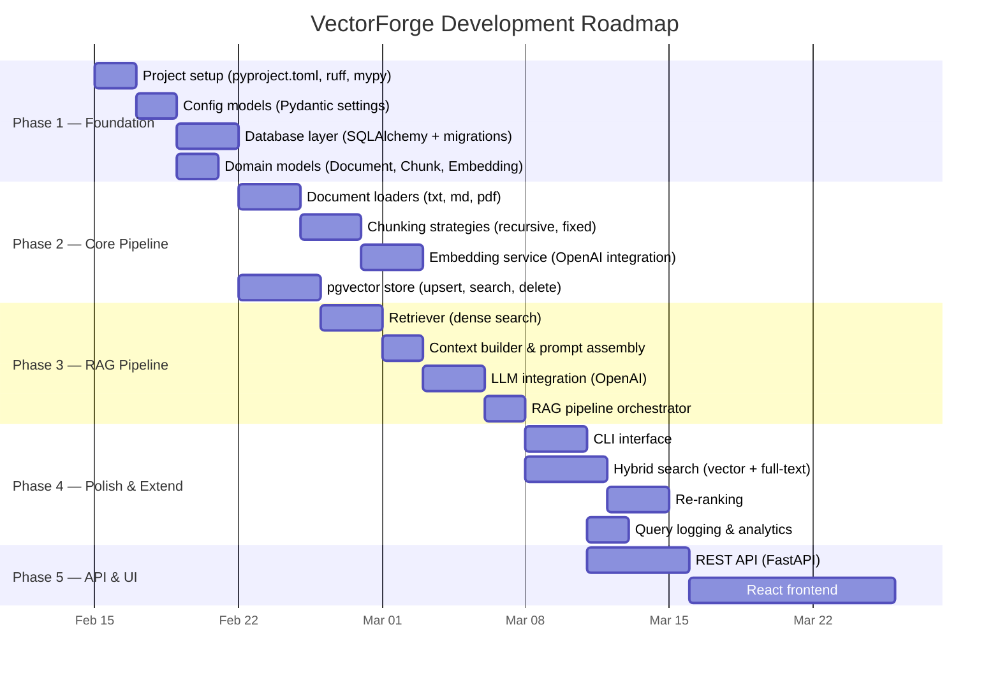

---

## 11. Key Design Decisions (To Be Discussed)

| # | Decision | Options | Current Lean | Status |
|---|----------|---------|-------------|--------|
| 1 | Async vs Sync API | Async-first / Sync-first / Both | Async-first | **DECIDED** |
| 2 | Collection concept | Flat / Collections (namespaced) | Collections | **DECIDED** |
| 3 | Embedding providers (initial) | OpenAI / Voyage / Cohere / local | **Voyage AI + Cohere** (2 providers) | **DECIDED** |
| 4 | Chunking approach | Custom / LangChain text splitters | **LangChain text splitters** (see §6d) | **DECIDED** |
| 5 | Distance metrics | Cosine / L2 / Inner product | **All three** — selectable per collection | **DECIDED** |
| 6 | SDK-first or API-first | Build Python SDK first / FastAPI first | SDK-first | **DECIDED** |
| 7 | Document storage | Store in PG / External files / Both | **PG default + S3 for large docs** | **DECIDED** |
| 8 | Multi-tenancy | Single-tenant / Multi-tenant with isolation | **Single-tenant** (add later if needed) | **DECIDED** |
| 9 | Configuration format | YAML file / ENV vars / Both | **ENV vars + .env file only** (pydantic-settings) | **DECIDED** |
| 10 | Migration tool | Alembic / Raw SQL scripts | **Alembic** | **DECIDED** |
| 11 | LLM architecture | Single provider / Provider registry pattern | Provider registry | **DECIDED** |
| 12 | Doc formats (initial) | txt+md / txt+md+pdf / txt+md+pdf+html | txt+md+pdf+html | **DECIDED** |

---

## 12. Non-Functional Requirements (Draft)

| Requirement | Target | Notes |
|-------------|--------|-------|
| Query latency (p95) | < 500ms | For top-10 retrieval + generation |
| Ingestion throughput | 100+ docs/min | Batch ingestion |
| Max document size | 50 MB | Configurable |
| Max chunk size | 8192 tokens | Model-dependent |
| Connection pool | 10-20 connections | Configurable |
| Embedding batch size | 100 texts/batch | Provider-dependent |
| Test coverage | > 80% | Unit + integration |

---

> **This is a DRAFT.** All sections are open for discussion. See blocking questions below.
