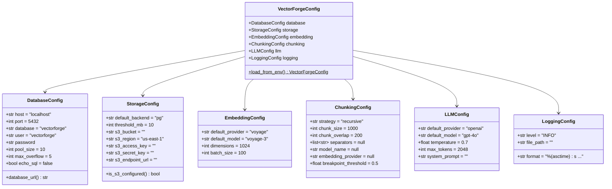

# Phase 1 — Foundation

> **Goal**: Establish project skeleton, configuration system, database layer, and domain models.
> **Estimated Duration**: ~9 days
> **Dependencies**: None (first phase)

---

## Phase Timeline


---

## Stage 1A — Project Setup

### What Gets Built

The project skeleton: `pyproject.toml`, tooling configuration, and the full directory structure with empty `__init__.py` files.

### Directory Structure Created

```
VectorForge/
├── pyproject.toml
├── README.md
├── LICENSE
├── .gitignore
├── .env.example
├── .pre-commit-config.yaml
│
├── vectorforge/
│   ├── __init__.py
│   ├── __main__.py
│   ├── config/
│   │   ├── __init__.py
│   │   ├── settings.py
│   │   └── defaults.py
│   ├── models/
│   │   ├── __init__.py
│   │   ├── domain.py
│   │   └── db.py
│   ├── db/
│   │   ├── __init__.py
│   │   ├── engine.py
│   │   ├── migrations/
│   │   └── repositories/
│   │       ├── __init__.py
│   │       ├── base.py
│   │       ├── collection_repo.py
│   │       ├── document_repo.py
│   │       ├── chunk_repo.py
│   │       └── embedding_repo.py
│   ├── ingestion/
│   │   ├── __init__.py
│   │   ├── service.py
│   │   └── loaders/
│   │       ├── __init__.py
│   │       ├── base.py
│   │       ├── text_loader.py
│   │       ├── pdf_loader.py
│   │       ├── markdown_loader.py
│   │       └── html_loader.py
│   ├── chunking/
│   │   ├── __init__.py
│   │   ├── base.py
│   │   ├── recursive.py
│   │   ├── token.py
│   │   ├── semantic.py
│   │   ├── markdown.py
│   │   ├── html.py
│   │   └── registry.py
│   ├── embedding/
│   │   ├── __init__.py
│   │   ├── base.py
│   │   ├── registry.py
│   │   └── providers/
│   │       ├── __init__.py
│   │       ├── voyage.py
│   │       ├── cohere.py
│   │       ├── openai.py
│   │       ├── ollama.py
│   │       ├── google.py
│   │       └── sentence_transformer.py
│   ├── storage/
│   │   ├── __init__.py
│   │   ├── base.py
│   │   ├── postgres.py
│   │   └── s3.py
│   ├── vectorstore/
│   │   ├── __init__.py
│   │   ├── base.py
│   │   └── pgvector.py
│   ├── retriever/
│   │   ├── __init__.py
│   │   ├── base.py
│   │   ├── dense.py
│   │   ├── hybrid.py
│   │   └── reranker.py
│   ├── llm/
│   │   ├── __init__.py
│   │   ├── base.py
│   │   ├── registry.py
│   │   ├── types.py
│   │   └── providers/
│   │       ├── __init__.py
│   │       ├── openai.py
│   │       ├── anthropic.py
│   │       ├── ollama.py
│   │       ├── google.py
│   │       └── cohere.py
│   ├── pipeline/
│   │   ├── __init__.py
│   │   ├── rag.py
│   │   ├── query.py
│   │   └── context.py
│   ├── api/
│   │   ├── __init__.py
│   │   ├── app.py
│   │   ├── routes/
│   │   └── middleware/
│   └── utils/
│       ├── __init__.py
│       ├── hashing.py
│       ├── text.py
│       └── retry.py
│
├── tests/
│   ├── conftest.py
│   ├── unit/
│   │   ├── __init__.py
│   │   ├── test_config.py
│   │   ├── test_models.py
│   │   ├── test_chunking.py
│   │   ├── test_embedding.py
│   │   ├── test_retriever.py
│   │   └── test_pipeline.py
│   ├── integration/
│   │   ├── __init__.py
│   │   ├── test_pgvector.py
│   │   ├── test_ingestion.py
│   │   └── test_rag_pipeline.py
│   └── fixtures/
│       ├── sample_documents/
│       └── mock_embeddings.py
│
├── docs/
│   └── README.md
│
└── planning/
    ├── architecture-plan-v0.1.md
    └── phase-1-foundation.md
```

### pyproject.toml — Dependency Manifest

```
[project]
name = "vectorforge"
version = "0.1.0"
description = "High-performance standalone RAG engine"
requires-python = ">=3.11"
license = {text = "MIT"}

[project.dependencies]
- pydantic >= 2.0
- pydantic-settings >= 2.0
- sqlalchemy[asyncio] >= 2.0
- asyncpg >= 0.29
- pgvector >= 0.3
- alembic >= 1.13
- python-dotenv >= 1.0

[project.optional-dependencies]
dev =
  - pytest >= 8.0
  - pytest-asyncio >= 0.23
  - pytest-cov >= 5.0
  - ruff >= 0.4
  - mypy >= 1.10
  - pre-commit >= 3.7

# Future — add per-phase:
# embedding = [voyageai, cohere, openai, ...]
# llm = [openai, anthropic, ...]
# chunking = [langchain-text-splitters]
# storage = [boto3]
```

### Tooling Config (in pyproject.toml)

```
[tool.ruff]
target-version = "py311"
line-length = 100
select = ["E", "F", "I", "UP", "B", "SIM", "RUF"]

[tool.ruff.format]
quote-style = "double"
indent-style = "space"

[tool.mypy]
python_version = "3.11"
strict = true
warn_return_any = true
warn_unused_configs = true
disallow_untyped_defs = true

[tool.pytest.ini_options]
asyncio_mode = "auto"
testpaths = ["tests"]

[tool.coverage.run]
source = ["vectorforge"]
omit = ["tests/*"]
```

### Algorithm: Project Scaffold Creation

```
ALGORITHM: CreateProjectScaffold

INPUT: directory_tree (from above)
OUTPUT: fully initialized project skeleton

1. FOR EACH directory IN directory_tree:
   a. CREATE directory
   b. CREATE __init__.py inside directory (empty)

2. CREATE pyproject.toml with dependency manifest
3. CREATE .gitignore (Python template + .env, .venv, __pycache__, dist/, *.egg-info)
4. CREATE .env.example with all VECTORFORGE_* env variables (values blanked)
5. CREATE .pre-commit-config.yaml with ruff + mypy hooks

6. VALIDATE:
   a. RUN `pip install -e ".[dev]"` → must succeed
   b. RUN `python -m ruff check .` → must pass (no files to lint yet)
   c. RUN `python -m mypy vectorforge/` → must pass (empty modules)
   d. RUN `python -m pytest` → must pass (0 tests collected)
```

---

## Stage 1B — Configuration Models (Pydantic Settings)

### What Gets Built

All configuration classes using `pydantic-settings`. Every setting has a sensible default. Configuration loads from ENV vars and `.env` files automatically — no YAML, no TOML config files.

### Configuration Architecture



### ENV Variable → Config Field Mapping


### Algorithm: Config Loading

```
ALGORITHM: LoadConfiguration

INPUT: none (reads from environment)
OUTPUT: VectorForgeConfig (fully validated)

1. INITIALIZE pydantic BaseSettings with:
   - env_prefix = "VECTORFORGE_"
   - env_file = ".env"
   - env_file_encoding = "utf-8"
   - case_sensitive = False

2. FOR EACH config section (database, storage, embedding, chunking, llm, logging):
   a. CREATE sub-model with defaults
   b. pydantic-settings automatically:
      - Reads VECTORFORGE_DB_HOST → database.host
      - Reads VECTORFORGE_S3_BUCKET → storage.s3_bucket
      - Reads VECTORFORGE_DEFAULT_LLM_PROVIDER → llm.default_provider
      - Applies type coercion (str → int for ports, str → bool for flags)

3. VALIDATE all fields:
   a. database.port must be 1-65535
   b. storage.threshold_mb must be > 0
   c. chunking.chunk_size must be > chunking.chunk_overlap
   d. llm.temperature must be 0.0-2.0
   e. logging.level must be one of DEBUG, INFO, WARNING, ERROR

4. COMPUTE derived values:
   a. database_url = f"postgresql+asyncpg://{user}:{password}@{host}:{port}/{database}"
   b. is_s3_configured = bool(storage.s3_bucket)

5. IF validation fails:
   RAISE ConfigurationError with clear message listing:
     - Which field failed
     - What value was received
     - What was expected

6. RETURN VectorForgeConfig instance
```

### Algorithm: Minimum Viable Config

```
ALGORITHM: MinimumViableStartup

INPUT: environment variables
OUTPUT: success or ConfigurationError

1. CHECK required variables:
   a. At least ONE embedding provider key must be set
      (VECTORFORGE_VOYAGE_API_KEY or VECTORFORGE_COHERE_API_KEY or ...)
   b. Database connection must be possible
      (VECTORFORGE_DB_HOST + credentials OR VECTORFORGE_DB_URL)

2. OPTIONAL variables fall back to defaults:
   a. No LLM key set → WARN "No LLM provider configured. Query/generation disabled."
   b. No S3 config → INFO "S3 not configured. All docs stored in PostgreSQL."
   c. No chunking config → DEBUG "Using defaults: recursive, size=1000, overlap=200"

3. LOG configuration summary (redacting secrets):
   "VectorForge Config:
    Database: postgresql://***@localhost:5432/vectorforge
    Embedding: voyage (voyage-3, 1024 dims)
    Chunking: recursive (1000 chars, 200 overlap)
    Storage: pg (threshold: 10MB, S3: not configured)
    LLM: openai (gpt-4o)"
```

### Files Produced

| File | Purpose |
|------|---------|
| `vectorforge/config/__init__.py` | Re-exports `VectorForgeConfig`, `load_config()` |
| `vectorforge/config/settings.py` | All Pydantic settings models (VectorForgeConfig, DatabaseConfig, etc.) |
| `vectorforge/config/defaults.py` | Named constants (`DEFAULT_CHUNK_SIZE = 1000`, `DEFAULT_DB_PORT = 5432`, etc.) |

---

## Stage 1C — Database Layer

### What Gets Built

The async SQLAlchemy engine, session factory, Alembic migration infrastructure, and the repository ABC with four concrete repositories.

### Database Layer Architecture


### Session Lifecycle


### Algorithm: Engine Initialization

```
ALGORITHM: InitializeAsyncEngine

INPUT: DatabaseConfig
OUTPUT: AsyncEngine + async_sessionmaker

1. BUILD connection URL:
   url = "postgresql+asyncpg://{user}:{password}@{host}:{port}/{database}"

2. CREATE async engine:
   engine = create_async_engine(
     url,
     pool_size = config.pool_size,        # default: 10
     max_overflow = config.max_overflow,   # default: 5
     echo = config.echo_sql,              # default: False
     pool_pre_ping = True,                # check connection health
     pool_recycle = 3600,                 # recycle connections every hour
   )

3. CREATE session factory:
   session_factory = async_sessionmaker(
     engine,
     class_ = AsyncSession,
     expire_on_commit = False,            # keep loaded attributes after commit
   )

4. VERIFY connectivity:
   a. EXECUTE "SELECT 1" via engine
   b. EXECUTE "SELECT extname FROM pg_extension WHERE extname = 'vector'"
   c. IF pgvector not installed:
      RAISE DatabaseError("pgvector extension not found. Run: CREATE EXTENSION vector;")

5. RETURN engine, session_factory
```

### Algorithm: Base Repository Pattern

```
ALGORITHM: BaseRepositoryOperations

CLASS: BaseRepository<T> where T is SQLAlchemy model

METHOD find_by_id(id: UUID) → T | None:
  1. EXECUTE: SELECT * FROM {table} WHERE id = :id
  2. RETURN result.scalar_one_or_none()

METHOD find_all(filters, limit=20, offset=0) → list[T]:
  1. BUILD query: SELECT * FROM {table}
  2. IF filters provided:
     FOR EACH (key, value) in filters:
       APPEND WHERE clause: {key} = :value
  3. APPEND ORDER BY created_at DESC
  4. APPEND LIMIT :limit OFFSET :offset
  5. EXECUTE query
  6. RETURN list of results

METHOD create(data: CreateDTO) → T:
  1. CONVERT DTO to model instance
  2. session.add(instance)
  3. session.flush()  # get generated ID without committing
  4. session.refresh(instance)  # load defaults from DB
  5. RETURN instance

METHOD update(id: UUID, data: UpdateDTO) → T:
  1. FETCH existing = find_by_id(id)
  2. IF existing is None: RAISE NotFoundError
  3. FOR EACH (field, value) in data (only set fields):
     SET existing.{field} = value
  4. SET existing.updated_at = utcnow()
  5. session.flush()
  6. RETURN existing

METHOD delete(id: UUID) → None:
  1. FETCH existing = find_by_id(id)
  2. IF existing is None: RAISE NotFoundError
  3. session.delete(existing)
  4. session.flush()

METHOD count(filters) → int:
  1. BUILD: SELECT count(*) FROM {table}
  2. APPLY filters (same as find_all)
  3. RETURN scalar result

METHOD exists(id: UUID) → bool:
  1. EXECUTE: SELECT 1 FROM {table} WHERE id = :id LIMIT 1
  2. RETURN result is not None
```

### Algorithm: Collection Repository (Specialized)

```
ALGORITHM: CollectionRepositoryOperations

EXTENDS: BaseRepository<CollectionModel>

METHOD find_by_name(name: str) → Collection | None:
  1. EXECUTE: SELECT * FROM collections WHERE name = :name
  2. RETURN result.scalar_one_or_none()
  NOTE: name is UNIQUE — at most one result

METHOD create(data: CreateCollectionDTO) → Collection:
  1. CHECK: find_by_name(data.name) must be None
     ELSE RAISE DuplicateError(f"Collection '{data.name}' already exists")
  2. SET defaults if not provided:
     - embedding_config = EmbeddingConfig defaults
     - chunking_config = ChunkingConfig defaults
  3. DELEGATE to BaseRepository.create()

METHOD delete(id: UUID) → None:
  1. CHECK: count documents in collection
  2. IF count > 0:
     a. DELETE all embeddings for chunks of documents in this collection
     b. DELETE all chunks for documents in this collection
     c. DELETE all documents in this collection
  3. DELETE collection
  NOTE: Cascading delete — must be atomic (single transaction)
```

### Alembic Setup


### Algorithm: Alembic Configuration

```
ALGORITHM: SetupAlembic

1. INITIALIZE Alembic:
   - migrations_dir = "vectorforge/db/migrations"
   - version_locations = "vectorforge/db/migrations/versions"

2. CONFIGURE env.py:
   a. IMPORT VectorForgeConfig from config.settings
   b. IMPORT Base from models.db (SQLAlchemy declarative base)
   c. SET target_metadata = Base.metadata
   d. CONFIGURE async engine connection:
      - Load config via VectorForgeConfig()
      - Build connection URL from config.database
      - Use run_async_migrations() wrapper

3. GENERATE initial migration:
   COMMAND: alembic revision --autogenerate -m "initial_schema"
   EXPECTED: Creates migration with:
     - CREATE TABLE collections (uuid PK, name UK, ...)
     - CREATE TABLE documents (uuid PK, collection_id FK, ...)
     - CREATE TABLE chunks (uuid PK, document_id FK, ...)
     - CREATE TABLE embeddings (uuid PK, chunk_id FK, vector column, ...)
     - CREATE TABLE query_logs (uuid PK, ...)
     - CREATE EXTENSION IF NOT EXISTS vector

4. VERIFY:
   a. RUN alembic upgrade head
   b. CHECK all 5 tables exist
   c. CHECK pgvector extension is active
   d. CHECK foreign key constraints are correct
```

### Files Produced

| File | Purpose |
|------|---------|
| `vectorforge/db/__init__.py` | Re-exports engine getter, session manager |
| `vectorforge/db/engine.py` | `AsyncDatabaseEngine` class |
| `vectorforge/db/repositories/__init__.py` | Re-exports all repositories |
| `vectorforge/db/repositories/base.py` | `BaseRepository[T]` generic ABC |
| `vectorforge/db/repositories/collection_repo.py` | `CollectionRepository` |
| `vectorforge/db/repositories/document_repo.py` | `DocumentRepository` |
| `vectorforge/db/repositories/chunk_repo.py` | `ChunkRepository` |
| `vectorforge/db/repositories/embedding_repo.py` | `EmbeddingRepository` |
| `vectorforge/db/migrations/env.py` | Alembic async environment |
| `vectorforge/db/migrations/versions/001_initial_schema.py` | Initial migration |
| `alembic.ini` | Alembic configuration |

---

## Stage 1D — Domain Models

### What Gets Built

Two parallel model layers:
1. **Pydantic domain models** — used as DTOs and for API/SDK boundaries
2. **SQLAlchemy ORM models** — direct DB table mapping

### Pydantic Domain Models

```mermaid
classDiagram
    class DocumentStatus {
        <<enumeration>>
        PENDING
        PROCESSING
        INDEXED
        ERROR
        DELETED
    }

    class DistanceMetric {
        <<enumeration>>
        COSINE
        L2
        INNER_PRODUCT
    }

    class Document {
        +UUID id
        +UUID collection_id
        +str source_uri
        +str content_type
        +str raw_content | None
        +str storage_backend
        +str s3_key | None
        +int content_size_bytes
        +dict metadata
        +DocumentStatus status
        +datetime created_at
        +datetime updated_at
    }

    class Chunk {
        +UUID id
        +UUID document_id
        +str text
        +int index
        +int start_char
        +int end_char
        +dict metadata
        +datetime created_at
    }

    class Embedding {
        +UUID id
        +UUID chunk_id
        +str model_name
        +int dimensions
        +list~float~ vector
        +datetime created_at
    }

    class Collection {
        +UUID id
        +str name
        +str description
        +dict embedding_config
        +dict chunking_config
        +datetime created_at
        +datetime updated_at
    }

    class QueryResult {
        +str query
        +list~RetrievedChunk~ chunks
        +str generated_answer
        +dict metadata
        +float latency_ms
    }

    class RetrievedChunk {
        +Chunk chunk
        +float score
        +str document_source
    }

    class CreateCollectionDTO {
        +str name
        +str description = ""
        +DistanceMetric metric = COSINE
        +dict embedding_config = null
        +dict chunking_config = null
    }

    class CreateDocumentDTO {
        +UUID collection_id
        +str source_uri
        +str content_type
        +bytes content
        +dict metadata
    }

    class CreateChunkDTO {
        +UUID document_id
        +str text
        +int index
        +int start_char
        +int end_char
        +dict metadata
    }

    class CreateEmbeddingDTO {
        +UUID chunk_id
        +str model_name
        +int dimensions
        +list~float~ vector
    }
```



### SQLAlchemy ORM Models


### ER Diagram — Physical Schema


### Algorithm: Model Alignment (Pydantic ↔ SQLAlchemy)

```
ALGORITHM: ModelConversion

PURPOSE: Convert between Pydantic domain models and SQLAlchemy ORM models.
         Domain models used at service/API boundary.
         ORM models used at DB layer only.

METHOD to_domain(orm_model: CollectionModel) → Collection:
  1. EXTRACT all column values from ORM model
  2. CREATE Pydantic model using model_validate()
  3. RETURN domain model
  NOTE: ORM relationships are NOT auto-loaded — use explicit joins

METHOD to_orm(domain_model: CreateCollectionDTO) → CollectionModel:
  1. EXTRACT all fields from DTO using model_dump()
  2. CREATE ORM model instance
  3. RETURN ORM model
  NOTE: Server-generated fields (id, created_at) are NOT set — DB handles them

PLACEMENT:
  - to_domain() lives in each Repository
  - to_orm() lives in each Repository
  - Models are NEVER mixed across boundaries:
    Service layer → always works with Pydantic models
    Repository layer → converts at the boundary, works with ORM internally
```

### Indexes Created

| Table | Index | Type | Purpose |
|-------|-------|------|---------|
| `collections` | `ix_collections_name` | UNIQUE B-tree | Fast lookup by name |
| `documents` | `ix_documents_collection_id` | B-tree | Filter docs by collection |
| `documents` | `ix_documents_status` | B-tree | Filter by processing status |
| `chunks` | `ix_chunks_document_id` | B-tree | Get chunks for a document |
| `chunks` | `ix_chunks_document_id_index` | B-tree (composite) | Ordered chunk retrieval |
| `embeddings` | `ix_embeddings_chunk_id` | UNIQUE B-tree | 1:1 lookup chunk → embedding |
| `embeddings` | `ix_embeddings_vector_*` | HNSW (pgvector) | Similarity search (created per-collection metric) |
| `query_logs` | `ix_query_logs_collection_id` | B-tree | Logs by collection |
| `query_logs` | `ix_query_logs_created_at` | B-tree | Time-range queries |

### Files Produced

| File | Purpose |
|------|---------|
| `vectorforge/models/__init__.py` | Re-exports all domain models and enums |
| `vectorforge/models/domain.py` | Pydantic domain models, DTOs, enums |
| `vectorforge/models/db.py` | SQLAlchemy ORM models (Base, all Model classes) |

---

## Stage 1E — Testing & Validation

### What Gets Built

Test infrastructure: shared fixtures, conftest, and unit tests for everything built in 1A–1D.

### Test Architecture


### Algorithm: Test Fixtures

```
ALGORITHM: TestFixtureSetup

FIXTURE: mock_config() → VectorForgeConfig
  1. SET test-specific ENV vars via monkeypatch:
     VECTORFORGE_DB_HOST = "localhost"
     VECTORFORGE_DB_NAME = "vectorforge_test"
     VECTORFORGE_VOYAGE_API_KEY = "test-key"
  2. RETURN VectorForgeConfig()
  NOTE: Uses in-memory values, never touches real DB

FIXTURE: sample_collection() → CreateCollectionDTO
  1. RETURN CreateCollectionDTO(
       name="test-collection",
       description="Test collection for unit tests",
       metric=DistanceMetric.COSINE,
     )

FIXTURE: sample_document() → CreateDocumentDTO
  1. RETURN CreateDocumentDTO(
       collection_id=UUID("..."),
       source_uri="file:///test/sample.txt",
       content_type="text/plain",
       content=b"Sample document content for testing.",
       metadata={"author": "test"},
     )

FIXTURE: sample_chunks() → list[CreateChunkDTO]
  1. RETURN list of 3 CreateChunkDTO objects with sequential indexes

FIXTURE: mock_async_session() → AsyncSession
  1. CREATE AsyncMock of AsyncSession
  2. CONFIGURE .execute() to return mock results
  3. CONFIGURE .flush() as no-op
  4. CONFIGURE context manager behavior
  5. RETURN mock session
```

### Algorithm: Validation Tests

```
ALGORITHM: ConfigValidationTests

TEST: test_default_values
  1. SET only required ENV vars (DB password, one provider key)
  2. LOAD config
  3. ASSERT config.database.host == "localhost"
  4. ASSERT config.database.port == 5432
  5. ASSERT config.chunking.chunk_size == 1000
  6. ASSERT config.embedding.default_provider == "voyage"

TEST: test_invalid_port_raises
  1. SET VECTORFORGE_DB_PORT = "99999"
  2. LOAD config
  3. ASSERT raises ConfigurationError

TEST: test_chunk_overlap_exceeds_size
  1. SET VECTORFORGE_CHUNKING_CHUNK_SIZE = "100"
  2. SET VECTORFORGE_CHUNKING_CHUNK_OVERLAP = "200"
  3. LOAD config
  4. ASSERT raises ConfigurationError("chunk_overlap must be < chunk_size")

TEST: test_env_file_loading
  1. CREATE temp .env file with VECTORFORGE_DB_HOST=testhost
  2. LOAD config
  3. ASSERT config.database.host == "testhost"

TEST: test_model_serialization_roundtrip
  1. CREATE Collection domain model
  2. SERIALIZE to dict via model_dump()
  3. DESERIALIZE back via model_validate()
  4. ASSERT original == deserialized

TEST: test_dto_validates_required_fields
  1. CREATE CreateCollectionDTO without name
  2. ASSERT raises ValidationError
```

---

## Stage 1F — Monitoring & Observability Foundation

### What Gets Built

The cross-cutting monitoring infrastructure that every service in VectorForge will use: structured logging, an in-process metrics collector, instrumentation decorators, and health-check primitives.

### Design Principles

| Principle | Rationale |
|-----------|-----------|
| **stdlib `logging` only** | No external logging libs (loguru, structlog) per project rules |
| **In-process metrics** | Lightweight; no Prometheus/StatsD dependency at this stage |
| **Decorator-based instrumentation** | Minimal intrusion — annotate, don't rewrite |
| **Health checks as composable probes** | Each component registers its own probe; aggregator combines |
| **Zero-dependency** | Uses only stdlib + Pydantic (already a project dep) |

### Monitoring Architecture


### Monitoring Config Model

```
MODEL: MonitoringConfig (extends Pydantic BaseSettings)

FIELDS:
  log_level: str = "INFO"                  # DEBUG | INFO | WARNING | ERROR
  log_format: str = "json"                 # "json" | "text"
  log_file: str | None = None              # Optional file path; None = stdout only
  metrics_enabled: bool = True             # Toggle metrics collection on/off
  metrics_flush_interval_seconds: int = 60 # How often to snapshot metrics
  health_check_timeout_seconds: int = 5    # Timeout for individual health probes

ENV_PREFIX: VECTORFORGE_MONITORING_

VALIDATORS:
  - log_level must be one of: DEBUG, INFO, WARNING, ERROR, CRITICAL
  - log_format must be one of: json, text
  - metrics_flush_interval_seconds must be > 0
  - health_check_timeout_seconds must be > 0

NOTE: MonitoringConfig is a sub-model nested inside the root VectorForgeConfig
```

### Algorithm: Structured Logging Setup

```
ALGORITHM: ConfigureLogging

INPUT: config: MonitoringConfig

PROCEDURE:
  1. GET root logger

  2. SET root logger level = config.log_level

  3. IF config.log_format == "json":
       CREATE JSONFormatter:
         FORMAT each log record as:
           {
             "timestamp": ISO-8601 UTC,
             "level": record.levelname,
             "logger": record.name,
             "message": record.getMessage(),
             "module": record.module,
             "function": record.funcName,
             "line": record.lineno,
             **record.__dict__.get("extra", {})
           }

     ELSE (text format):
       CREATE standard Formatter:
         FORMAT: "%(asctime)s | %(levelname)-8s | %(name)s | %(message)s"

  4. CREATE StreamHandler (stdout)
     ATTACH formatter
     ADD to root logger

  5. IF config.log_file is not None:
       CREATE RotatingFileHandler(
         filename=config.log_file,
         maxBytes=10_485_760,     # 10 MB
         backupCount=5,
       )
       ATTACH same formatter
       ADD to root logger

  6. SUPPRESS noisy third-party loggers:
     SET logging.getLogger("httpx").level = WARNING
     SET logging.getLogger("httpcore").level = WARNING
     SET logging.getLogger("sqlalchemy.engine").level = WARNING

  7. LOG INFO "Logging configured" with {level, format, file}
```

### Algorithm: MetricsCollector

```
ALGORITHM: MetricsCollector (Singleton)

DESCRIPTION:
  Thread-safe in-process metrics store. Tracks counters (monotonic),
  gauges (point-in-time), and histograms (distribution of values).
  All metrics are keyed by a dotted name + optional tags dict.

DATA STRUCTURES:
  _counters: dict[str, dict[frozenset, float]]
    # metric_name → {frozen_tag_set → accumulated_value}
  _gauges: dict[str, dict[frozenset, float]]
  _histograms: dict[str, dict[frozenset, list[float]]]
  _lock: threading.Lock

METHOD increment(name: str, value: float = 1.0, tags: dict[str, str] | None = None):
  1. ACQUIRE _lock
  2. key = frozenset((tags or {}).items())
  3. _counters[name][key] += value
  4. RELEASE _lock

METHOD gauge(name: str, value: float, tags: dict[str, str] | None = None):
  1. ACQUIRE _lock
  2. key = frozenset((tags or {}).items())
  3. _gauges[name][key] = value
  4. RELEASE _lock

METHOD observe(name: str, value: float, tags: dict[str, str] | None = None):
  1. ACQUIRE _lock
  2. key = frozenset((tags or {}).items())
  3. APPEND value to _histograms[name][key]
  4. RELEASE _lock

METHOD snapshot() → MetricsSnapshot:
  1. ACQUIRE _lock
  2. FOR each histogram:
       COMPUTE: count, sum, min, max, avg, p50, p95, p99
  3. DEEP-COPY _counters, _gauges, computed histograms
  4. RELEASE _lock
  5. RETURN MetricsSnapshot(
       timestamp=utcnow(),
       counters=copy_of_counters,
       gauges=copy_of_gauges,
       histograms=computed_histograms,
     )

METHOD reset():
  1. ACQUIRE _lock
  2. CLEAR all _counters, _gauges, _histograms
  3. RELEASE _lock

SINGLETON PATTERN:
  - Module-level instance: _collector = MetricsCollector()
  - Public function: get_metrics_collector() → MetricsCollector
  - Returns the singleton; lazily created on first call
```

### Algorithm: Instrumentation Decorator

```
ALGORITHM: @instrument Decorator

PURPOSE:
  Wraps any sync or async function to automatically:
  - Log entry and exit with structured context
  - Record execution duration as a histogram metric
  - Increment error counter on exception
  - Re-raise the original exception (never swallow)

SIGNATURE:
  @instrument(
    name: str | None = None,       # Metric name override (default: module.function)
    log_args: bool = False,        # Log function arguments (careful with PII)
    tags: dict[str, str] | None = None,  # Additional metric tags
  )

ALGORITHM:
  1. RESOLVE metric_name:
     IF name is provided: USE name
     ELSE: USE f"{func.__module__}.{func.__qualname__}"

  2. DETECT if target function is async (inspect.iscoroutinefunction)

  3. CREATE wrapper function (async or sync, matching target):

     ENTRY:
       a. LOG DEBUG: f"→ {metric_name}" with optional args
       b. RECORD start_time = time.perf_counter()

     CALL:
       c. INVOKE original function with *args, **kwargs

     EXIT (success):
       d. COMPUTE duration = time.perf_counter() - start_time
       e. LOG DEBUG: f"← {metric_name}" with {duration_ms}
       f. CALL metrics.observe(f"{metric_name}.duration_ms", duration * 1000, tags)
       g. CALL metrics.increment(f"{metric_name}.calls", tags=tags)
       h. RETURN result

     EXIT (exception):
       i. COMPUTE duration = time.perf_counter() - start_time
       j. LOG ERROR: f"✗ {metric_name}" with {error, duration_ms}
       k. CALL metrics.increment(f"{metric_name}.errors", tags={**tags, "error_type": type(e).__name__})
       l. RE-RAISE exception

  4. PRESERVE original function metadata via functools.wraps
```

### Algorithm: Health Check System

```
ALGORITHM: HealthChecker

DESCRIPTION:
  Aggregates health probes from all components. Each component registers
  a callable probe that returns a ComponentHealth status.

DATA STRUCTURES:
  ComponentHealth:
    name: str                  # e.g., "database", "embedding.voyage"
    status: "healthy" | "degraded" | "unhealthy"
    latency_ms: float | None   # Probe execution time
    message: str | None         # Human-readable detail
    last_checked: datetime

  SystemHealth:
    status: "healthy" | "degraded" | "unhealthy"  # Worst of all components
    components: list[ComponentHealth]
    checked_at: datetime

  HealthProbe = Callable[[], Awaitable[ComponentHealth]]

REGISTRY:
  _probes: dict[str, HealthProbe]   # component_name → probe callable

METHOD register(name: str, probe: HealthProbe):
  1. STORE probe in _probes[name]
  2. LOG DEBUG: f"Health probe registered: {name}"

METHOD unregister(name: str):
  1. REMOVE name from _probes if present

METHOD check_all(timeout: float) → SystemHealth:
  1. results: list[ComponentHealth] = []

  2. FOR EACH (name, probe) in _probes:
       start = time.perf_counter()
       TRY:
         result = AWAIT asyncio.wait_for(probe(), timeout=timeout)
         result.latency_ms = (time.perf_counter() - start) * 1000
         result.last_checked = utcnow()
         APPEND result to results
       EXCEPT TimeoutError:
         APPEND ComponentHealth(
           name=name,
           status="unhealthy",
           message="Health probe timed out",
           latency_ms=timeout * 1000,
           last_checked=utcnow(),
         )
       EXCEPT Exception as e:
         APPEND ComponentHealth(
           name=name,
           status="unhealthy",
           message=str(e),
           latency_ms=(time.perf_counter() - start) * 1000,
           last_checked=utcnow(),
         )

  3. DETERMINE overall status:
     IF ANY component is "unhealthy": overall = "unhealthy"
     ELIF ANY component is "degraded": overall = "degraded"
     ELSE: overall = "healthy"

  4. RETURN SystemHealth(status=overall, components=results, checked_at=utcnow())

METHOD check_one(name: str, timeout: float) → ComponentHealth:
  1. LOOKUP probe by name (raise KeyError if not found)
  2. EXECUTE probe with timeout (same try/except pattern)
  3. RETURN ComponentHealth
```

### Built-in Health Probes

```
ALGORITHM: BuiltInHealthProbes

PROBE: database_health_probe(session_factory) → ComponentHealth:
  1. ACQUIRE async session from session_factory
  2. EXECUTE: SELECT 1
  3. IF success:
       RETURN ComponentHealth(name="database", status="healthy")
  4. IF exception:
       RETURN ComponentHealth(name="database", status="unhealthy", message=str(error))

PROBE: pgvector_health_probe(session_factory) → ComponentHealth:
  1. ACQUIRE async session
  2. EXECUTE: SELECT extversion FROM pg_extension WHERE extname = 'vector'
  3. IF result exists:
       RETURN ComponentHealth(name="pgvector", status="healthy", message=f"v{version}")
  4. IF no result or error:
       RETURN ComponentHealth(name="pgvector", status="unhealthy", message="extension not found")

NOTE: Provider-specific probes (Voyage, Cohere, OpenAI, etc.) are registered
      by each provider during initialization in their respective phases.
      Each provider adds a probe that performs a lightweight API ping/test call.
```

### Monitoring Data Models

```
MODEL: MetricsSnapshot (Pydantic)
  timestamp: datetime
  counters: dict[str, dict[str, float]]    # name → {tags_str → value}
  gauges: dict[str, dict[str, float]]
  histograms: dict[str, dict[str, HistogramSummary]]

MODEL: HistogramSummary (Pydantic)
  count: int
  sum: float
  min: float
  max: float
  avg: float
  p50: float
  p95: float
  p99: float

MODEL: ComponentHealth (Pydantic)
  name: str
  status: Literal["healthy", "degraded", "unhealthy"]
  latency_ms: float | None = None
  message: str | None = None
  last_checked: datetime

MODEL: SystemHealth (Pydantic)
  status: Literal["healthy", "degraded", "unhealthy"]
  components: list[ComponentHealth]
  checked_at: datetime
```

### Class Diagram


### Algorithm: Monitoring Tests

```
ALGORITHM: MonitoringTests

TEST: test_json_logging_format
  1. CONFIGURE logging with format="json"
  2. EMIT a log message with extra context
  3. CAPTURE log output
  4. PARSE as JSON
  5. ASSERT keys present: timestamp, level, logger, message, module
  6. ASSERT extra fields merged into output

TEST: test_text_logging_format
  1. CONFIGURE logging with format="text"
  2. EMIT a log message
  3. CAPTURE log output
  4. ASSERT format matches: "YYYY-MM-DD HH:MM:SS | LEVEL    | logger | message"

TEST: test_metrics_counter_increment
  1. CREATE MetricsCollector
  2. INCREMENT "test.counter" by 1 (3 times)
  3. SNAPSHOT
  4. ASSERT counters["test.counter"] == 3.0

TEST: test_metrics_counter_with_tags
  1. CREATE MetricsCollector
  2. INCREMENT "api.calls" with tags={"provider": "voyage"}
  3. INCREMENT "api.calls" with tags={"provider": "cohere"}
  4. SNAPSHOT
  5. ASSERT separate entries for each tag set

TEST: test_metrics_gauge
  1. CREATE MetricsCollector
  2. GAUGE "active_connections" = 5
  3. GAUGE "active_connections" = 3  (overwrite)
  4. SNAPSHOT
  5. ASSERT gauges["active_connections"] == 3.0

TEST: test_metrics_histogram_percentiles
  1. CREATE MetricsCollector
  2. OBSERVE "request.duration_ms" with values: [10, 20, 30, 40, 50, 100, 200, 500, 1000]
  3. SNAPSHOT
  4. ASSERT histogram p50 ≈ 50
  5. ASSERT histogram p99 ≈ 1000
  6. ASSERT histogram count == 9

TEST: test_instrument_decorator_success
  1. DEFINE async function with @instrument()
  2. CALL function (returns normally)
  3. SNAPSHOT metrics
  4. ASSERT "{function_name}.calls" counter == 1
  5. ASSERT "{function_name}.duration_ms" histogram has 1 observation
  6. ASSERT "{function_name}.errors" counter == 0

TEST: test_instrument_decorator_error
  1. DEFINE async function with @instrument() that raises ValueError
  2. CALL function, EXPECT ValueError
  3. SNAPSHOT metrics
  4. ASSERT "{function_name}.errors" counter == 1
  5. ASSERT error tagged with error_type="ValueError"

TEST: test_health_checker_all_healthy
  1. CREATE HealthChecker
  2. REGISTER probe "db" that returns healthy
  3. REGISTER probe "cache" that returns healthy
  4. CHECK_ALL
  5. ASSERT system status == "healthy"
  6. ASSERT 2 components returned

TEST: test_health_checker_degraded
  1. CREATE HealthChecker
  2. REGISTER probe "db" that returns healthy
  3. REGISTER probe "cache" that returns degraded
  4. CHECK_ALL
  5. ASSERT system status == "degraded"

TEST: test_health_checker_unhealthy_on_timeout
  1. CREATE HealthChecker
  2. REGISTER probe "slow_service" that sleeps 10 seconds
  3. CHECK_ALL with timeout=0.1
  4. ASSERT "slow_service" status == "unhealthy"
  5. ASSERT message contains "timed out"

TEST: test_health_checker_unhealthy_on_exception
  1. CREATE HealthChecker
  2. REGISTER probe "broken" that raises ConnectionError
  3. CHECK_ALL
  4. ASSERT "broken" status == "unhealthy"
  5. ASSERT message contains error details

TEST: test_monitoring_config_defaults
  1. LOAD MonitoringConfig with no ENV vars
  2. ASSERT log_level == "INFO"
  3. ASSERT log_format == "json"
  4. ASSERT metrics_enabled == True
  5. ASSERT health_check_timeout_seconds == 5

TEST: test_monitoring_config_invalid_log_level
  1. SET VECTORFORGE_MONITORING_LOG_LEVEL = "INVALID"
  2. LOAD MonitoringConfig
  3. ASSERT raises ConfigurationError
```

### Files Produced

| File | Purpose |
|------|---------|
| `vectorforge/monitoring/__init__.py` | Re-exports: `configure_logging`, `get_metrics_collector`, `instrument`, `HealthChecker` |
| `vectorforge/monitoring/logging.py` | `configure_logging()`, `JSONFormatter`, log setup |
| `vectorforge/monitoring/metrics.py` | `MetricsCollector`, `MetricsSnapshot`, `HistogramSummary`, `get_metrics_collector()` |
| `vectorforge/monitoring/health.py` | `HealthChecker`, `ComponentHealth`, `SystemHealth`, built-in probes |
| `vectorforge/monitoring/decorators.py` | `@instrument` decorator |
| `tests/unit/test_monitoring.py` | All monitoring unit tests |

---

### Phase 1 Exit Criteria


### Files Produced

| File | Purpose |
|------|---------|
| `tests/conftest.py` | Shared fixtures, mock session, config helpers |
| `tests/unit/__init__.py` | Package marker |
| `tests/unit/test_config.py` | Config loading, defaults, validation tests |
| `tests/unit/test_models.py` | Domain model, DTO, enum tests |
| `tests/unit/test_repositories.py` | Repository CRUD tests (mocked DB) |
| `tests/fixtures/mock_embeddings.py` | Mock embedding vectors for testing |
| `tests/fixtures/sample_documents/` | Sample .txt, .md, .pdf, .html files |

---

## Complete File Inventory — Phase 1

| # | File | Stage | Purpose |
|---|------|-------|---------|
| 1 | `pyproject.toml` | 1A | Project metadata, dependencies, tool config |
| 2 | `.env.example` | 1A | Example ENV variables |
| 3 | `.pre-commit-config.yaml` | 1A | Pre-commit hooks (ruff, mypy) |
| 4 | `alembic.ini` | 1C | Alembic configuration |
| 5 | `vectorforge/__init__.py` | 1A | Public API surface |
| 6 | `vectorforge/__main__.py` | 1A | CLI entry point stub |
| 7 | `vectorforge/config/__init__.py` | 1B | Config re-exports |
| 8 | `vectorforge/config/settings.py` | 1B | Pydantic settings models |
| 9 | `vectorforge/config/defaults.py` | 1B | Default constants |
| 10 | `vectorforge/models/__init__.py` | 1D | Model re-exports |
| 11 | `vectorforge/models/domain.py` | 1D | Pydantic domain models + DTOs |
| 12 | `vectorforge/models/db.py` | 1D | SQLAlchemy ORM models |
| 13 | `vectorforge/db/__init__.py` | 1C | DB layer re-exports |
| 14 | `vectorforge/db/engine.py` | 1C | Async engine + session factory |
| 15 | `vectorforge/db/migrations/env.py` | 1C | Alembic async env |
| 16 | `vectorforge/db/migrations/versions/001_initial_schema.py` | 1C | Initial migration |
| 17 | `vectorforge/db/repositories/__init__.py` | 1C | Repository re-exports |
| 18 | `vectorforge/db/repositories/base.py` | 1C | `BaseRepository[T]` ABC |
| 19 | `vectorforge/db/repositories/collection_repo.py` | 1C | Collection repository |
| 20 | `vectorforge/db/repositories/document_repo.py` | 1C | Document repository |
| 21 | `vectorforge/db/repositories/chunk_repo.py` | 1C | Chunk repository |
| 22 | `vectorforge/db/repositories/embedding_repo.py` | 1C | Embedding repository |
| 23 | `tests/conftest.py` | 1E | Shared test fixtures |
| 24 | `tests/unit/test_config.py` | 1E | Config unit tests |
| 25 | `tests/unit/test_models.py` | 1E | Model unit tests |
| 26 | `tests/unit/test_repositories.py` | 1E | Repository unit tests |
| 27 | `vectorforge/monitoring/__init__.py` | 1F | Monitoring re-exports |
| 28 | `vectorforge/monitoring/logging.py` | 1F | Structured logging setup, `JSONFormatter` |
| 29 | `vectorforge/monitoring/metrics.py` | 1F | `MetricsCollector`, `MetricsSnapshot`, singleton |
| 30 | `vectorforge/monitoring/health.py` | 1F | `HealthChecker`, `ComponentHealth`, built-in probes |
| 31 | `vectorforge/monitoring/decorators.py` | 1F | `@instrument` decorator |
| 32 | `tests/unit/test_monitoring.py` | 1F | Monitoring infrastructure tests |
| 33 | All `__init__.py` stubs | 1A | Package markers for remaining modules |
