# Phase 2 — Core Pipeline

> **Goal**: Build the document loading, chunking, embedding, and vector storage layers — the full ingestion pipeline from raw document to searchable vectors.
> **Estimated Duration**: ~13 days
> **Dependencies**: Phase 1 (config, models, DB layer, repositories)

---

## Phase Timeline

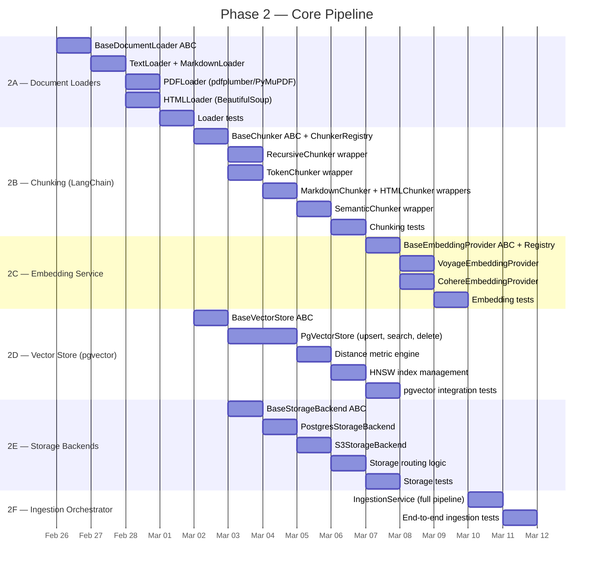

---

## Stage 2A — Document Loaders

### What Gets Built

Loaders that read raw files (from path, URL, or bytes) and produce a `Document` domain model with extracted text.

### Loader Architecture

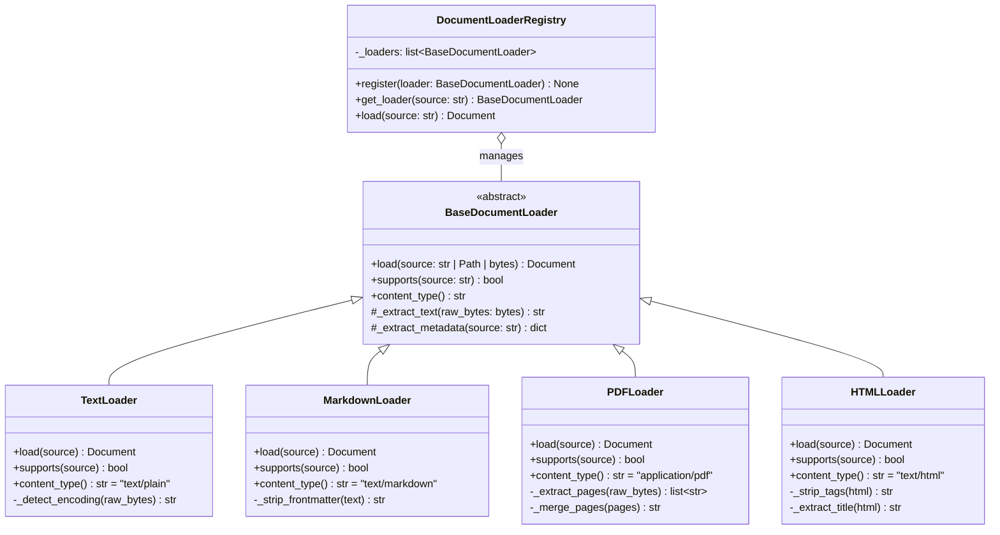

### Loading Flow

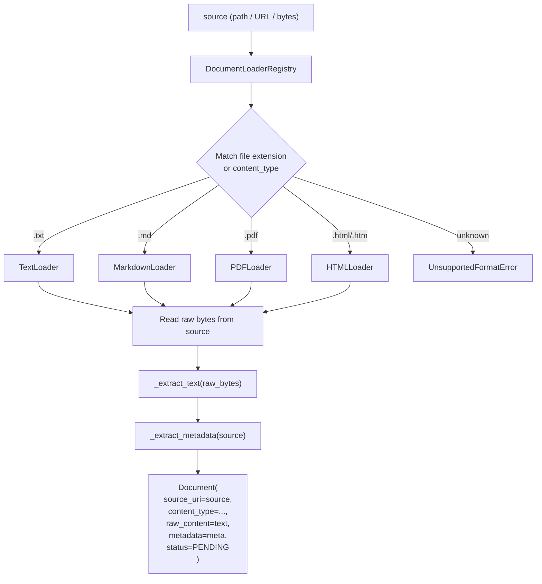

### Algorithm: BaseDocumentLoader

```
ALGORITHM: DocumentLoading

METHOD load(source: str | Path | bytes) → Document:
  1. DETERMINE input type:
     - IF str and starts with "http://" or "https://":
       a. FETCH content via httpx async GET
       b. raw_bytes = response.content
       c. source_uri = URL string
     - IF str or Path (file path):
       a. VALIDATE file exists (raise FileNotFoundError)
       b. raw_bytes = read file in binary mode
       c. source_uri = absolute file path as string
     - IF bytes:
       a. raw_bytes directly
       b. source_uri = "bytes://<sha256 hash>"

  2. EXTRACT text:
     text = self._extract_text(raw_bytes)

  3. IF text is empty or whitespace:
     RAISE DocumentLoadError("No text content extracted from {source}")

  4. EXTRACT metadata:
     metadata = self._extract_metadata(source)
     metadata["content_length"] = len(raw_bytes)
     metadata["text_length"] = len(text)

  5. COMPUTE content size:
     content_size_bytes = len(raw_bytes)

  6. RETURN Document(
       id = generate_uuid(),
       source_uri = source_uri,
       content_type = self.content_type(),
       raw_content = text,
       content_size_bytes = content_size_bytes,
       metadata = metadata,
       status = DocumentStatus.PENDING,
     )

METHOD supports(source: str) → bool:
  1. EXTRACT file extension from source
  2. RETURN extension in self._supported_extensions
```

### Algorithm: TextLoader Specifics

```
ALGORITHM: TextLoaderExtraction

METHOD _extract_text(raw_bytes: bytes) → str:
  1. DETECT encoding:
     a. TRY decode as UTF-8
     b. IF fails, TRY decode as Latin-1
     c. IF fails, USE chardet/charset-normalizer to detect
     d. IF still fails, RAISE DocumentLoadError("Cannot detect encoding")
  2. RETURN decoded string

METHOD _extract_metadata(source: str) → dict:
  1. RETURN {
       "filename": basename(source),
       "encoding": detected_encoding,
     }
```

### Algorithm: PDFLoader Specifics

```
ALGORITHM: PDFLoaderExtraction

METHOD _extract_text(raw_bytes: bytes) → str:
  1. OPEN PDF from bytes using pdf library (pdfplumber or PyMuPDF)
  2. pages = []
  3. FOR EACH page in document:
     a. text = page.extract_text()
     b. IF text is not empty:
        pages.append(text)
  4. RETURN self._merge_pages(pages)

METHOD _merge_pages(pages: list[str]) → str:
  1. RETURN "\n\n".join(pages)
  NOTE: Double newline between pages to preserve structure

METHOD _extract_metadata(source: str) → dict:
  1. OPEN PDF metadata (title, author, creation_date)
  2. RETURN {
       "filename": basename(source),
       "page_count": number_of_pages,
       "title": pdf_metadata.get("title", ""),
       "author": pdf_metadata.get("author", ""),
     }
```

### Algorithm: HTMLLoader Specifics

```
ALGORITHM: HTMLLoaderExtraction

METHOD _extract_text(raw_bytes: bytes) → str:
  1. DECODE bytes to string (UTF-8)
  2. PARSE HTML using BeautifulSoup(html, "html.parser")
  3. REMOVE <script>, <style>, <nav>, <footer>, <header> tags
  4. text = soup.get_text(separator="\n", strip=True)
  5. COLLAPSE multiple blank lines into single blank line
  6. RETURN text

METHOD _extract_metadata(source: str) → dict:
  1. PARSE HTML
  2. title = soup.find("title").string or ""
  3. RETURN {
       "filename": basename(source),
       "title": title,
     }
```

### Algorithm: MarkdownLoader Specifics

```
ALGORITHM: MarkdownLoaderExtraction

METHOD _extract_text(raw_bytes: bytes) → str:
  1. DECODE bytes to string (UTF-8)
  2. STRIP YAML frontmatter if present:
     a. IF text starts with "---":
        FIND closing "---"
        REMOVE frontmatter block
  3. RETURN remaining text (Markdown preserved for chunker)
  NOTE: We do NOT convert to plain text — MarkdownChunker needs the structure

METHOD _extract_metadata(source: str) → dict:
  1. PARSE frontmatter (if present) as YAML
  2. RETURN {
       "filename": basename(source),
       "frontmatter": parsed_frontmatter or {},
     }
```

### Files Produced

| File | Purpose |
|------|---------|
| `vectorforge/ingestion/loaders/base.py` | `BaseDocumentLoader` ABC, `DocumentLoaderRegistry` |
| `vectorforge/ingestion/loaders/text_loader.py` | `TextLoader` |
| `vectorforge/ingestion/loaders/markdown_loader.py` | `MarkdownLoader` |
| `vectorforge/ingestion/loaders/pdf_loader.py` | `PDFLoader` |
| `vectorforge/ingestion/loaders/html_loader.py` | `HTMLLoader` |
| `tests/unit/test_loaders.py` | Unit tests for all loaders |
| `tests/fixtures/sample_documents/` | sample.txt, sample.md, sample.pdf, sample.html |

---

## Stage 2B — Chunking (LangChain Text Splitters)

### What Gets Built

`BaseChunker` ABC that wraps LangChain text splitters, plus 5 concrete chunker implementations and a `ChunkerRegistry` for strategy selection.

### Chunker Architecture

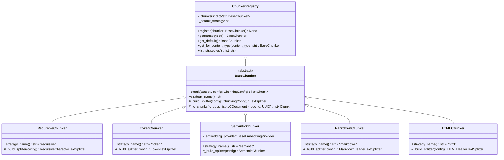

### Chunker Selection Flow

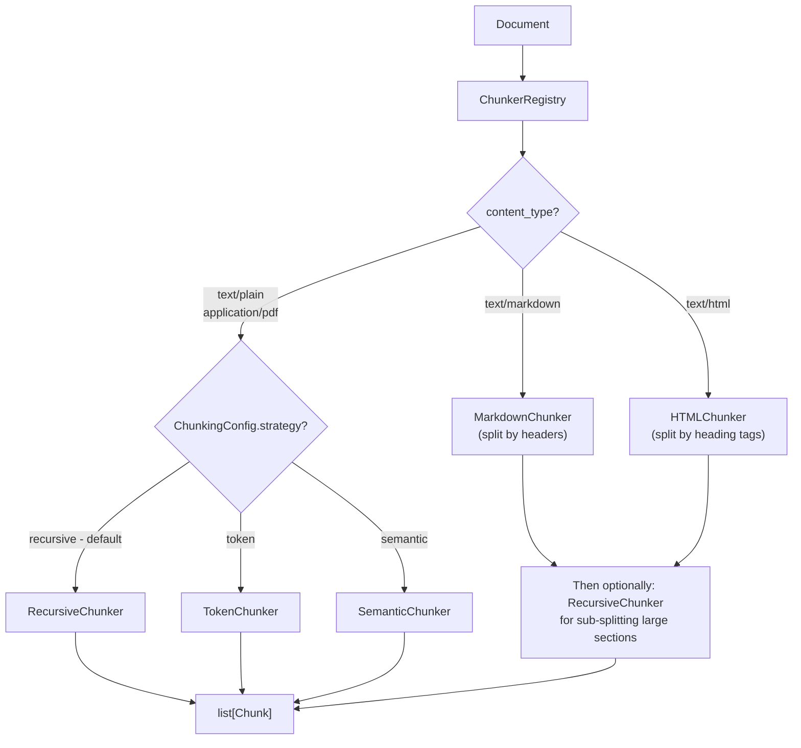

### Algorithm: BaseChunker

```
ALGORITHM: BaseChunkerOperations

METHOD chunk(text: str, config: ChunkingConfig) → list[Chunk]:
  1. VALIDATE input:
     a. IF text is empty: RETURN []
     b. IF len(text) <= config.chunk_size: 
        RETURN [single Chunk containing full text]

  2. BUILD splitter:
     splitter = self._build_splitter(config)

  3. SPLIT text:
     lc_docs = splitter.create_documents(
       [text],
       metadatas=[{"source": "chunker"}],
     )

  4. CONVERT to domain Chunks:
     chunks = self._to_chunks(lc_docs)

  5. VALIDATE output:
     a. ASSERT len(chunks) > 0
     b. ASSERT all chunks have non-empty text
     c. LOG: f"Split into {len(chunks)} chunks (strategy={self.strategy_name()})"

  6. RETURN chunks

METHOD _to_chunks(lc_docs: list[LCDocument]) → list[Chunk]:
  1. chunks = []
  2. running_offset = 0
  3. FOR i, doc IN enumerate(lc_docs):
     a. start_char = doc.metadata.get("start_index", running_offset)
     b. end_char = start_char + len(doc.page_content)
     c. chunks.append(Chunk(
          id = generate_uuid(),
          text = doc.page_content,
          index = i,
          start_char = start_char,
          end_char = end_char,
          metadata = doc.metadata,
        ))
     d. running_offset = end_char
  4. RETURN chunks
```

### Algorithm: RecursiveChunker

```
ALGORITHM: RecursiveChunkerOperations

METHOD _build_splitter(config: ChunkingConfig) → RecursiveCharacterTextSplitter:
  1. separators = config.separators OR ["\n\n", "\n", ". ", " ", ""]
  2. RETURN RecursiveCharacterTextSplitter(
       chunk_size = config.chunk_size,       # default: 1000
       chunk_overlap = config.chunk_overlap,  # default: 200
       separators = separators,
       add_start_index = True,               # track char offsets
       strip_whitespace = True,
     )

HOW IT WORKS (internal to LangChain):
  1. TRY split text using first separator ("\n\n" — paragraph breaks)
  2. FOR EACH resulting segment:
     a. IF segment <= chunk_size: keep it
     b. IF segment > chunk_size: recursively split with next separator ("\n")
  3. CONTINUE down hierarchy: "\n" → ". " → " " → "" (single char)
  4. MERGE adjacent small segments until they approach chunk_size
  5. ADD overlap between consecutive chunks
```

### Algorithm: TokenChunker

```
ALGORITHM: TokenChunkerOperations

METHOD _build_splitter(config: ChunkingConfig) → TokenTextSplitter:
  1. model_name = config.model_name OR "gpt-4"
  2. RETURN TokenTextSplitter(
       chunk_size = config.chunk_size,       # in tokens, not chars
       chunk_overlap = config.chunk_overlap,  # in tokens
       model_name = model_name,              # for tiktoken encoding
       add_start_index = True,
     )

HOW IT WORKS:
  1. TOKENIZE entire text using tiktoken (model-specific tokenizer)
  2. SPLIT token sequence into windows of chunk_size tokens
  3. OVERLAP consecutive windows by chunk_overlap tokens
  4. DECODE each token window back to text
  NOTE: Guarantees each chunk fits within model's context window
```

### Algorithm: SemanticChunker

```
ALGORITHM: SemanticChunkerOperations

METHOD _build_splitter(config: ChunkingConfig) → SemanticChunker:
  1. embedding_fn = self._embedding_provider.embed
  2. RETURN LangChainSemanticChunker(
       embeddings = embedding_fn,
       breakpoint_threshold_type = "percentile",
       breakpoint_threshold_amount = config.breakpoint_threshold,
     )

HOW IT WORKS:
  1. SPLIT text into sentences
  2. EMBED each sentence using the configured embedding provider
  3. COMPUTE cosine similarity between consecutive sentence embeddings
  4. IDENTIFY "breakpoints" where similarity drops below threshold
  5. GROUP consecutive sentences between breakpoints into chunks
  NOTE: Produces variable-sized chunks that are semantically coherent
  NOTE: Slower than other strategies (requires embedding calls during chunking)
```

### Algorithm: MarkdownChunker

```
ALGORITHM: MarkdownChunkerOperations

METHOD _build_splitter(config: ChunkingConfig) → MarkdownHeaderTextSplitter:
  1. headers_to_split_on = [
       ("#", "h1"),
       ("##", "h2"),
       ("###", "h3"),
       ("####", "h4"),
     ]
  2. RETURN MarkdownHeaderTextSplitter(
       headers_to_split_on = headers_to_split_on,
       strip_headers = False,           # keep headers in chunk text
     )

HOW IT WORKS:
  1. SCAN text for Markdown headers (#, ##, ###, ####)
  2. SPLIT text at each header occurrence
  3. EACH chunk = header + section content
  4. METADATA includes header hierarchy: {"h1": "Chapter", "h2": "Section"}
  NOTE: If a section exceeds chunk_size, sub-split using RecursiveChunker
```

### Algorithm: HTMLChunker

```
ALGORITHM: HTMLChunkerOperations

METHOD _build_splitter(config: ChunkingConfig) → HTMLHeaderTextSplitter:
  1. headers_to_split_on = [
       ("h1", "h1"), ("h2", "h2"), ("h3", "h3"),
       ("h4", "h4"), ("h5", "h5"), ("h6", "h6"),
     ]
  2. RETURN HTMLHeaderTextSplitter(
       headers_to_split_on = headers_to_split_on,
     )

HOW IT WORKS:
  1. PARSE HTML and locate heading tags (<h1> through <h6>)
  2. SPLIT content at each heading boundary
  3. STRIP HTML tags from chunk text (plain text output)
  4. METADATA includes heading hierarchy
```

### Algorithm: ChunkerRegistry

```
ALGORITHM: ChunkerRegistryOperations

METHOD register(chunker: BaseChunker) → None:
  1. name = chunker.strategy_name()
  2. IF name already registered:
     RAISE DuplicateRegistrationError
  3. self._chunkers[name] = chunker

METHOD get(strategy: str) → BaseChunker:
  1. IF strategy NOT in self._chunkers:
     RAISE ChunkerNotFoundError(f"Unknown strategy: {strategy}")
  2. RETURN self._chunkers[strategy]

METHOD get_for_content_type(content_type: str) → BaseChunker:
  1. MAPPING:
     "text/markdown" → "markdown"
     "text/html" → "html"
     default → self._default_strategy
  2. RETURN self.get(mapped_strategy)

METHOD get_default() → BaseChunker:
  1. RETURN self._chunkers[self._default_strategy]
  NOTE: Default strategy = "recursive" (set at initialization)
```

### Files Produced

| File | Purpose |
|------|---------|
| `vectorforge/chunking/base.py` | `BaseChunker` ABC |
| `vectorforge/chunking/recursive.py` | `RecursiveChunker` |
| `vectorforge/chunking/token.py` | `TokenChunker` |
| `vectorforge/chunking/semantic.py` | `SemanticChunker` |
| `vectorforge/chunking/markdown.py` | `MarkdownChunker` |
| `vectorforge/chunking/html.py` | `HTMLChunker` |
| `vectorforge/chunking/registry.py` | `ChunkerRegistry` |
| `tests/unit/test_chunking.py` | Unit tests for all chunker strategies |

---

## Stage 2C — Embedding Service

### What Gets Built

`BaseEmbeddingProvider` ABC, `EmbeddingProviderRegistry` with auto-discovery, and two concrete providers: **Voyage AI** (default) and **Cohere**.

### Embedding Architecture

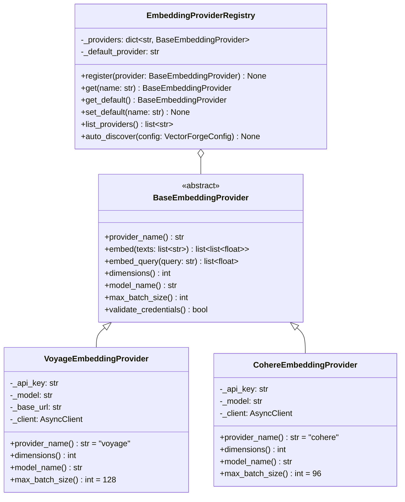

### Embedding Flow


### Algorithm: BaseEmbeddingProvider

```
ALGORITHM: EmbeddingOperations

METHOD embed(texts: list[str]) → list[list[float]]:
  1. VALIDATE:
     a. IF texts is empty: RETURN []
     b. IF any text exceeds provider max input length: TRUNCATE with WARNING

  2. BATCH processing:
     a. batch_size = self.max_batch_size()
     b. batches = split texts into groups of batch_size
     c. all_embeddings = []

  3. FOR EACH batch IN batches:
     a. TRY:
        embeddings = await self._call_api(batch)
     b. CATCH rate limit error:
        RETRY with exponential backoff (max 3 retries)
     c. CATCH API error:
        RAISE EmbeddingError(f"Provider {self.provider_name()} failed: {error}")
     d. all_embeddings.extend(embeddings)

  4. VALIDATE output:
     a. ASSERT len(all_embeddings) == len(texts)
     b. ASSERT all vectors have same dimensionality == self.dimensions()

  5. RETURN all_embeddings

METHOD embed_query(query: str) → list[float]:
  1. result = await self.embed([query])
  2. RETURN result[0]
  NOTE: Some providers have different API calls for query vs document embedding.
        Voyage AI uses input_type="query" vs input_type="document".
```

### Algorithm: VoyageEmbeddingProvider

```
ALGORITHM: VoyageEmbeddingOperations

INITIALIZATION:
  1. api_key = VECTORFORGE_VOYAGE_API_KEY (required)
  2. model = VECTORFORGE_DEFAULT_EMBEDDING_MODEL or "voyage-3"
  3. base_url = VECTORFORGE_VOYAGE_BASE_URL or "https://api.voyageai.com/v1"
  4. CREATE async HTTP client with:
     - Authorization header: "Bearer {api_key}"
     - Content-Type: application/json
     - Timeout: 60 seconds

METHOD _call_api(texts: list[str], input_type: str = "document") → list[list[float]]:
  1. BUILD request payload:
     {
       "model": self._model,
       "input": texts,
       "input_type": input_type,       # "document" for indexing, "query" for search
       "encoding_format": "float"
     }

  2. POST to {base_url}/embeddings
  3. PARSE response:
     a. EXTRACT data[i].embedding for each i
     b. SORT by data[i].index (API may return out of order)
  4. RETURN list of embedding vectors

METHOD dimensions() → int:
  MODEL_DIMENSIONS = {
    "voyage-3": 1024,
    "voyage-3-lite": 512,
    "voyage-code-3": 1024,
    "voyage-finance-2": 1024,
    "voyage-law-2": 1024,
  }
  RETURN MODEL_DIMENSIONS[self._model]

METHOD embed_query(query: str) → list[float]:
  1. result = await self._call_api([query], input_type="query")
  2. RETURN result[0]

METHOD validate_credentials() → bool:
  1. TRY embed a single test string: ["test"]
  2. IF success: RETURN True
  3. IF auth error: RETURN False
```

### Algorithm: CohereEmbeddingProvider

```
ALGORITHM: CohereEmbeddingOperations

INITIALIZATION:
  1. api_key = VECTORFORGE_COHERE_API_KEY (required)
  2. model = "embed-v4.0" (default)
  3. CREATE async HTTP client with:
     - Authorization: "Bearer {api_key}"
     - Timeout: 60 seconds

METHOD _call_api(texts: list[str], input_type: str = "search_document") → list[list[float]]:
  1. BUILD request payload:
     {
       "model": self._model,
       "texts": texts,
       "input_type": input_type,        # "search_document" or "search_query"
       "embedding_types": ["float"]
     }

  2. POST to https://api.cohere.com/v2/embed
  3. PARSE response:
     a. EXTRACT embeddings.float for each item
  4. RETURN list of embedding vectors

METHOD dimensions() → int:
  MODEL_DIMENSIONS = {
    "embed-v4.0": 1024,
    "embed-english-v3.0": 1024,
    "embed-multilingual-v3.0": 1024,
    "embed-english-light-v3.0": 384,
    "embed-multilingual-light-v3.0": 384,
  }
  RETURN MODEL_DIMENSIONS[self._model]

METHOD embed_query(query: str) → list[float]:
  1. result = await self._call_api([query], input_type="search_query")
  2. RETURN result[0]
```

### Algorithm: EmbeddingProviderRegistry

```
ALGORITHM: EmbeddingRegistryOperations

METHOD auto_discover(config: VectorForgeConfig) → None:
  1. PROVIDERS = {
       "voyage": (VoyageEmbeddingProvider, "VECTORFORGE_VOYAGE_API_KEY"),
       "cohere": (CohereEmbeddingProvider, "VECTORFORGE_COHERE_API_KEY"),
       "openai": (OpenAIEmbeddingProvider, "VECTORFORGE_OPENAI_API_KEY"),
       ...
     }

  2. FOR EACH (name, (ProviderClass, env_key)) IN PROVIDERS:
     a. value = os.getenv(env_key)
     b. IF value is not None and value != "":
        i.  provider = ProviderClass(api_key=value, ...)
        ii. self.register(provider)
        iii. LOG: f"Registered embedding provider: {name}"
     c. ELSE:
        LOG: f"Skipped embedding provider: {name} (no credentials)"

  3. SET default:
     a. default_name = config.embedding.default_provider
     b. IF default_name IN self._providers:
        self.set_default(default_name)
     c. ELSE IF any providers registered:
        self.set_default(first registered provider)
        WARN: f"Default provider '{default_name}' not available, using '{first}'"
     d. ELSE:
        RAISE ConfigurationError("No embedding providers configured")

  4. LOG: f"Embedding registry ready: {len(self._providers)} providers, default={self._default}"
```

### Embedding Model Comparison

| Model | Provider | Dimensions | Max Input Tokens | Speed | Quality | Cost |
|-------|----------|-----------|------------------|-------|---------|------|
| `voyage-3` | Voyage AI | 1024 | 32,000 | Medium | High (MTEB top-tier) | ~$0.06/1M tokens |
| `voyage-3-lite` | Voyage AI | 512 | 32,000 | Fast | Good | ~$0.02/1M tokens |
| `embed-v4.0` | Cohere | 1024 | 512 | Fast | High | ~$0.10/1M tokens |
| `embed-english-light-v3.0` | Cohere | 384 | 512 | Very Fast | Medium | ~$0.01/1M tokens |

### Files Produced

| File | Purpose |
|------|---------|
| `vectorforge/embedding/base.py` | `BaseEmbeddingProvider` ABC |
| `vectorforge/embedding/registry.py` | `EmbeddingProviderRegistry` |
| `vectorforge/embedding/providers/voyage.py` | `VoyageEmbeddingProvider` |
| `vectorforge/embedding/providers/cohere.py` | `CohereEmbeddingProvider` |
| `tests/unit/test_embedding.py` | Embedding unit tests (mocked API) |

---

## Stage 2D — Vector Store (pgvector)

### What Gets Built

`BaseVectorStore` ABC and `PgVectorStore` with full support for upsert, search (3 distance metrics), delete, and HNSW index management.

### Vector Store Architecture

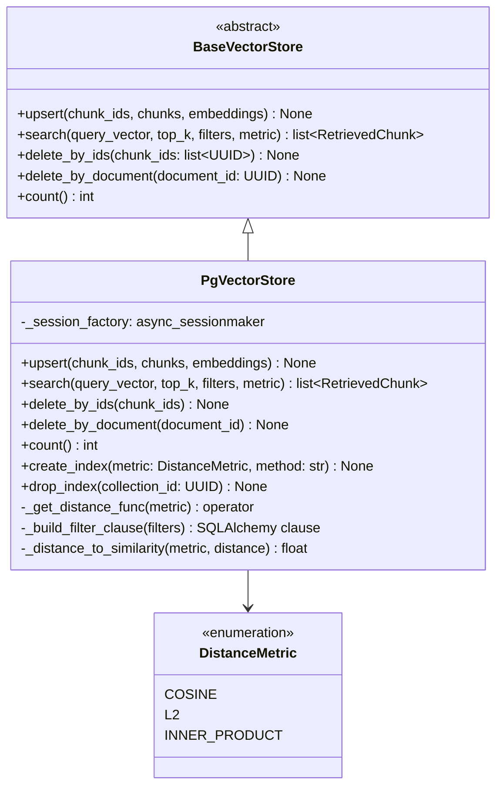

### Distance Metric Routing

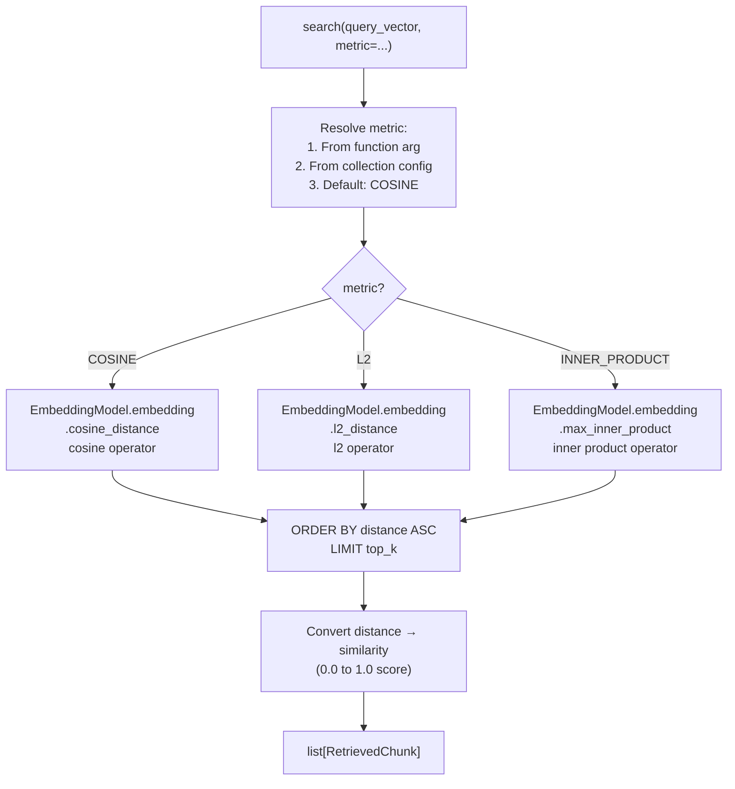

### Algorithm: PgVectorStore.upsert

```
ALGORITHM: VectorUpsert

METHOD upsert(chunk_ids: list[UUID], chunks: list[Chunk], embeddings: list[list[float]]) → None:
  1. VALIDATE:
     a. ASSERT len(chunk_ids) == len(chunks) == len(embeddings)
     b. ASSERT all embeddings have same dimensions

  2. OPEN async session:
     async with self._session_factory() as session:

  3. FOR EACH (chunk_id, chunk, embedding) IN zip(chunk_ids, chunks, embeddings):
     a. CHECK if embedding exists for chunk_id:
        existing = SELECT id FROM embeddings WHERE chunk_id = :chunk_id
     b. IF existing:
        UPDATE embeddings SET
          embedding = :embedding,
          model_name = :model_name,
          dimensions = :dimensions
        WHERE chunk_id = :chunk_id
     c. ELSE:
        INSERT INTO embeddings (id, chunk_id, model_name, dimensions, embedding)
        VALUES (gen_uuid(), :chunk_id, :model, :dims, :embedding)

  4. COMMIT transaction
  5. LOG: f"Upserted {len(chunk_ids)} embeddings"

  NOTE: Use INSERT ... ON CONFLICT (chunk_id) DO UPDATE for efficiency
```

### Algorithm: PgVectorStore.search

```
ALGORITHM: VectorSearch

METHOD search(
  query_vector: list[float],
  top_k: int = 10,
  filters: dict | None = None,
  metric: DistanceMetric = COSINE,
  collection_id: UUID | None = None,
) → list[RetrievedChunk]:

  1. GET distance function:
     distance_func = self._get_distance_func(metric)
     # Returns: cosine_distance | l2_distance | max_inner_product

  2. BUILD query:
     distance_expr = distance_func(EmbeddingModel.embedding, query_vector)

     query = (
       SELECT
         ChunkModel.*,
         EmbeddingModel.*,
         DocumentModel.source_uri,
         distance_expr AS distance
       FROM embeddings
       JOIN chunks ON chunks.id = embeddings.chunk_id
       JOIN documents ON documents.id = chunks.document_id
       WHERE documents.collection_id = :collection_id   (if provided)
       ORDER BY distance ASC
       LIMIT :top_k
     )

  3. APPLY metadata filters (if provided):
     FOR EACH (key, value) IN filters:
       APPEND: WHERE chunks.metadata @> '{"key": "value"}'::jsonb

  4. EXECUTE query
  5. CONVERT results:
     FOR EACH row:
       similarity = self._distance_to_similarity(metric, row.distance)
       retrieved_chunks.append(RetrievedChunk(
         chunk = Chunk from row,
         score = similarity,
         document_source = row.source_uri,
       ))

  6. RETURN retrieved_chunks

METHOD _get_distance_func(metric: DistanceMetric):
  MAPPING = {
    COSINE: EmbeddingModel.embedding.cosine_distance,
    L2: EmbeddingModel.embedding.l2_distance,
    INNER_PRODUCT: EmbeddingModel.embedding.max_inner_product,
  }
  RETURN MAPPING[metric]

METHOD _distance_to_similarity(metric: DistanceMetric, distance: float) → float:
  IF metric == COSINE:
    RETURN max(0.0, 1.0 - distance)
  IF metric == L2:
    RETURN 1.0 / (1.0 + distance)
  IF metric == INNER_PRODUCT:
    RETURN max(0.0, min(1.0, -distance))
```

### Algorithm: HNSW Index Management

```
ALGORITHM: HNSWIndexManagement

METHOD create_index(
  collection_id: UUID,
  metric: DistanceMetric,
  method: str = "hnsw",
  m: int = 16,              # HNSW: max connections per node
  ef_construction: int = 64, # HNSW: search depth during build
) → None:

  1. DETERMINE index ops:
     ops = METRIC_TO_INDEX_OPS[metric]
     # "vector_cosine_ops" | "vector_l2_ops" | "vector_ip_ops"

  2. BUILD index name:
     index_name = f"ix_embeddings_{collection_id}_{metric.value}"

  3. EXECUTE SQL:
     CREATE INDEX {index_name}
     ON embeddings USING {method} (embedding {ops})
     WITH (m = {m}, ef_construction = {ef_construction})
     WHERE chunk_id IN (
       SELECT c.id FROM chunks c
       JOIN documents d ON d.id = c.document_id
       WHERE d.collection_id = '{collection_id}'
     );

  4. LOG: f"Created {method} index for collection {collection_id} with {metric.value}"

  NOTE: Partial index per collection — allows different metrics per collection.
  NOTE: For small collections (< 1000 vectors), skip index — sequential scan is faster.

METHOD drop_index(collection_id: UUID) → None:
  1. FIND indexes matching pattern: ix_embeddings_{collection_id}_*
  2. DROP each index
```

### Files Produced

| File | Purpose |
|------|---------|
| `vectorforge/vectorstore/base.py` | `BaseVectorStore` ABC, `DistanceMetric` enum |
| `vectorforge/vectorstore/pgvector.py` | `PgVectorStore` implementation |
| `tests/integration/test_pgvector.py` | pgvector integration tests |

---

## Stage 2E — Storage Backends

### What Gets Built

`BaseStorageBackend` ABC, `PostgresStorageBackend`, and `S3StorageBackend` with size-threshold routing.

### Storage Routing Flow

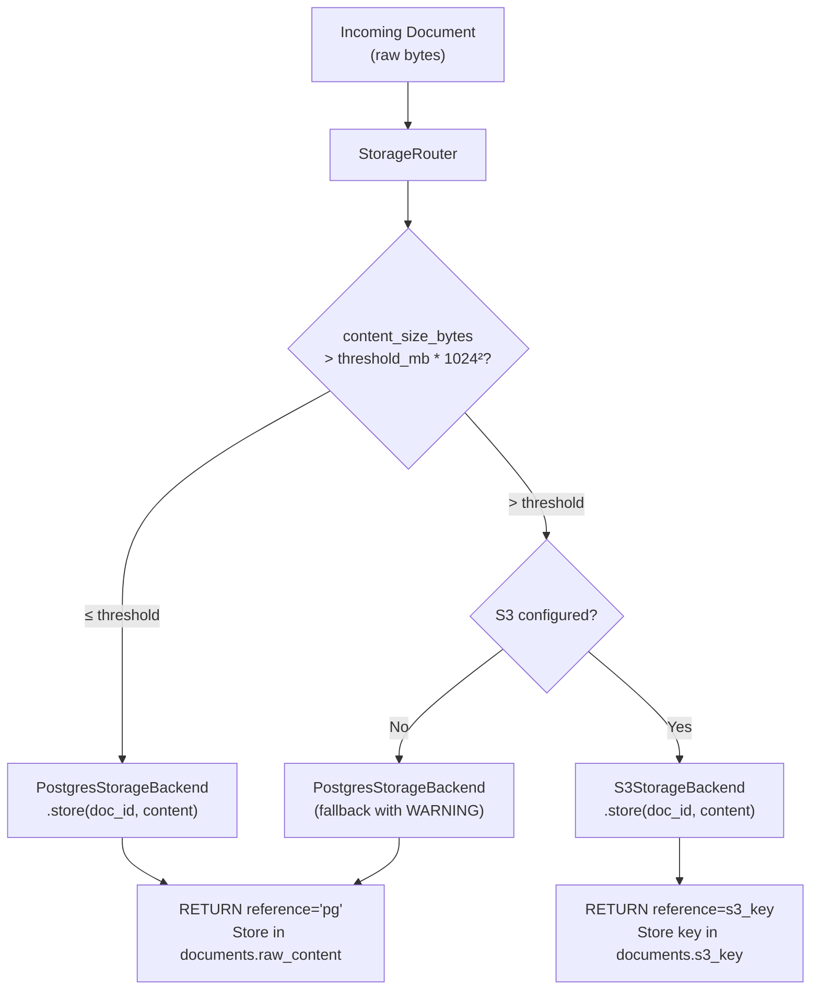

### Algorithm: StorageRouter

```
ALGORITHM: StorageRouting

METHOD store_document(
  document_id: UUID,
  collection_id: UUID,
  content: bytes,
  filename: str,
  config: StorageConfig,
) → tuple[str, str | None]:
  """Returns (storage_backend, s3_key_or_none)"""

  1. content_size_bytes = len(content)
  2. threshold_bytes = config.threshold_mb * 1024 * 1024

  3. IF content_size_bytes > threshold_bytes AND config.is_s3_configured():
     a. s3_key = f"collections/{collection_id}/documents/{document_id}/{filename}"
     b. await self._s3_backend.store(s3_key, content)
     c. RETURN ("s3", s3_key)

  4. ELSE:
     a. RETURN ("pg", None)
     NOTE: Raw content stored directly in the Document model's raw_content field

METHOD retrieve_document(
  storage_backend: str,
  raw_content: str | None,
  s3_key: str | None,
) → bytes:

  1. IF storage_backend == "pg":
     RETURN raw_content.encode("utf-8")

  2. IF storage_backend == "s3":
     a. IF s3_key is None: RAISE StorageError("S3 key missing")
     b. RETURN await self._s3_backend.retrieve(s3_key)

  3. RAISE StorageError(f"Unknown backend: {storage_backend}")
```

### Algorithm: S3StorageBackend

```
ALGORITHM: S3Operations

INITIALIZATION:
  1. bucket = config.s3_bucket
  2. region = config.s3_region
  3. CREATE boto3 async S3 client with:
     - endpoint_url = config.s3_endpoint_url (for MinIO/LocalStack)
     - aws_access_key_id = config.s3_access_key (or None for IAM)
     - aws_secret_access_key = config.s3_secret_key (or None for IAM)

METHOD store(key: str, content: bytes) → str:
  1. await s3_client.put_object(
       Bucket = self._bucket,
       Key = key,
       Body = content,
     )
  2. LOG: f"Stored {len(content)} bytes to s3://{self._bucket}/{key}"
  3. RETURN key

METHOD retrieve(key: str) → bytes:
  1. response = await s3_client.get_object(
       Bucket = self._bucket,
       Key = key,
     )
  2. content = await response["Body"].read()
  3. RETURN content

METHOD delete(key: str) → None:
  1. await s3_client.delete_object(
       Bucket = self._bucket,
       Key = key,
     )
```

### Files Produced

| File | Purpose |
|------|---------|
| `vectorforge/storage/base.py` | `BaseStorageBackend` ABC |
| `vectorforge/storage/postgres.py` | `PostgresStorageBackend` |
| `vectorforge/storage/s3.py` | `S3StorageBackend` |
| `vectorforge/storage/router.py` | `StorageRouter` (size-threshold routing) |
| `tests/unit/test_storage.py` | Storage unit tests (S3 mocked) |

---

## Stage 2F — Ingestion Orchestrator

### What Gets Built

`IngestionService` that orchestrates the full pipeline: load → store → chunk → embed → index.

### Ingestion Pipeline Architecture

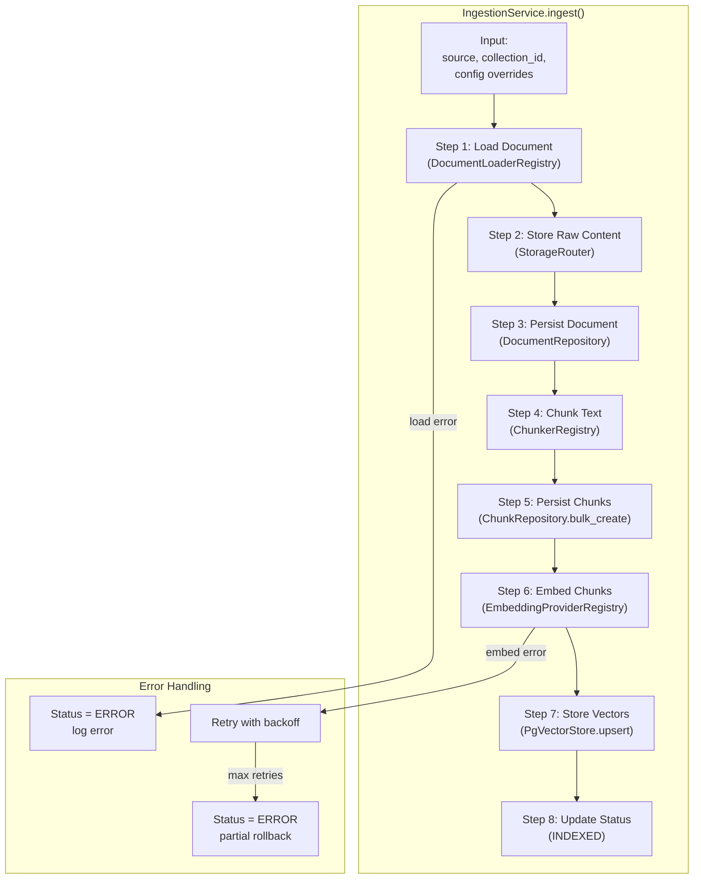

### Algorithm: IngestionService.ingest

```
ALGORITHM: DocumentIngestion

METHOD ingest(
  source: str,
  collection_id: UUID,
  embedding_provider: str | None = None,
  embedding_model: str | None = None,
  chunking_strategy: str | None = None,
  metadata: dict | None = None,
) → Document:

  1. LOAD collection config:
     collection = await collection_repo.find_by_id(collection_id)
     IF collection is None: RAISE NotFoundError
     chunking_config = ChunkingConfig from collection.chunking_config
     embedding_config = EmbeddingConfig from collection.embedding_config

  2. APPLY overrides (if provided):
     IF chunking_strategy: chunking_config.strategy = chunking_strategy
     IF embedding_provider: embedding_config.default_provider = embedding_provider
     IF embedding_model: embedding_config.default_model = embedding_model

  3. LOAD document:
     loader = loader_registry.get_loader(source)
     document = await loader.load(source)
     document.collection_id = collection_id
     document.metadata = {**document.metadata, **(metadata or {})}

  4. STORE raw content:
     storage_backend, s3_key = await storage_router.store_document(
       document_id = document.id,
       collection_id = collection_id,
       content = document.raw_content.encode(),
       filename = basename(source),
       config = storage_config,
     )
     document.storage_backend = storage_backend
     document.s3_key = s3_key
     IF storage_backend == "s3":
       document.raw_content = None  # don't duplicate in PG

  5. PERSIST document:
     document.status = DocumentStatus.PROCESSING
     document = await document_repo.create(CreateDocumentDTO from document)

  6. CHUNK text:
     chunker = chunker_registry.get_for_content_type(document.content_type)
     text = document.raw_content or await storage_router.retrieve(...)
     chunks = await chunker.chunk(text, chunking_config)

  7. PERSIST chunks:
     chunk_dtos = [CreateChunkDTO from chunk for chunk in chunks]
     saved_chunks = await chunk_repo.bulk_create(chunk_dtos)

  8. EMBED chunks:
     provider = embedding_registry.get(embedding_config.default_provider)
     chunk_texts = [chunk.text for chunk in chunks]
     embeddings = await provider.embed(chunk_texts)

  9. STORE vectors:
     await vector_store.upsert(
       chunk_ids = [c.id for c in saved_chunks],
       chunks = saved_chunks,
       embeddings = embeddings,
     )

  10. UPDATE status:
      await document_repo.update_status(document.id, DocumentStatus.INDEXED)

  11. LOG: f"Ingested '{source}': {len(chunks)} chunks, {len(embeddings)} embeddings"
  12. RETURN document

EXCEPTION HANDLING:
  - DocumentLoadError → set status=ERROR, RAISE
  - EmbeddingError → retry with backoff (3x), then set status=ERROR, RAISE
  - DatabaseError → rollback transaction, set status=ERROR, RAISE
  - ANY unexpected error → rollback, set status=ERROR, LOG stack trace, RAISE
```

### Algorithm: Batch Ingestion

```
ALGORITHM: BatchIngestion

METHOD ingest_batch(
  sources: list[str],
  collection_id: UUID,
  **kwargs,
) → list[Document]:

  1. results = []
  2. errors = []

  3. FOR EACH source IN sources:
     TRY:
       doc = await self.ingest(source, collection_id, **kwargs)
       results.append(doc)
     CATCH Exception as e:
       errors.append({"source": source, "error": str(e)})
       LOG: f"Failed to ingest '{source}': {e}"

  4. LOG: f"Batch complete: {len(results)} succeeded, {len(errors)} failed"
  5. IF errors:
     LOG WARNING with error details

  6. RETURN results
```

### Files Produced

| File | Purpose |
|------|---------|
| `vectorforge/ingestion/service.py` | `IngestionService` (full pipeline orchestrator) |
| `tests/unit/test_ingestion.py` | Ingestion unit tests (all external deps mocked) |
| `tests/integration/test_ingestion.py` | End-to-end ingestion tests |

---

## Monitoring Instrumentation — Phase 2

### Overview

All core pipeline services built in Phase 2 are instrumented using the monitoring foundation from Phase 1 (Stage 1F). This section defines what gets monitored and where.

### Instrumentation Map

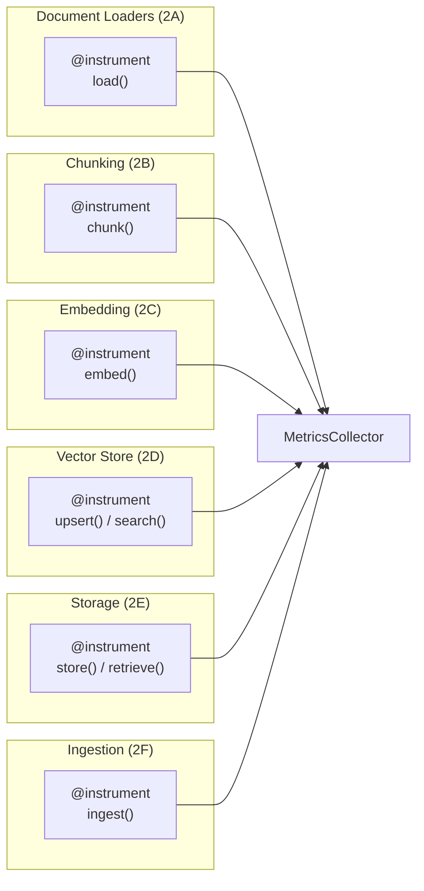

### Metrics Emitted per Component

| Component | Metric Name | Type | Tags | Description |
|-----------|-------------|------|------|-------------|
| **Loaders** | `loader.load.duration_ms` | histogram | `loader_type` | Time to load a single document |
| **Loaders** | `loader.load.calls` | counter | `loader_type` | Total load invocations |
| **Loaders** | `loader.load.errors` | counter | `loader_type`, `error_type` | Load failures |
| **Loaders** | `loader.bytes_loaded` | counter | `loader_type` | Total bytes read |
| **Chunking** | `chunker.chunk.duration_ms` | histogram | `chunker_type` | Time to chunk a document |
| **Chunking** | `chunker.chunks_produced` | counter | `chunker_type` | Total chunks generated |
| **Chunking** | `chunker.avg_chunk_size` | gauge | `chunker_type` | Average chunk character count |
| **Embedding** | `embedding.embed.duration_ms` | histogram | `provider` | Time per embed API call |
| **Embedding** | `embedding.embed.calls` | counter | `provider` | Total embed invocations |
| **Embedding** | `embedding.embed.errors` | counter | `provider`, `error_type` | Embed failures |
| **Embedding** | `embedding.tokens_used` | counter | `provider` | Total tokens sent to provider |
| **Embedding** | `embedding.vectors_produced` | counter | `provider` | Total vectors generated |
| **Embedding** | `embedding.batch_size` | histogram | `provider` | Texts per batch call |
| **Vector Store** | `vectorstore.upsert.duration_ms` | histogram | `metric_type` | Time to upsert vectors |
| **Vector Store** | `vectorstore.upsert.vectors` | counter | `metric_type` | Total vectors upserted |
| **Vector Store** | `vectorstore.search.duration_ms` | histogram | `metric_type` | Similarity search latency |
| **Vector Store** | `vectorstore.search.results` | histogram | `metric_type` | Result count per search |
| **Storage** | `storage.store.duration_ms` | histogram | `backend` | Time to store content |
| **Storage** | `storage.store.bytes` | counter | `backend` | Total bytes stored |
| **Storage** | `storage.retrieve.duration_ms` | histogram | `backend` | Time to retrieve content |
| **Ingestion** | `ingestion.ingest.duration_ms` | histogram | — | Full pipeline latency |
| **Ingestion** | `ingestion.documents_processed` | counter | `status` | Docs processed (success/error) |
| **Ingestion** | `ingestion.pipeline_errors` | counter | `stage`, `error_type` | Errors by pipeline stage |

### Algorithm: Embedding Provider Instrumentation

```
ALGORITHM: InstrumentedEmbeddingProvider

NOTE: Each provider's embed() method is decorated with @instrument.
      Additional provider-specific metrics are emitted inside the method:

WITHIN embed() METHOD:
  1. @instrument handles: duration_ms, calls, errors automatically

  2. AFTER successful API call:
     metrics.increment("embedding.tokens_used", token_count, tags={"provider": self.name})
     metrics.increment("embedding.vectors_produced", len(vectors), tags={"provider": self.name})
     metrics.observe("embedding.batch_size", len(texts), tags={"provider": self.name})

  3. Health probe registration (during __init__):
     health_checker.register(
       name=f"embedding.{self.name}",
       probe=self._health_probe,
     )

  4. HEALTH PROBE algorithm:
     async def _health_probe() → ComponentHealth:
       TRY:
         CALL self.embed(["health check"]) with small timeout
         RETURN ComponentHealth(name=f"embedding.{self.name}", status="healthy")
       EXCEPT:
         RETURN ComponentHealth(name=f"embedding.{self.name}", status="unhealthy", message=str(e))
```

### Algorithm: Ingestion Pipeline Instrumentation

```
ALGORITHM: InstrumentedIngestionService

NOTE: The IngestionService.ingest() method uses @instrument for
      top-level timing. Each internal stage emits granular metrics:

WITHIN ingest() METHOD:
  1. @instrument handles: total duration_ms, calls, errors

  2. AFTER loader stage:
     metrics.increment("ingestion.documents_processed", 1, tags={"status": "loaded"})

  3. AFTER chunking stage:
     metrics.increment("chunker.chunks_produced", len(chunks), tags={"chunker_type": strategy})
     metrics.gauge("chunker.avg_chunk_size", avg_len, tags={"chunker_type": strategy})

  4. AFTER embedding stage:
     (provider metrics emitted internally by the provider — see above)

  5. AFTER vector store upsert:
     metrics.increment("vectorstore.upsert.vectors", len(embeddings))

  6. ON ERROR at any stage:
     metrics.increment("ingestion.pipeline_errors", 1, tags={
       "stage": current_stage,     # "load" | "chunk" | "embed" | "upsert"
       "error_type": type(e).__name__,
     })
     metrics.increment("ingestion.documents_processed", 1, tags={"status": "error"})
```

---

## Phase 2 Exit Criteria

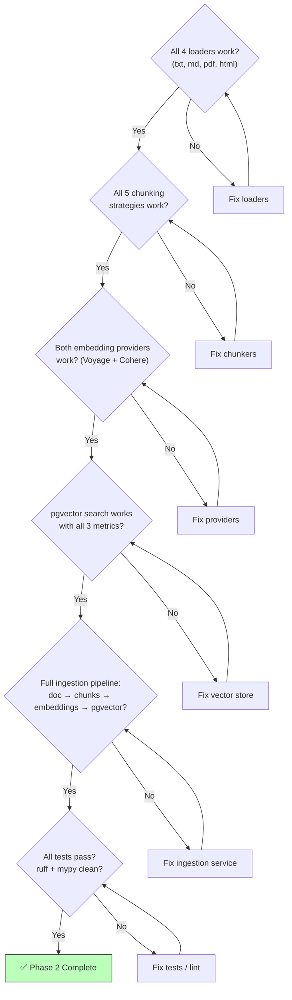

---

## Complete File Inventory — Phase 2

| # | File | Stage | Purpose |
|---|------|-------|---------|
| 1 | `vectorforge/ingestion/loaders/base.py` | 2A | `BaseDocumentLoader` ABC, `DocumentLoaderRegistry` |
| 2 | `vectorforge/ingestion/loaders/text_loader.py` | 2A | `TextLoader` |
| 3 | `vectorforge/ingestion/loaders/markdown_loader.py` | 2A | `MarkdownLoader` |
| 4 | `vectorforge/ingestion/loaders/pdf_loader.py` | 2A | `PDFLoader` |
| 5 | `vectorforge/ingestion/loaders/html_loader.py` | 2A | `HTMLLoader` |
| 6 | `vectorforge/chunking/base.py` | 2B | `BaseChunker` ABC |
| 7 | `vectorforge/chunking/recursive.py` | 2B | `RecursiveChunker` |
| 8 | `vectorforge/chunking/token.py` | 2B | `TokenChunker` |
| 9 | `vectorforge/chunking/semantic.py` | 2B | `SemanticChunker` |
| 10 | `vectorforge/chunking/markdown.py` | 2B | `MarkdownChunker` |
| 11 | `vectorforge/chunking/html.py` | 2B | `HTMLChunker` |
| 12 | `vectorforge/chunking/registry.py` | 2B | `ChunkerRegistry` |
| 13 | `vectorforge/embedding/base.py` | 2C | `BaseEmbeddingProvider` ABC |
| 14 | `vectorforge/embedding/registry.py` | 2C | `EmbeddingProviderRegistry` |
| 15 | `vectorforge/embedding/providers/voyage.py` | 2C | `VoyageEmbeddingProvider` |
| 16 | `vectorforge/embedding/providers/cohere.py` | 2C | `CohereEmbeddingProvider` |
| 17 | `vectorforge/vectorstore/base.py` | 2D | `BaseVectorStore` ABC, `DistanceMetric` enum |
| 18 | `vectorforge/vectorstore/pgvector.py` | 2D | `PgVectorStore` (all 3 metrics) |
| 19 | `vectorforge/storage/base.py` | 2E | `BaseStorageBackend` ABC |
| 20 | `vectorforge/storage/postgres.py` | 2E | `PostgresStorageBackend` |
| 21 | `vectorforge/storage/s3.py` | 2E | `S3StorageBackend` |
| 22 | `vectorforge/storage/router.py` | 2E | `StorageRouter` |
| 23 | `vectorforge/ingestion/service.py` | 2F | `IngestionService` |
| 24 | `tests/unit/test_loaders.py` | 2A | Loader unit tests |
| 25 | `tests/unit/test_chunking.py` | 2B | Chunking unit tests |
| 26 | `tests/unit/test_embedding.py` | 2C | Embedding unit tests |
| 27 | `tests/unit/test_storage.py` | 2E | Storage unit tests |
| 28 | `tests/unit/test_ingestion.py` | 2F | Ingestion unit tests |
| 29 | `tests/integration/test_pgvector.py` | 2D | pgvector integration tests |
| 30 | `tests/integration/test_ingestion.py` | 2F | End-to-end ingestion tests |
| 31 | `tests/fixtures/sample_documents/` | 2A | Sample test files |
