# Phase 3 — RAG Pipeline

> **Goal**: Build the retrieval, context assembly, LLM generation, and query orchestration layers — turning indexed vectors into answers.
> **Estimated Duration**: ~10 days
> **Dependencies**: Phase 2 (embedding service, pgvector store, ingestion pipeline completed)

---

## Phase Timeline


---

## Stage 3A — Retriever

### What Gets Built

`BaseRetriever` ABC and `DenseRetriever` for pure vector similarity search, plus query preprocessing (embedding the query, applying filters).

### Retriever Architecture


### Retrieval Flow

```mermaid
flowchart TD
    Query["User Query\n(natural language)"] --> Preprocess["Query Preprocessor\n• Strip whitespace\n• Validate non-empty\n• Truncate if too long"]
    Preprocess --> LoadCollection["Load Collection Config\n• embedding_provider\n• embedding_model\n• distance_metric"]
    LoadCollection --> Embed["Embed Query\nembedding_provider.embed_query(query)"]
    Embed --> Search["PgVectorStore.search(\n  query_vector,\n  top_k,\n  filters,\n  metric\n)"]
    Search --> Filter["Apply Score Threshold\n(discard chunks below min_score)"]
    Filter --> Results["list[RetrievedChunk]\n• chunk text\n• similarity score\n• document source"]

    LoadCollection -->|"collection not found"| Error["NotFoundError"]
    Embed -->|"embedding fails"| EmbedError["EmbeddingError"]
```



### Algorithm: DenseRetriever.retrieve

```
ALGORITHM: DenseRetrieval

METHOD retrieve(
  query: str,
  collection_id: UUID,
  top_k: int = 10,
  filters: dict | None = None,
  min_score: float = 0.0,
  embedding_provider: str | None = None,
) → list[RetrievedChunk]:

  1. PREPROCESS query:
     a. query = query.strip()
     b. IF query is empty: RAISE ValueError("Query cannot be empty")
     c. IF len(query) > MAX_QUERY_LENGTH: TRUNCATE with WARNING

  2. LOAD collection:
     collection = await self._collection_repo.find_by_id(collection_id)
     IF collection is None: RAISE NotFoundError(f"Collection {collection_id} not found")

  3. RESOLVE embedding provider:
     provider_name = embedding_provider OR collection.embedding_config["default_provider"]
     provider = self._embedding_registry.get(provider_name)

  4. EMBED query:
     query_vector = await provider.embed_query(query)

  5. RESOLVE distance metric:
     metric = DistanceMetric(collection.embedding_config.get("metric", "cosine"))

  6. SEARCH vectors:
     results = await self._vector_store.search(
       query_vector = query_vector,
       top_k = top_k,
       filters = filters,
       metric = metric,
       collection_id = collection_id,
     )

  7. FILTER by score threshold:
     results = [r for r in results if r.score >= min_score]

  8. LOG: f"Retrieved {len(results)} chunks for query (top_k={top_k}, metric={metric.value})"

  9. RETURN results
```

### Algorithm: QueryPreprocessor

```
ALGORITHM: QueryPreprocessing

METHOD preprocess(query: str) → str:
  1. STRIP leading/trailing whitespace
  2. COLLAPSE multiple spaces into single space
  3. IF len(query) == 0: RAISE ValueError
  4. IF len(query) > MAX_QUERY_LENGTH (default: 10000 chars):
     a. TRUNCATE to MAX_QUERY_LENGTH
     b. LOG WARNING: "Query truncated from {original_len} to {MAX_QUERY_LENGTH} chars"
  5. RETURN query

NOTE: Future enhancements — query expansion, synonym injection, 
      spelling correction. Keep preprocessor simple for Phase 3.
```

### Files Produced

| File | Purpose |
|------|---------|
| `vectorforge/retriever/base.py` | `BaseRetriever` ABC |
| `vectorforge/retriever/dense.py` | `DenseRetriever` |
| `vectorforge/pipeline/query.py` | `QueryPreprocessor` |
| `tests/unit/test_retriever.py` | Retriever unit tests |

---

## Stage 3B — Context Builder

### What Gets Built

`ContextBuilder` that assembles the LLM prompt from retrieved chunks, system prompts, and source citations.

### Context Assembly Architecture


### Context Assembly Flow

```mermaid
flowchart TD
    Chunks["Retrieved Chunks\n(ranked by score)"] --> Format["Format Chunks\n• Add [Source N] labels\n• Add chunk text\n• Separate with divider"]
    Format --> Truncate{"Total tokens\n> max_context_tokens?"}
    Truncate -->|"Yes"| Cut["Truncate: drop lowest-scored\nchunks until within budget"]
    Truncate -->|"No"| Assemble["Assemble"]
    Cut --> Assemble

    Query["User Query"] --> Assemble
    SystemTpl["System Prompt Template"] --> Assemble

    Assemble --> Payload["ContextPayload\n• system_prompt (with context injected)\n• user_message (original query)\n• sources list\n• token count"]
```



### Algorithm: ContextBuilder.build

```
ALGORITHM: ContextAssembly

METHOD build(
  query: str,
  chunks: list[RetrievedChunk],
  config: ContextConfig | None = None,
) → ContextPayload:

  1. USE defaults if config is None:
     config = ContextConfig(
       system_prompt_template = DEFAULT_SYSTEM_PROMPT,
       max_context_tokens = 4096,
       include_sources = True,
       chunk_separator = "\n---\n",
       include_scores = False,
     )

  2. FORMAT chunks into context string:
     context_parts = []
     FOR i, chunk IN enumerate(chunks):
       header = f"[Source {i + 1}]"
       IF config.include_scores:
         header += f" (relevance: {chunk.score:.2f})"
       context_parts.append(f"{header}\n{chunk.chunk.text}")
     context_text = config.chunk_separator.join(context_parts)

  3. TRUNCATE if needed:
     token_count = estimate_tokens(context_text)
     IF token_count > config.max_context_tokens:
       a. REMOVE chunks from the end (lowest scored)
       b. REBUILD context_text from remaining chunks
       c. RECOUNT tokens
       d. LOG WARNING: f"Context truncated from {original_count} to {token_count} tokens"

  4. BUILD system prompt:
     system_prompt = config.system_prompt_template.format(
       context = context_text,
     )
     NOTE: Template must contain {context} placeholder

  5. BUILD sources:
     sources = []
     IF config.include_sources:
       FOR i, chunk IN enumerate(chunks actually used):
         sources.append(SourceCitation(
           document_source = chunk.document_source,
           chunk_index = chunk.chunk.index,
           score = chunk.score,
           snippet = chunk.chunk.text[:200] + "...",
         ))

  6. RETURN ContextPayload(
       system_prompt = system_prompt,
       user_message = query,
       assembled_context = context_text,
       sources = sources,
       context_token_count = token_count,
     )
```

### Default System Prompt Template

```
DEFAULT_SYSTEM_PROMPT = """
You are a helpful assistant that answers questions based on the provided context.
Use ONLY the information in the context below to answer. If the answer cannot be
found in the context, say "I don't have enough information to answer that question."

Do not make up information. Always cite which source(s) you used.

Context:
{context}
"""
```

### Algorithm: Token Estimation

```
ALGORITHM: TokenEstimation

FUNCTION estimate_tokens(text: str, model: str = "gpt-4") → int:
  1. TRY use tiktoken:
     encoding = tiktoken.encoding_for_model(model)
     RETURN len(encoding.encode(text))
  2. IF tiktoken not available:
     FALLBACK to character-based estimate:
     RETURN len(text) // 4   # rough: ~4 chars per token for English

NOTE: tiktoken is an optional dependency. If not installed, use the fallback.
      This keeps the core engine lightweight.
```

### Files Produced

| File | Purpose |
|------|---------|
| `vectorforge/pipeline/context.py` | `ContextBuilder`, `ContextConfig`, `ContextPayload`, `SourceCitation` |
| `vectorforge/pipeline/prompts.py` | Default prompt templates |
| `tests/unit/test_context.py` | Context builder unit tests |

---

## Stage 3C — LLM Integration

### What Gets Built

`BaseLLMProvider` ABC, `LLMProviderRegistry` with auto-discovery, `OpenAIProvider`, and `AnthropicProvider` with both sync and streaming generation.

### LLM Architecture


### LLM Generation Flow

```mermaid
flowchart LR
    Context["ContextPayload"] --> Messages["Build Messages:\n1. system: system_prompt\n2. user: user_message"]
    Messages --> Provider["LLMProvider.generate(messages, config)"]
    Provider --> API["Provider API\n(OpenAI / Anthropic / Ollama)"]
    API --> Response["LLMResponse\n• content\n• token usage\n• latency"]

    Provider -->|"streaming"| Stream["LLMProvider.generate_stream(messages, config)"]
    Stream --> AsyncIter["AsyncIterator[str]\n(yields token-by-token)"]
```



### Algorithm: BaseLLMProvider

```
ALGORITHM: LLMGenerationBase

METHOD generate(
  messages: list[dict],
  config: LLMRequestConfig | None = None,
) → LLMResponse:
  1. APPLY defaults if config is None:
     config = LLMRequestConfig(
       model = self._default_model,
       temperature = 0.7,
       max_tokens = 1024,
     )
  2. START timer
  3. TRY:
     response = await self._call_api(messages, config)
  4. CATCH rate limit → RETRY with exponential backoff (max 3 retries)
  5. CATCH auth error → RAISE LLMError("Invalid credentials for {provider_name}")
  6. CATCH timeout → RAISE LLMError("Provider {provider_name} timed out")
  7. STOP timer
  8. BUILD LLMResponse with token counts and latency
  9. RETURN response

METHOD generate_stream(
  messages: list[dict],
  config: LLMRequestConfig | None = None,
) → AsyncIterator[str]:
  1. APPLY defaults
  2. OPEN streaming connection to provider API
  3. YIELD each token/chunk as it arrives
  4. ON completion: LOG total tokens and latency
  5. ON error: RAISE LLMError with context
```

### Algorithm: OpenAIProvider

```
ALGORITHM: OpenAIGeneration

INITIALIZATION:
  1. api_key = VECTORFORGE_OPENAI_API_KEY (required)
  2. base_url = VECTORFORGE_OPENAI_BASE_URL or default
  3. org_id = VECTORFORGE_OPENAI_ORG_ID or None
  4. default_model = VECTORFORGE_DEFAULT_LLM_MODEL or "gpt-4o"
  5. CREATE AsyncOpenAI client

METHOD _call_api(messages: list[dict], config: LLMRequestConfig) → LLMResponse:
  1. BUILD request:
     response = await self._client.chat.completions.create(
       model = config.model,
       messages = messages,
       temperature = config.temperature,
       max_tokens = config.max_tokens,
       top_p = config.top_p,
       frequency_penalty = config.frequency_penalty,
       presence_penalty = config.presence_penalty,
       stop = config.stop_sequences or None,
     )

  2. EXTRACT:
     content = response.choices[0].message.content
     usage = response.usage

  3. RETURN LLMResponse(
       content = content,
       model = response.model,
       provider = "openai",
       prompt_tokens = usage.prompt_tokens,
       completion_tokens = usage.completion_tokens,
       total_tokens = usage.total_tokens,
     )

METHOD _call_api_stream(messages, config) → AsyncIterator[str]:
  1. response = await self._client.chat.completions.create(
       ...same params...,
       stream = True,
     )
  2. async for chunk in response:
     IF chunk.choices[0].delta.content:
       YIELD chunk.choices[0].delta.content
```

### Algorithm: AnthropicProvider

```
ALGORITHM: AnthropicGeneration

INITIALIZATION:
  1. api_key = VECTORFORGE_ANTHROPIC_API_KEY (required)
  2. default_model = "claude-sonnet-4-20250514"
  3. CREATE AsyncAnthropic client

METHOD _call_api(messages: list[dict], config: LLMRequestConfig) → LLMResponse:
  1. SEPARATE system message from user/assistant messages:
     system_msg = extract system message from messages list
     conversation = remaining messages

  2. BUILD request:
     response = await self._client.messages.create(
       model = config.model,
       system = system_msg,
       messages = conversation,
       max_tokens = config.max_tokens,
       temperature = config.temperature,
     )

  3. EXTRACT:
     content = response.content[0].text
     usage = response.usage

  4. RETURN LLMResponse(
       content = content,
       model = response.model,
       provider = "anthropic",
       prompt_tokens = usage.input_tokens,
       completion_tokens = usage.output_tokens,
       total_tokens = usage.input_tokens + usage.output_tokens,
     )

NOTE: Anthropic API has a different message format — system prompt is a
      separate parameter, not in the messages array. The provider must
      transform the standard VectorForge message format.
```

### Algorithm: LLMProviderRegistry

```
ALGORITHM: LLMRegistryAutoDiscovery

METHOD auto_discover(config: VectorForgeConfig) → None:
  1. PROVIDERS = {
       "openai":    (OpenAIProvider,    "VECTORFORGE_OPENAI_API_KEY"),
       "anthropic": (AnthropicProvider, "VECTORFORGE_ANTHROPIC_API_KEY"),
       "ollama":    (OllamaProvider,    "VECTORFORGE_OLLAMA_BASE_URL"),
       "google":    (GoogleProvider,    "VECTORFORGE_GOOGLE_API_KEY"),
       "cohere":    (CohereProvider,    "VECTORFORGE_COHERE_API_KEY"),
     }

  2. FOR EACH (name, (ProviderClass, env_key)) IN PROVIDERS:
     a. value = os.getenv(env_key)
     b. IF value is not None and value != "":
        i.   provider = ProviderClass(credentials=value)
        ii.  self.register(provider)
        iii. LOG: f"Registered LLM provider: {name}"
     c. ELSE:
        LOG: f"Skipped LLM provider: {name} (no credentials)"

  3. SET default:
     a. default_name = config.llm.default_provider
     b. IF default_name IN self._providers:
        self.set_default(default_name)
     c. ELSE IF any providers registered:
        self.set_default(first registered)
        WARN: f"Default LLM provider '{default_name}' not available"
     d. ELSE:
        LOG WARNING: "No LLM providers configured — generation disabled"

  NOTE: Unlike embedding registry (which raises on empty), LLM registry
        allows empty state. VectorForge can still be used for ingestion +
        retrieval without LLM generation.
```

### Files Produced

| File | Purpose |
|------|---------|
| `vectorforge/llm/base.py` | `BaseLLMProvider` ABC |
| `vectorforge/llm/types.py` | `LLMRequestConfig`, `LLMResponse`, `ProviderInfo`, `ProviderCapability` |
| `vectorforge/llm/registry.py` | `LLMProviderRegistry` |
| `vectorforge/llm/providers/openai.py` | `OpenAIProvider` |
| `vectorforge/llm/providers/anthropic.py` | `AnthropicProvider` |
| `tests/unit/test_llm.py` | LLM provider unit tests (mocked APIs) |

---

## Stage 3D — RAG Orchestrator

### What Gets Built

`QueryService` — the main RAG pipeline that ties retrieval, context building, and LLM generation into a single `query()` method.

### Orchestrator Architecture


### RAG Pipeline Flow


### Algorithm: QueryService.query

```
ALGORITHM: RAGQuery

METHOD query(
  query: str,
  collection_id: UUID,
  config: QueryConfig | None = None,
) → QueryResult:

  1. APPLY defaults if config is None:
     config = QueryConfig(
       top_k = 10,
       min_score = 0.0,
       filters = None,
       llm_provider = None,     # uses registry default
       llm_model = None,        # uses provider default
       embedding_provider = None, # uses collection config
       temperature = 0.7,
       max_tokens = 1024,
       include_sources = True,
       stream = False,
     )

  2. START total_timer

  3. RETRIEVE chunks:
     START retrieval_timer
     retrieved_chunks = await self._retriever.retrieve(
       query = query,
       collection_id = collection_id,
       top_k = config.top_k,
       filters = config.filters,
       min_score = config.min_score,
       embedding_provider = config.embedding_provider,
     )
     retrieval_latency = STOP retrieval_timer

  4. HANDLE empty results:
     IF len(retrieved_chunks) == 0:
       RETURN QueryResult(
         query = query,
         answer = "No relevant documents found for your query.",
         retrieved_chunks = [],
         sources = [],
         retrieval_latency_ms = retrieval_latency,
         generation_latency_ms = 0,
         total_latency_ms = retrieval_latency,
         llm_response = None,
       )

  5. BUILD context:
     context_config = ContextConfig(
       max_context_tokens = config.max_tokens * 3,  # 3x budget for context
       include_sources = config.include_sources,
     )
     context_payload = self._context_builder.build(
       query = query,
       chunks = retrieved_chunks,
       config = context_config,
     )

  6. GENERATE answer:
     START generation_timer
     llm_provider = self._llm_registry.get(config.llm_provider) if config.llm_provider \
                    else self._llm_registry.get_default()

     messages = [
       {"role": "system", "content": context_payload.system_prompt},
       {"role": "user", "content": context_payload.user_message},
     ]

     llm_config = LLMRequestConfig(
       model = config.llm_model or llm_provider.default_model,
       temperature = config.temperature,
       max_tokens = config.max_tokens,
     )

     llm_response = await llm_provider.generate(messages, llm_config)
     generation_latency = STOP generation_timer

  7. BUILD result:
     total_latency = STOP total_timer
     result = QueryResult(
       query = query,
       answer = llm_response.content,
       retrieved_chunks = retrieved_chunks,
       sources = context_payload.sources,
       retrieval_latency_ms = retrieval_latency,
       generation_latency_ms = generation_latency,
       total_latency_ms = total_latency,
       llm_response = llm_response,
     )

  8. LOG query (async, non-blocking):
     asyncio.create_task(self._log_query(query, collection_id, result))

  9. RETURN result
```

### Algorithm: QueryService.query_stream

```
ALGORITHM: RAGQueryStreaming

METHOD query_stream(
  query: str,
  collection_id: UUID,
  config: QueryConfig | None = None,
) → AsyncIterator[str]:
  """Same as query() but yields tokens as they arrive from the LLM."""

  1-5. SAME as query() steps 1-5 (retrieve + build context)

  6. STREAM answer:
     llm_provider = resolve provider (same logic as query())
     messages = build messages (same as query())

     async for token in llm_provider.generate_stream(messages, llm_config):
       YIELD token

  7. After stream completes:
     LOG query (async, non-blocking)

  NOTE: Streaming returns tokens individually. The caller is responsible
        for assembly. QueryResult is not returned — caller accumulates 
        the answer or uses a collector callback.
```

### Algorithm: Query Logging

```
ALGORITHM: QueryLogging

METHOD _log_query(
  query: str,
  collection_id: UUID,
  result: QueryResult,
) → None:
  """Non-blocking query log for analytics. Failures are swallowed with WARNING."""

  1. TRY:
     await self._query_log_repo.create(
       QueryLog(
         id = generate_uuid(),
         collection_id = collection_id,
         query_text = query,
         retrieved_chunk_ids = [c.chunk.id for c in result.retrieved_chunks],
         generated_response = result.answer,
         latency_ms = result.total_latency_ms,
       )
     )
  2. CATCH Exception as e:
     LOG WARNING: f"Failed to log query: {e}"
     # Never fail the main query because of logging errors

NOTE: Query logs are used in Phase 4 for analytics. The QUERY_LOGS table
      stores retrieved chunk IDs as JSONB for later analysis.
```

### RAG Pipeline State Diagram

```mermaid
stateDiagram-v2
    [*] --> QueryReceived
    QueryReceived --> Preprocessing: validate query

    Preprocessing --> Retrieving: embed & search
    Retrieving --> NoResults: 0 chunks found
    Retrieving --> ContextBuilding: chunks found

    NoResults --> [*]: return "no results" answer

    ContextBuilding --> Generating: context assembled
    Generating --> Building: LLM response received
    Generating --> RetryLLM: LLM error

    RetryLLM --> Generating: retry (≤3)
    RetryLLM --> ErrorState: max retries

    Building --> Logging: result built
    Logging --> [*]: return QueryResult

    ErrorState --> [*]: raise LLMError
```



### Files Produced

| File | Purpose |
|------|---------|
| `vectorforge/pipeline/rag.py` | `QueryService` (main RAG orchestrator) |
| `vectorforge/pipeline/types.py` | `QueryConfig`, `QueryResult` |
| `vectorforge/db/repositories/query_log_repo.py` | `QueryLogRepository` |
| `tests/unit/test_rag_pipeline.py` | RAG pipeline unit tests |
| `tests/integration/test_rag_pipeline.py` | End-to-end RAG tests |

---

## Monitoring Instrumentation — Phase 3

### Overview

The RAG pipeline is the primary user-facing path — its performance is critical. Every stage of the query flow is instrumented for latency, throughput, and error tracking using the Phase 1 monitoring foundation.

### Query Pipeline Instrumentation Flow


### Metrics Emitted per Component

| Component | Metric Name | Type | Tags | Description |
|-----------|-------------|------|------|-------------|
| **Retriever** | `retriever.search.duration_ms` | histogram | `retriever_type` | Similarity search latency |
| **Retriever** | `retriever.search.calls` | counter | `retriever_type` | Total search invocations |
| **Retriever** | `retriever.search.errors` | counter | `retriever_type`, `error_type` | Search failures |
| **Retriever** | `retriever.results_returned` | histogram | `retriever_type` | Chunks returned per query |
| **Retriever** | `retriever.empty_results` | counter | `retriever_type` | Queries with zero results |
| **Context** | `context.build.duration_ms` | histogram | — | Context assembly time |
| **Context** | `context.tokens_used` | histogram | — | Tokens in assembled context |
| **Context** | `context.chunks_included` | histogram | — | Chunks fitting token budget |
| **Context** | `context.chunks_truncated` | counter | — | Chunks dropped due to budget |
| **LLM** | `llm.generate.duration_ms` | histogram | `provider`, `model` | Generation latency |
| **LLM** | `llm.generate.calls` | counter | `provider`, `model` | Total generation calls |
| **LLM** | `llm.generate.errors` | counter | `provider`, `model`, `error_type` | Generation failures |
| **LLM** | `llm.generate.retries` | counter | `provider`, `model` | Retry attempts |
| **LLM** | `llm.tokens_input` | counter | `provider`, `model` | Total prompt tokens sent |
| **LLM** | `llm.tokens_output` | counter | `provider`, `model` | Total completion tokens |
| **LLM** | `llm.streaming.chunks` | counter | `provider`, `model` | SSE chunks emitted |
| **LLM** | `llm.streaming.first_token_ms` | histogram | `provider`, `model` | Time to first token |
| **Pipeline** | `pipeline.query.duration_ms` | histogram | — | Total end-to-end latency |
| **Pipeline** | `pipeline.query.calls` | counter | — | Total query invocations |
| **Pipeline** | `pipeline.query.errors` | counter | `stage`, `error_type` | Errors by pipeline stage |

### Algorithm: QueryService Instrumentation

```
ALGORITHM: InstrumentedQueryService

WITHIN query() METHOD (decorated with @instrument):

  1. @instrument handles: pipeline.query.duration_ms, calls, errors

  2. RETRIEVAL STAGE:
     retrieval_start = perf_counter()
     chunks = await retriever.search(query, top_k)
     retrieval_ms = (perf_counter() - retrieval_start) * 1000
     metrics.observe("retriever.search.duration_ms", retrieval_ms, tags={"retriever_type": "dense"})
     metrics.observe("retriever.results_returned", len(chunks), tags={"retriever_type": "dense"})
     IF len(chunks) == 0:
       metrics.increment("retriever.empty_results", tags={"retriever_type": "dense"})

  3. CONTEXT STAGE:
     context_start = perf_counter()
     context = await context_builder.build(query, chunks, config)
     context_ms = (perf_counter() - context_start) * 1000
     metrics.observe("context.build.duration_ms", context_ms)
     metrics.observe("context.tokens_used", context.token_count)
     metrics.observe("context.chunks_included", context.chunks_used)

  4. GENERATION STAGE:
     gen_start = perf_counter()
     response = await llm.generate(prompt, config)
     gen_ms = (perf_counter() - gen_start) * 1000
     metrics.observe("llm.generate.duration_ms", gen_ms, tags={"provider": provider_name, "model": model})
     metrics.increment("llm.tokens_input", response.prompt_tokens, tags={"provider": provider_name})
     metrics.increment("llm.tokens_output", response.completion_tokens, tags={"provider": provider_name})

  5. ON ERROR at any stage:
     metrics.increment("pipeline.query.errors", tags={
       "stage": current_stage,
       "error_type": type(e).__name__,
     })
```

### Algorithm: LLM Provider Instrumentation

```
ALGORITHM: InstrumentedLLMProvider

WITHIN generate() METHOD:
  1. @instrument handles: llm.generate.duration_ms, calls, errors

  2. ON retry:
     metrics.increment("llm.generate.retries", tags={"provider": self.name, "model": model})

  3. Health probe registration (during __init__):
     health_checker.register(
       name=f"llm.{self.name}",
       probe=self._health_probe,
     )

  4. HEALTH PROBE: lightweight models list call or small completion
     async def _health_probe() → ComponentHealth:
       TRY:
         CALL self._client.models.list() (or equivalent ping)
         RETURN healthy
       EXCEPT:
         RETURN unhealthy with error message

WITHIN generate_stream() METHOD:
  1. RECORD first_token_time when first chunk arrives
     metrics.observe("llm.streaming.first_token_ms", first_token_ms, tags={...})
  2. COUNT chunks emitted
     metrics.increment("llm.streaming.chunks", chunk_count, tags={...})
```

---

## Phase 3 Exit Criteria


---

## Complete File Inventory — Phase 3

| # | File | Stage | Purpose |
|---|------|-------|---------|
| 1 | `vectorforge/retriever/base.py` | 3A | `BaseRetriever` ABC |
| 2 | `vectorforge/retriever/dense.py` | 3A | `DenseRetriever` |
| 3 | `vectorforge/pipeline/query.py` | 3A | `QueryPreprocessor` |
| 4 | `vectorforge/pipeline/context.py` | 3B | `ContextBuilder`, `ContextConfig`, `ContextPayload`, `SourceCitation` |
| 5 | `vectorforge/pipeline/prompts.py` | 3B | Default prompt templates |
| 6 | `vectorforge/llm/base.py` | 3C | `BaseLLMProvider` ABC |
| 7 | `vectorforge/llm/types.py` | 3C | `LLMRequestConfig`, `LLMResponse`, `ProviderInfo`, `ProviderCapability` |
| 8 | `vectorforge/llm/registry.py` | 3C | `LLMProviderRegistry` |
| 9 | `vectorforge/llm/providers/openai.py` | 3C | `OpenAIProvider` |
| 10 | `vectorforge/llm/providers/anthropic.py` | 3C | `AnthropicProvider` |
| 11 | `vectorforge/pipeline/rag.py` | 3D | `QueryService` (RAG orchestrator) |
| 12 | `vectorforge/pipeline/types.py` | 3D | `QueryConfig`, `QueryResult` |
| 13 | `vectorforge/db/repositories/query_log_repo.py` | 3D | `QueryLogRepository` |
| 14 | `tests/unit/test_retriever.py` | 3A | Retriever unit tests |
| 15 | `tests/unit/test_context.py` | 3B | Context builder tests |
| 16 | `tests/unit/test_llm.py` | 3C | LLM provider tests |
| 17 | `tests/unit/test_rag_pipeline.py` | 3D | RAG pipeline unit tests |
| 18 | `tests/integration/test_rag_pipeline.py` | 3D | End-to-end RAG tests |
