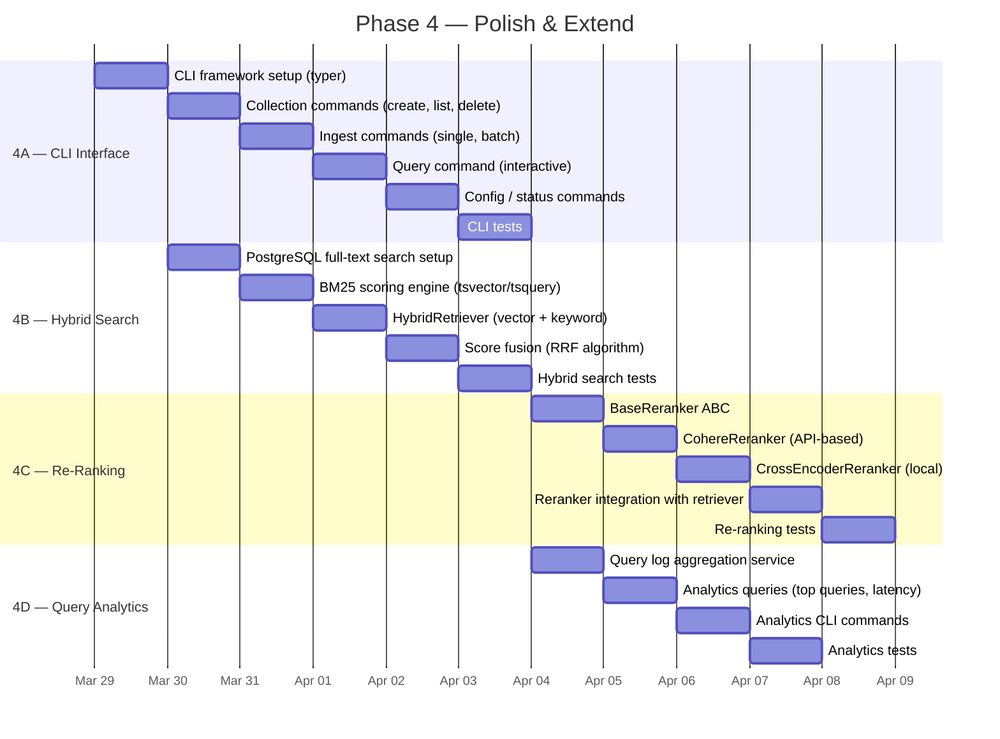
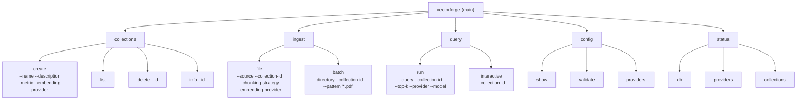
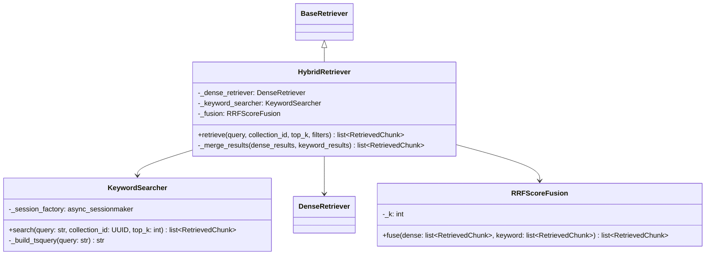
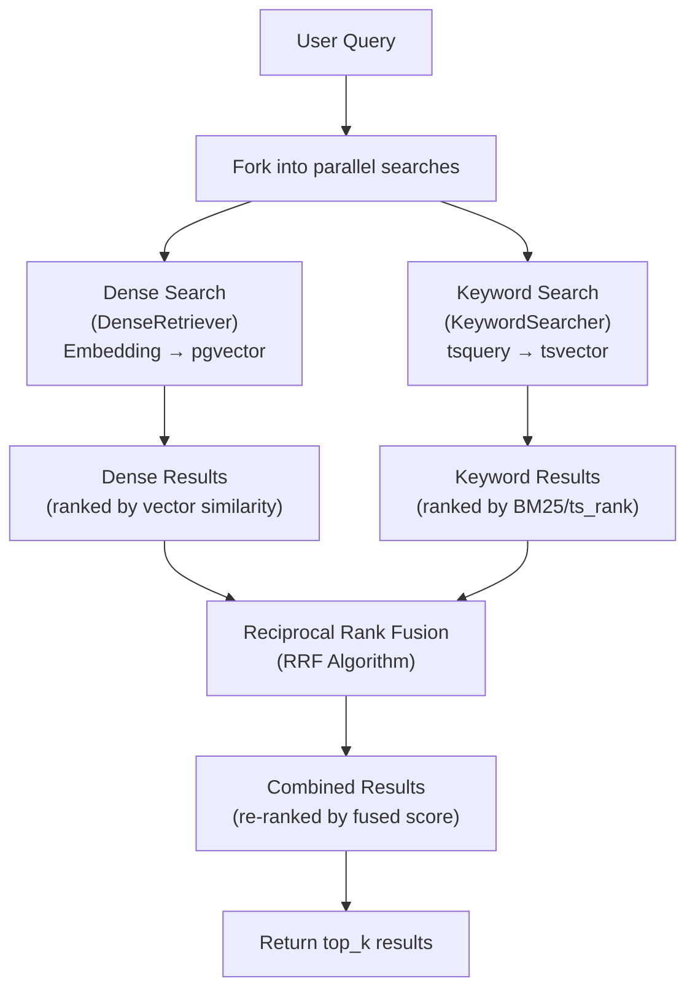
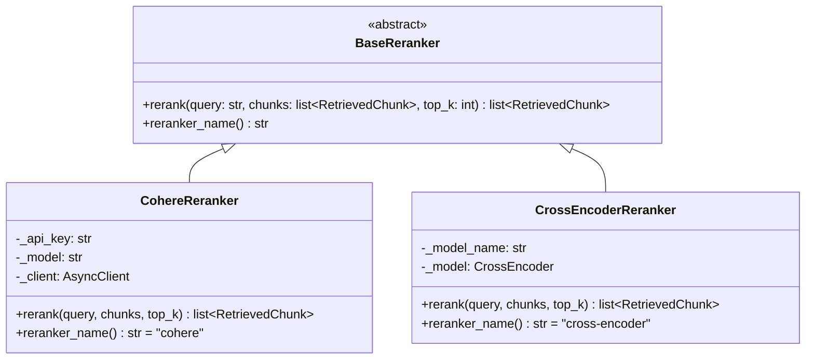
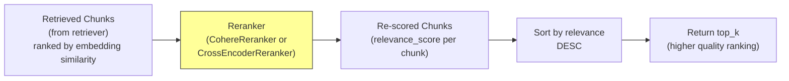
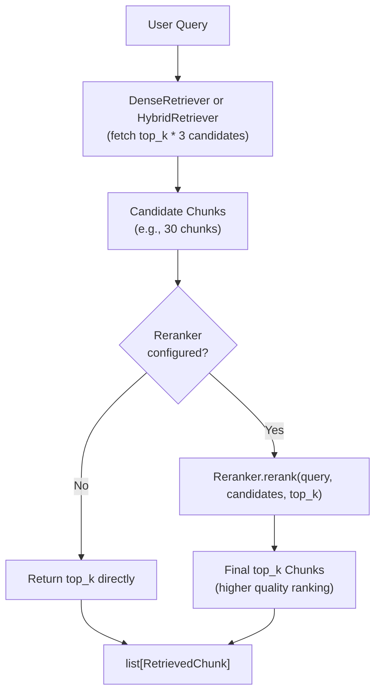
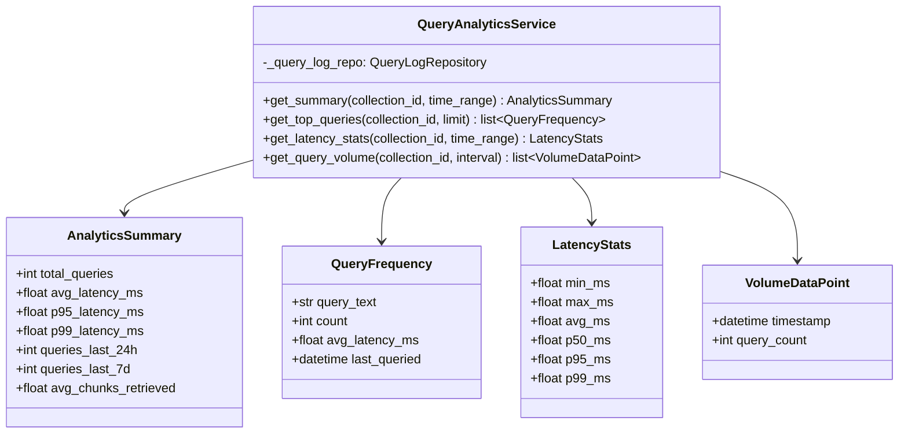
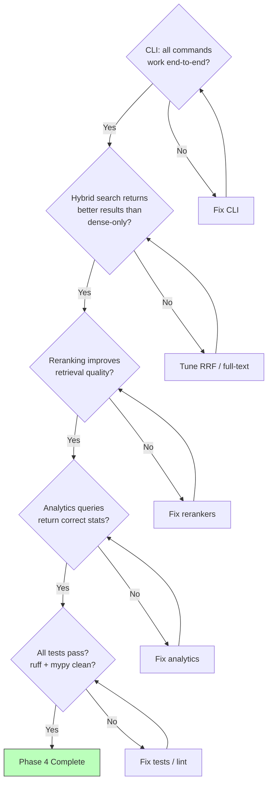

# Phase 4 — Polish & Extend

> **Goal**: Add CLI interface, hybrid search (vector + full-text), re-ranking, and query logging analytics — making VectorForge production-ready.
> **Estimated Duration**: ~12 days
> **Dependencies**: Phase 3 (RAG pipeline fully functional)

---

## Phase Timeline



---

## Stage 4A — CLI Interface

### What Gets Built

A command-line interface using `typer` that exposes all core VectorForge operations: collection management, document ingestion, querying, and status inspection.

### CLI Command Tree



### Algorithm: CLI Application Structure

```
ALGORITHM: CLIApplicationSetup

STRUCTURE:
  main_app = typer.Typer(name="vectorforge", help="VectorForge RAG Engine")

  collections_app = typer.Typer(help="Manage collections")
  ingest_app = typer.Typer(help="Ingest documents")
  query_app = typer.Typer(help="Query the RAG engine")
  config_app = typer.Typer(help="Configuration management")
  status_app = typer.Typer(help="System status")

  main_app.add_typer(collections_app, name="collections")
  main_app.add_typer(ingest_app, name="ingest")
  main_app.add_typer(query_app, name="query")
  main_app.add_typer(config_app, name="config")
  main_app.add_typer(status_app, name="status")

EXECUTION MODEL:
  All CLI commands use asyncio.run() to bridge sync CLI → async core.
  A shared helper creates the VectorForge engine instance with config loaded from ENV.
```

### Algorithm: Collection Commands

```
ALGORITHM: CollectionCLICommands

COMMAND: collections create
  ARGS: name (required), description (optional), metric (default: cosine),
        embedding_provider (optional), embedding_model (optional)
  FLOW:
    1. LOAD config from ENV
    2. CREATE engine instance
    3. collection = await engine.create_collection(
         name=name, description=description,
         embedding_config={"provider": provider, "model": model, "metric": metric},
       )
    4. PRINT: f"Created collection '{name}' (id={collection.id})"

COMMAND: collections list
  FLOW:
    1. collections = await engine.list_collections()
    2. PRINT table:
       | ID | Name | Documents | Metric | Created |

COMMAND: collections delete
  ARGS: id (required), force (flag, default: False)
  FLOW:
    1. IF not force: PROMPT confirmation
    2. await engine.delete_collection(id)
    3. PRINT: f"Deleted collection {id}"

COMMAND: collections info
  ARGS: id (required)
  FLOW:
    1. collection = await engine.get_collection(id)
    2. doc_count = await engine.count_documents(id)
    3. chunk_count = await engine.count_chunks(id)
    4. PRINT detailed info:
       Name, ID, Description, Metric, Embedding Provider/Model,
       Chunking Strategy, Document Count, Chunk Count, Created, Updated
```

### Algorithm: Ingest Commands

```
ALGORITHM: IngestCLICommands

COMMAND: ingest file
  ARGS: source (required), collection_id (required),
        chunking_strategy (optional), embedding_provider (optional)
  FLOW:
    1. VALIDATE source exists (file path or URL)
    2. doc = await engine.ingest(source, collection_id, ...)
    3. PRINT: f"Ingested '{source}': {chunk_count} chunks indexed"

COMMAND: ingest batch
  ARGS: directory (required), collection_id (required),
        pattern (default: "*"), recursive (flag)
  FLOW:
    1. GLOB files matching pattern in directory
    2. PRINT: f"Found {len(files)} files to ingest"
    3. FOR file IN files:
       TRY:
         doc = await engine.ingest(file, collection_id)
         PRINT: f"  ✓ {file.name} ({chunk_count} chunks)"
       CATCH:
         PRINT: f"  ✗ {file.name}: {error}"
    4. PRINT summary: f"{success} succeeded, {failed} failed"
```

### Algorithm: Query Commands

```
ALGORITHM: QueryCLICommands

COMMAND: query run
  ARGS: query (required), collection_id (required),
        top_k (default: 10), provider (optional), model (optional),
        show_sources (flag, default: True)
  FLOW:
    1. result = await engine.query(query, collection_id, ...)
    2. PRINT: f"\nAnswer:\n{result.answer}"
    3. IF show_sources AND result.sources:
       PRINT: f"\nSources ({len(result.sources)}):"
       FOR source IN result.sources:
         PRINT: f"  [{source.chunk_index}] {source.document_source} (score: {source.score:.3f})"
    4. PRINT: f"\nLatency: {result.total_latency_ms:.0f}ms"

COMMAND: query interactive
  ARGS: collection_id (required)
  FLOW:
    1. PRINT: "VectorForge Interactive Query (type 'exit' to quit)"
    2. LOOP:
       a. query = input("> ")
       b. IF query.lower() in ("exit", "quit", "q"): BREAK
       c. result = await engine.query(query, collection_id)
       d. PRINT answer and sources
```

### Algorithm: Status & Config Commands

```
ALGORITHM: StatusCLICommands

COMMAND: status db
  FLOW:
    1. TRY connect to PostgreSQL
    2. CHECK pgvector extension installed
    3. PRINT: "Database: Connected ({host}:{port}/{db})"
    4. PRINT: "pgvector: Installed (version {version})"
    5. OR PRINT: "Database: Connection failed ({error})"

COMMAND: config providers
  FLOW:
    1. LOAD provider registries
    2. FOR each embedding provider:
       PRINT: f"  Embedding: {name} ({'active' if registered else 'not configured'})"
    3. FOR each LLM provider:
       PRINT: f"  LLM: {name} ({'active' if registered else 'not configured'})"

COMMAND: config show
  FLOW:
    1. LOAD config (masking sensitive values: API keys → "sk-...****")
    2. PRINT config as formatted table
```

### Files Produced

| File | Purpose |
|------|---------|
| `vectorforge/cli/__init__.py` | CLI package init |
| `vectorforge/cli/main.py` | Main app + typer setup |
| `vectorforge/cli/collections.py` | Collection commands |
| `vectorforge/cli/ingest.py` | Ingest commands |
| `vectorforge/cli/query.py` | Query commands |
| `vectorforge/cli/config.py` | Config & status commands |
| `vectorforge/__main__.py` | `python -m vectorforge` entry point |
| `tests/unit/test_cli.py` | CLI unit tests (using typer.testing.CliRunner) |

---

## Stage 4B — Hybrid Search

### What Gets Built

PostgreSQL full-text search (tsvector/tsquery) combined with vector search using Reciprocal Rank Fusion (RRF) to produce better retrieval results.

### Hybrid Search Architecture



### Hybrid Search Flow



### Algorithm: HybridRetriever.retrieve

```
ALGORITHM: HybridRetrieval

METHOD retrieve(
  query: str,
  collection_id: UUID,
  top_k: int = 10,
  filters: dict | None = None,
  dense_weight: float = 0.7,
  keyword_weight: float = 0.3,
) → list[RetrievedChunk]:

  1. EXECUTE both searches in parallel (asyncio.gather):
     dense_results, keyword_results = await asyncio.gather(
       self._dense_retriever.retrieve(query, collection_id, top_k=top_k*2, filters=filters),
       self._keyword_searcher.search(query, collection_id, top_k=top_k*2),
     )
     NOTE: Fetch 2x top_k from each to give fusion enough candidates

  2. FUSE results:
     fused = self._fusion.fuse(
       dense_results, keyword_results,
       dense_weight=dense_weight,
       keyword_weight=keyword_weight,
     )

  3. RETURN fused[:top_k]
```

### Algorithm: KeywordSearcher

```
ALGORITHM: KeywordSearch

METHOD search(
  query: str,
  collection_id: UUID,
  top_k: int = 20,
) → list[RetrievedChunk]:

  1. BUILD tsquery:
     tsquery_str = self._build_tsquery(query)
     # "hello world" → "hello & world" (AND all terms)

  2. EXECUTE SQL:
     SELECT
       chunks.*,
       documents.source_uri,
       ts_rank(chunks.search_vector, to_tsquery('english', :tsquery)) AS rank
     FROM chunks
     JOIN documents ON documents.id = chunks.document_id
     WHERE documents.collection_id = :collection_id
       AND chunks.search_vector @@ to_tsquery('english', :tsquery)
     ORDER BY rank DESC
     LIMIT :top_k

  3. CONVERT to RetrievedChunk list with BM25 rank as score

METHOD _build_tsquery(query: str) → str:
  1. TOKENIZE query into words
  2. REMOVE common stop words
  3. JOIN with " & " (AND operator)
  4. RETURN tsquery string

DATABASE SETUP (migration required):
  1. ADD column: chunks.search_vector tsvector
  2. CREATE TRIGGER: auto-update tsvector on chunk insert/update:
     UPDATE chunks SET search_vector = to_tsvector('english', content)
  3. CREATE INDEX: GIN index on chunks.search_vector
```

### Algorithm: Reciprocal Rank Fusion (RRF)

```
ALGORITHM: ReciprocalRankFusion

METHOD fuse(
  dense_results: list[RetrievedChunk],
  keyword_results: list[RetrievedChunk],
  dense_weight: float = 0.7,
  keyword_weight: float = 0.3,
  k: int = 60,
) → list[RetrievedChunk]:
  """
  RRF formula: score(d) = Σ (weight / (k + rank(d)))
  where k is a constant (default 60, from original RRF paper)
  """

  1. BUILD rank maps:
     dense_ranks = {chunk.chunk.id: rank for rank, chunk in enumerate(dense_results, 1)}
     keyword_ranks = {chunk.chunk.id: rank for rank, chunk in enumerate(keyword_results, 1)}

  2. COLLECT all unique chunk IDs:
     all_chunk_ids = set(dense_ranks.keys()) | set(keyword_ranks.keys())

  3. COMPUTE RRF scores:
     scores = {}
     FOR chunk_id IN all_chunk_ids:
       score = 0.0
       IF chunk_id IN dense_ranks:
         score += dense_weight / (k + dense_ranks[chunk_id])
       IF chunk_id IN keyword_ranks:
         score += keyword_weight / (k + keyword_ranks[chunk_id])
       scores[chunk_id] = score

  4. BUILD chunk lookup:
     chunk_map = {}
     FOR chunk IN dense_results + keyword_results:
       IF chunk.chunk.id NOT IN chunk_map:
         chunk_map[chunk.chunk.id] = chunk

  5. SORT by RRF score (descending):
     sorted_ids = sorted(scores.keys(), key=lambda cid: scores[cid], reverse=True)

  6. BUILD result list:
     result = []
     FOR chunk_id IN sorted_ids:
       chunk = chunk_map[chunk_id]
       chunk.score = scores[chunk_id]  # replace with fused score
       result.append(chunk)

  7. RETURN result
```

### Full-Text Search Setup (Migration)

```
MIGRATION: AddFullTextSearchSupport

1. ADD column to chunks table:
   ALTER TABLE chunks
   ADD COLUMN search_vector tsvector
   GENERATED ALWAYS AS (to_tsvector('english', content)) STORED;

2. CREATE GIN index:
   CREATE INDEX ix_chunks_search_vector
   ON chunks USING GIN (search_vector);

3. This is a GENERATED COLUMN — automatically updated when content changes.
   No trigger needed (PostgreSQL 12+ feature).
```

### Files Produced

| File | Purpose |
|------|---------|
| `vectorforge/retriever/hybrid.py` | `HybridRetriever` |
| `vectorforge/retriever/keyword.py` | `KeywordSearcher` |
| `vectorforge/retriever/fusion.py` | `RRFScoreFusion` |
| `migrations/versions/xxx_add_fulltext_search.py` | Alembic migration for tsvector |
| `tests/unit/test_hybrid.py` | Hybrid search unit tests |
| `tests/integration/test_hybrid.py` | Hybrid search integration tests |

---

## Stage 4C — Re-Ranking

### What Gets Built

`BaseReranker` ABC with two implementations: `CohereReranker` (API-based, using Cohere's rerank endpoint) and `CrossEncoderReranker` (local, using sentence-transformers cross-encoder models).

### Reranker Architecture



### Re-Ranking Flow



### Algorithm: CohereReranker

```
ALGORITHM: CohereReranking

INITIALIZATION:
  1. api_key = VECTORFORGE_COHERE_API_KEY (required)
  2. model = "rerank-v3.5" (default)
  3. CREATE async HTTP client

METHOD rerank(
  query: str,
  chunks: list[RetrievedChunk],
  top_k: int = 10,
) → list[RetrievedChunk]:

  1. VALIDATE:
     IF len(chunks) == 0: RETURN []
     IF len(chunks) <= top_k: top_k = len(chunks)

  2. BUILD request:
     documents = [chunk.chunk.text for chunk in chunks]
     payload = {
       "model": self._model,
       "query": query,
       "documents": documents,
       "top_n": top_k,
       "return_documents": False,  # we have them already
     }

  3. CALL API:
     response = await self._client.post(
       "https://api.cohere.com/v2/rerank",
       json=payload,
     )

  4. PARSE response:
     results = response.json()["results"]
     # Each result: { "index": int, "relevance_score": float }

  5. BUILD reranked list:
     reranked = []
     FOR result IN results:
       original_chunk = chunks[result["index"]]
       original_chunk.score = result["relevance_score"]
       reranked.append(original_chunk)

  6. SORT by relevance_score descending (API should return sorted, but verify)
  7. RETURN reranked[:top_k]
```

### Algorithm: CrossEncoderReranker

```
ALGORITHM: CrossEncoderReranking

INITIALIZATION:
  1. model_name = "cross-encoder/ms-marco-MiniLM-L-6-v2" (default)
  2. LAZY LOAD model:
     self._model = None  # loaded on first use

METHOD _load_model() → CrossEncoder:
  1. IF self._model is None:
     from sentence_transformers import CrossEncoder
     self._model = CrossEncoder(self._model_name)
     LOG: f"Loaded cross-encoder model: {self._model_name}"
  2. RETURN self._model

METHOD rerank(
  query: str,
  chunks: list[RetrievedChunk],
  top_k: int = 10,
) → list[RetrievedChunk]:

  1. VALIDATE (same as CohereReranker)

  2. LOAD model:
     model = self._load_model()

  3. BUILD query-document pairs:
     pairs = [(query, chunk.chunk.text) for chunk in chunks]

  4. SCORE pairs:
     scores = model.predict(pairs)
     # Returns: list[float] — relevance scores

  5. ASSIGN scores to chunks:
     FOR i, chunk IN enumerate(chunks):
       chunk.score = float(scores[i])

  6. SORT by score descending
  7. RETURN sorted_chunks[:top_k]

NOTE: CrossEncoder runs locally — no API key needed, but slower than
      bi-encoder retrieval. Use for re-ranking a small candidate set (20-100).
      Model is lazy-loaded to avoid startup delay when reranking isn't used.
```

### Reranker Integration with Retriever



### Algorithm: Retriever with Reranker

```
ALGORITHM: RetrieverWithReranking

NOTE: This modifies the DenseRetriever/HybridRetriever to optionally
      apply re-ranking after initial retrieval.

METHOD retrieve_and_rerank(
  query: str,
  collection_id: UUID,
  top_k: int = 10,
  reranker: BaseReranker | None = None,
  rerank_candidates: int = 30,
) → list[RetrievedChunk]:

  1. SET candidate_count:
     IF reranker is not None:
       fetch_k = max(rerank_candidates, top_k * 3)
     ELSE:
       fetch_k = top_k

  2. RETRIEVE candidates:
     candidates = await self.retrieve(query, collection_id, top_k=fetch_k)

  3. IF reranker is not None AND len(candidates) > 0:
     reranked = await reranker.rerank(query, candidates, top_k=top_k)
     RETURN reranked

  4. RETURN candidates[:top_k]
```

### Files Produced

| File | Purpose |
|------|---------|
| `vectorforge/retriever/reranker.py` | `BaseReranker` ABC |
| `vectorforge/retriever/rerankers/cohere.py` | `CohereReranker` |
| `vectorforge/retriever/rerankers/cross_encoder.py` | `CrossEncoderReranker` |
| `tests/unit/test_reranker.py` | Reranker unit tests |

---

## Stage 4D — Query Analytics

### What Gets Built

A `QueryAnalyticsService` that aggregates data from the `QUERY_LOGS` table to provide insights: most common queries, average latency, retrieval quality metrics.

### Analytics Architecture



### Algorithm: QueryAnalyticsService

```
ALGORITHM: QueryAnalytics

METHOD get_summary(
  collection_id: UUID,
  time_range: tuple[datetime, datetime] | None = None,
) → AnalyticsSummary:

  1. BASE query:
     SELECT
       COUNT(*) AS total_queries,
       AVG(latency_ms) AS avg_latency,
       PERCENTILE_CONT(0.95) WITHIN GROUP (ORDER BY latency_ms) AS p95,
       PERCENTILE_CONT(0.99) WITHIN GROUP (ORDER BY latency_ms) AS p99,
       AVG(jsonb_array_length(retrieved_chunk_ids)) AS avg_chunks
     FROM query_logs
     WHERE collection_id = :collection_id

  2. IF time_range provided:
     APPEND: AND created_at BETWEEN :start AND :end

  3. ADDITIONAL queries:
     last_24h = COUNT WHERE created_at > NOW() - INTERVAL '24 hours'
     last_7d = COUNT WHERE created_at > NOW() - INTERVAL '7 days'

  4. RETURN AnalyticsSummary(...)

METHOD get_top_queries(
  collection_id: UUID,
  limit: int = 20,
) → list[QueryFrequency]:

  1. EXECUTE:
     SELECT
       query_text,
       COUNT(*) AS count,
       AVG(latency_ms) AS avg_latency,
       MAX(created_at) AS last_queried
     FROM query_logs
     WHERE collection_id = :collection_id
     GROUP BY query_text
     ORDER BY count DESC
     LIMIT :limit

  2. RETURN list of QueryFrequency

METHOD get_latency_stats(
  collection_id: UUID,
  time_range: tuple[datetime, datetime] | None = None,
) → LatencyStats:

  1. EXECUTE:
     SELECT
       MIN(latency_ms),
       MAX(latency_ms),
       AVG(latency_ms),
       PERCENTILE_CONT(0.50) WITHIN GROUP (ORDER BY latency_ms) AS p50,
       PERCENTILE_CONT(0.95) WITHIN GROUP (ORDER BY latency_ms) AS p95,
       PERCENTILE_CONT(0.99) WITHIN GROUP (ORDER BY latency_ms) AS p99
     FROM query_logs
     WHERE collection_id = :collection_id

  2. RETURN LatencyStats(...)

METHOD get_query_volume(
  collection_id: UUID,
  interval: str = "hour",   # "hour" | "day" | "week"
) → list[VolumeDataPoint]:

  1. EXECUTE:
     SELECT
       date_trunc(:interval, created_at) AS bucket,
       COUNT(*) AS query_count
     FROM query_logs
     WHERE collection_id = :collection_id
     GROUP BY bucket
     ORDER BY bucket ASC

  2. RETURN list of VolumeDataPoint
```

### Analytics CLI Commands

```
ALGORITHM: AnalyticsCLICommands

COMMAND: vectorforge analytics summary --collection-id <UUID>
  FLOW:
    1. summary = await analytics.get_summary(collection_id)
    2. PRINT table:
       | Metric | Value |
       | Total Queries | 1,234 |
       | Avg Latency | 245ms |
       | p95 Latency | 480ms |
       | Last 24h | 56 queries |

COMMAND: vectorforge analytics top-queries --collection-id <UUID> --limit 10
  FLOW:
    1. queries = await analytics.get_top_queries(collection_id, limit)
    2. PRINT table:
       | Query | Count | Avg Latency | Last Queried |
```

### Files Produced

| File | Purpose |
|------|---------|
| `vectorforge/analytics/service.py` | `QueryAnalyticsService` |
| `vectorforge/analytics/types.py` | `AnalyticsSummary`, `QueryFrequency`, `LatencyStats`, `VolumeDataPoint` |
| `vectorforge/cli/analytics.py` | Analytics CLI commands |
| `tests/unit/test_analytics.py` | Analytics unit tests |

---

## Monitoring Instrumentation — Phase 4

### Overview

Phase 4 adds hybrid search, re-ranking, and analytics. Each new component is instrumented, and the CLI gains a `status` command that surfaces runtime health and metrics.

### Metrics Emitted per Component

| Component | Metric Name | Type | Tags | Description |
|-----------|-------------|------|------|-------------|
| **Keyword Search** | `retriever.keyword.duration_ms` | histogram | — | Full-text search latency |
| **Keyword Search** | `retriever.keyword.results` | histogram | — | BM25 results per query |
| **Hybrid Retriever** | `retriever.hybrid.duration_ms` | histogram | — | Combined retrieval latency |
| **Hybrid Retriever** | `retriever.hybrid.calls` | counter | — | Total hybrid search invocations |
| **Score Fusion** | `retriever.fusion.duration_ms` | histogram | `algorithm` | RRF fusion compute time |
| **Score Fusion** | `retriever.fusion.input_results` | histogram | `source` | Results per source (dense/keyword) |
| **Score Fusion** | `retriever.fusion.output_results` | histogram | — | Final fused result count |
| **Reranker** | `reranker.rerank.duration_ms` | histogram | `reranker_type` | Re-ranking latency |
| **Reranker** | `reranker.rerank.calls` | counter | `reranker_type` | Total rerank invocations |
| **Reranker** | `reranker.rerank.errors` | counter | `reranker_type`, `error_type` | Rerank failures |
| **Reranker** | `reranker.input_count` | histogram | `reranker_type` | Chunks in before reranking |
| **Reranker** | `reranker.output_count` | histogram | `reranker_type` | Chunks out after reranking |
| **Reranker** | `reranker.score_delta` | histogram | `reranker_type` | Average score change after reranking |

### Algorithm: HybridRetriever Instrumentation

```
ALGORITHM: InstrumentedHybridRetriever

WITHIN search() METHOD (decorated with @instrument):
  1. @instrument handles: retriever.hybrid.duration_ms, calls, errors

  2. DENSE ARM:
     dense_start = perf_counter()
     dense_results = await dense_retriever.search(query, top_k)
     metrics.observe("retriever.search.duration_ms", elapsed, tags={"retriever_type": "dense"})
     metrics.observe("retriever.fusion.input_results", len(dense_results), tags={"source": "dense"})

  3. KEYWORD ARM:
     kw_start = perf_counter()
     keyword_results = await keyword_searcher.search(query, top_k)
     metrics.observe("retriever.keyword.duration_ms", elapsed)
     metrics.observe("retriever.fusion.input_results", len(keyword_results), tags={"source": "keyword"})

  4. FUSION:
     fusion_start = perf_counter()
     fused = rrf_fusion.fuse(dense_results, keyword_results)
     metrics.observe("retriever.fusion.duration_ms", elapsed, tags={"algorithm": "rrf"})
     metrics.observe("retriever.fusion.output_results", len(fused))

  5. RERANKING (if configured):
     rerank_start = perf_counter()
     reranked = await reranker.rerank(query, fused, top_n)
     metrics.observe("reranker.rerank.duration_ms", elapsed, tags={"reranker_type": reranker.name})
     metrics.observe("reranker.input_count", len(fused), tags={"reranker_type": reranker.name})
     metrics.observe("reranker.output_count", len(reranked), tags={"reranker_type": reranker.name})
```

### CLI Status Command

```
ALGORITHM: StatusCLICommand

COMMAND: vectorforge status
  FLOW:
    1. health = await health_checker.check_all(timeout=5.0)

    2. PRINT system health:
       System Status: ✅ healthy | ⚠️ degraded | ❌ unhealthy

    3. PRINT component table:
       | Component        | Status  | Latency | Message          |
       | database         | healthy | 2ms     |                  |
       | pgvector         | healthy | 1ms     | v0.7.0           |
       | embedding.voyage | healthy | 45ms    |                  |
       | llm.openai       | healthy | 120ms   |                  |

    4. IF --metrics flag:
       snapshot = metrics_collector.snapshot()
       PRINT key metrics:
       | Metric                         | Value       |
       | pipeline.query.calls           | 1,234       |
       | pipeline.query.duration_ms p50 | 245ms       |
       | pipeline.query.duration_ms p95 | 480ms       |
       | ingestion.documents_processed  | 5,678       |
       | llm.tokens_output (total)      | 2,345,678   |

COMMAND: vectorforge status --component database
  FLOW:
    1. result = await health_checker.check_one("database", timeout=5.0)
    2. PRINT detailed component health with latency and message
```

### Reranker Health Probes

```
ALGORITHM: RerankerHealthProbes

PROBE: cohere_reranker_health_probe
  1. CALL Cohere rerank API with minimal test data
  2. IF success → healthy
  3. IF error → unhealthy with message

PROBE: cross_encoder_reranker_health_probe
  1. LOAD model (should already be cached in memory)
  2. SCORE a trivial query-document pair
  3. IF success → healthy
  4. IF error → unhealthy with message

REGISTRATION: Each reranker registers its probe during __init__():
  health_checker.register(f"reranker.{self.name}", self._health_probe)
```

---

## Phase 4 Exit Criteria



---

## Complete File Inventory — Phase 4

| # | File | Stage | Purpose |
|---|------|-------|---------|
| 1 | `vectorforge/cli/__init__.py` | 4A | CLI package |
| 2 | `vectorforge/cli/main.py` | 4A | Main app + typer setup |
| 3 | `vectorforge/cli/collections.py` | 4A | Collection commands |
| 4 | `vectorforge/cli/ingest.py` | 4A | Ingest commands |
| 5 | `vectorforge/cli/query.py` | 4A | Query commands |
| 6 | `vectorforge/cli/config.py` | 4A | Config & status commands |
| 7 | `vectorforge/__main__.py` | 4A | `python -m vectorforge` entry |
| 8 | `vectorforge/retriever/hybrid.py` | 4B | `HybridRetriever` |
| 9 | `vectorforge/retriever/keyword.py` | 4B | `KeywordSearcher` (tsvector) |
| 10 | `vectorforge/retriever/fusion.py` | 4B | `RRFScoreFusion` |
| 11 | `vectorforge/retriever/reranker.py` | 4C | `BaseReranker` ABC |
| 12 | `vectorforge/retriever/rerankers/cohere.py` | 4C | `CohereReranker` |
| 13 | `vectorforge/retriever/rerankers/cross_encoder.py` | 4C | `CrossEncoderReranker` |
| 14 | `vectorforge/analytics/service.py` | 4D | `QueryAnalyticsService` |
| 15 | `vectorforge/analytics/types.py` | 4D | Analytics data models |
| 16 | `vectorforge/cli/analytics.py` | 4D | Analytics CLI commands |
| 17 | `migrations/versions/xxx_add_fulltext_search.py` | 4B | tsvector migration |
| 18 | `tests/unit/test_cli.py` | 4A | CLI tests |
| 19 | `tests/unit/test_hybrid.py` | 4B | Hybrid search tests |
| 20 | `tests/unit/test_reranker.py` | 4C | Reranker tests |
| 21 | `tests/unit/test_analytics.py` | 4D | Analytics tests |
| 22 | `tests/integration/test_hybrid.py` | 4B | Hybrid search integration |
