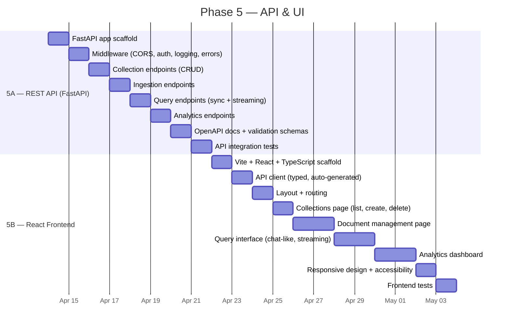
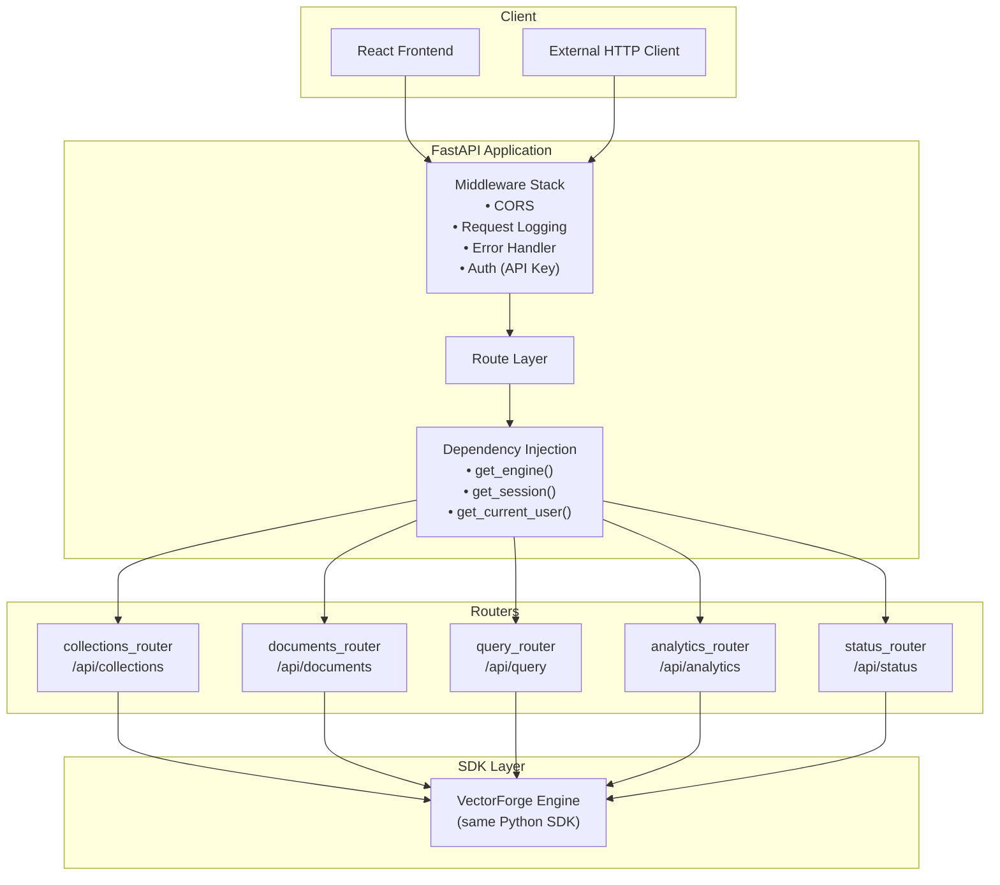
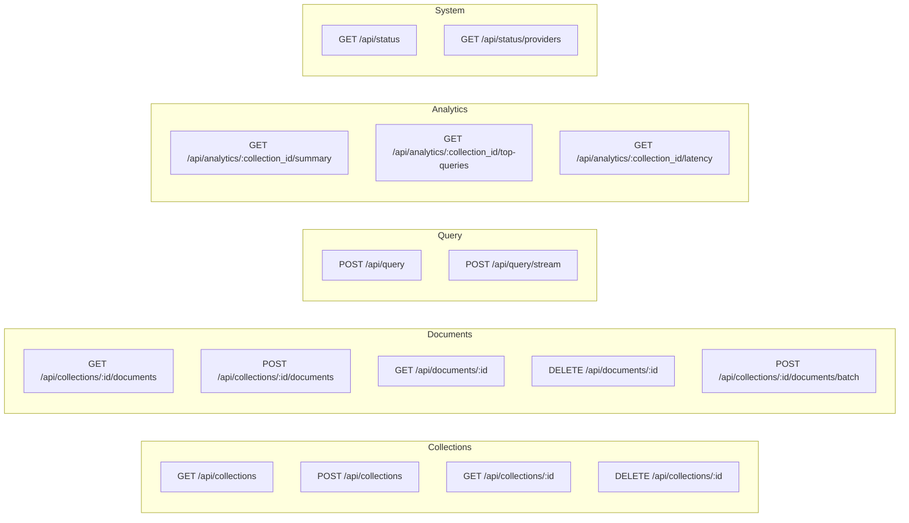
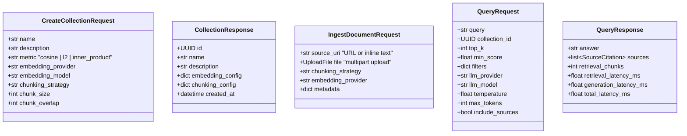
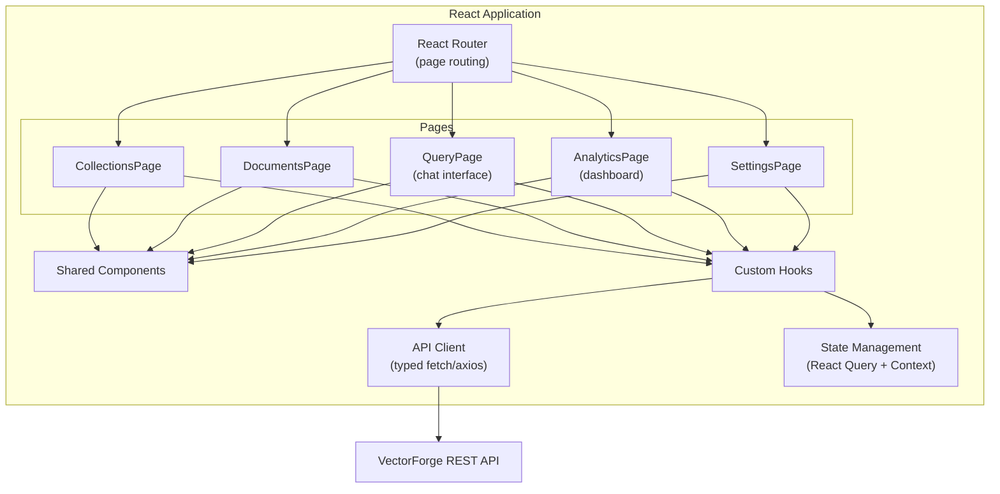
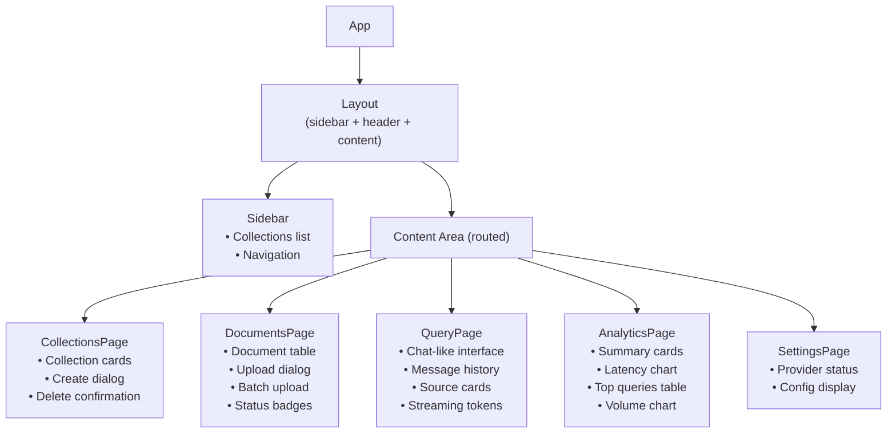
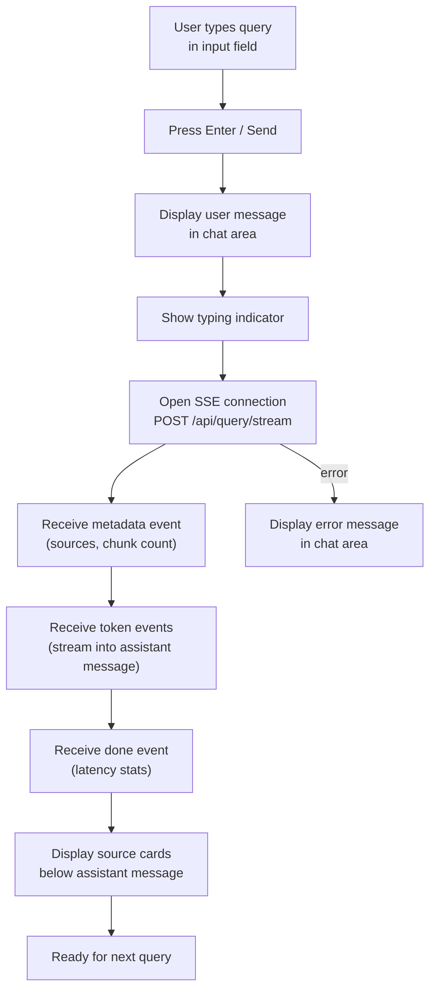
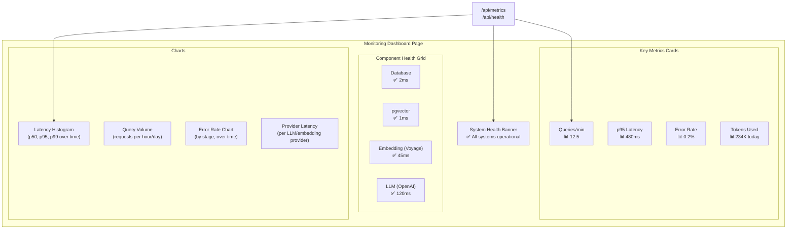
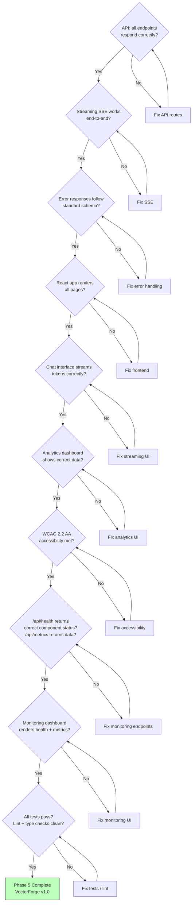

# Phase 5 — API & UI

> **Goal**: Expose VectorForge as a REST API (FastAPI) and build a React frontend for browser-based interaction.
> **Estimated Duration**: ~15 days
> **Dependencies**: Phase 4 (CLI, hybrid search, re-ranking, analytics all functional)

---

## Phase Timeline



---

## Stage 5A — REST API (FastAPI)

### What Gets Built

A FastAPI application that wraps the Python SDK, exposing all VectorForge operations as RESTful HTTP endpoints with proper authentication, error handling, and OpenAPI documentation.

### API Architecture



### API Endpoint Map



### Endpoint Specifications

#### Collections

| Method | Path | Request Body | Response | Status |
|--------|------|-------------|----------|--------|
| `GET` | `/api/collections` | - | `{ collections: [...] }` | 200 |
| `POST` | `/api/collections` | `CreateCollectionRequest` | `CollectionResponse` | 201 |
| `GET` | `/api/collections/:id` | - | `CollectionDetailResponse` | 200 / 404 |
| `DELETE` | `/api/collections/:id` | - | `{ message: "deleted" }` | 200 / 404 |

#### Documents

| Method | Path | Request Body | Response | Status |
|--------|------|-------------|----------|--------|
| `GET` | `/api/collections/:id/documents` | Query: `?status=...&limit=...&offset=...` | `{ documents: [...], total: N }` | 200 |
| `POST` | `/api/collections/:id/documents` | `IngestDocumentRequest` (multipart or JSON) | `DocumentResponse` | 201 |
| `POST` | `/api/collections/:id/documents/batch` | `BatchIngestRequest` (multipart) | `{ results: [...], errors: [...] }` | 200 |
| `GET` | `/api/documents/:id` | - | `DocumentDetailResponse` | 200 / 404 |
| `DELETE` | `/api/documents/:id` | - | `{ message: "deleted" }` | 200 / 404 |

#### Query

| Method | Path | Request Body | Response | Status |
|--------|------|-------------|----------|--------|
| `POST` | `/api/query` | `QueryRequest` | `QueryResponse` | 200 |
| `POST` | `/api/query/stream` | `QueryRequest` | SSE stream | 200 |

#### Analytics

| Method | Path | Query Params | Response | Status |
|--------|------|-------------|----------|--------|
| `GET` | `/api/analytics/:id/summary` | `?from=...&to=...` | `AnalyticsSummaryResponse` | 200 |
| `GET` | `/api/analytics/:id/top-queries` | `?limit=20` | `{ queries: [...] }` | 200 |
| `GET` | `/api/analytics/:id/latency` | `?from=...&to=...` | `LatencyStatsResponse` | 200 |

### Request/Response Schemas



### Algorithm: FastAPI Application Setup

```
ALGORITHM: FastAPISetup

FUNCTION create_app() → FastAPI:
  1. CREATE FastAPI instance:
     app = FastAPI(
       title = "VectorForge API",
       version = "0.1.0",
       description = "RAG Engine REST API",
     )

  2. ADD middleware (order matters — last added = first executed):
     a. CORSMiddleware:
        allow_origins = config.api.cors_origins or ["*"]
        allow_methods = ["*"]
        allow_headers = ["*"]
     b. RequestLoggingMiddleware:
        LOG each request: method, path, status_code, latency_ms
     c. ErrorHandlerMiddleware:
        CATCH VectorForgeError → 400/404/422 JSON response
        CATCH unexpected errors → 500 JSON response

  3. SETUP lifespan (startup/shutdown):
     @asynccontextmanager
     async def lifespan(app):
       # Startup
       engine = await VectorForge.create(config)
       app.state.engine = engine
       yield
       # Shutdown
       await engine.close()

  4. INCLUDE routers:
     app.include_router(collections_router, prefix="/api")
     app.include_router(documents_router, prefix="/api")
     app.include_router(query_router, prefix="/api")
     app.include_router(analytics_router, prefix="/api")
     app.include_router(status_router, prefix="/api")

  5. RETURN app
```

### Algorithm: Dependency Injection

```
ALGORITHM: DependencyInjection

FUNCTION get_engine(request: Request) → VectorForge:
  """Inject the VectorForge engine from app state."""
  RETURN request.app.state.engine

FUNCTION get_session(engine = Depends(get_engine)) → AsyncSession:
  """Inject an async DB session."""
  async with engine.session_factory() as session:
    YIELD session

FUNCTION verify_api_key(
  x_api_key: str = Header(...),
) → str:
  """Simple API key auth (optional, configurable)."""
  IF config.api.require_auth:
    IF x_api_key != config.api.api_key:
      RAISE HTTPException(401, "Invalid API key")
  RETURN x_api_key

NOTE: Auth is optional — disabled by default for development.
      In production, set VECTORFORGE_API_KEY and VECTORFORGE_API_AUTH_REQUIRED=true.
```

### Algorithm: Query Streaming (SSE)

```
ALGORITHM: StreamingQueryEndpoint

ENDPOINT: POST /api/query/stream

FLOW:
  1. PARSE request body → QueryRequest
  2. VALIDATE collection exists
  3. EXECUTE retrieval + context building (same as non-streaming)
  4. STREAM LLM response via Server-Sent Events:

  async def event_generator():
    # Send retrieval metadata first
    YIELD f"data: {json.dumps({'type': 'metadata', 'sources': sources})}\n\n"

    # Stream LLM tokens
    async for token in engine.query_stream(query, collection_id, config):
      YIELD f"data: {json.dumps({'type': 'token', 'content': token})}\n\n"

    # Send completion signal
    YIELD f"data: {json.dumps({'type': 'done', 'latency_ms': total_latency})}\n\n"

  RETURN StreamingResponse(
    event_generator(),
    media_type="text/event-stream",
  )
```

### Algorithm: Error Handling Middleware

```
ALGORITHM: ErrorHandlerMiddleware

MAPPING VectorForge exceptions → HTTP responses:
  NotFoundError         → 404 {"error": "not_found",    "message": str(e)}
  ValidationError       → 422 {"error": "validation",   "message": str(e), "details": [...]}
  ConfigurationError    → 500 {"error": "config",       "message": str(e)}
  EmbeddingError        → 502 {"error": "embedding",    "message": str(e)}
  LLMError              → 502 {"error": "llm",          "message": str(e)}
  ProviderNotFoundError → 400 {"error": "provider",     "message": str(e)}
  DatabaseError         → 500 {"error": "database",     "message": "Internal database error"}
  Exception (catch-all) → 500 {"error": "internal",     "message": "An unexpected error occurred"}

ALL error responses follow the same schema:
  {
    "error": str,        # machine-readable error code
    "message": str,      # human-readable message
    "details": [...],    # optional — validation error details
    "request_id": str,   # for debugging / support
  }
```

### Files Produced

| File | Purpose |
|------|---------|
| `vectorforge/api/__init__.py` | API package |
| `vectorforge/api/app.py` | FastAPI app factory + lifespan |
| `vectorforge/api/dependencies.py` | Dependency injection (engine, session, auth) |
| `vectorforge/api/middleware.py` | CORS, logging, error handler middleware |
| `vectorforge/api/routes/collections.py` | Collection CRUD endpoints |
| `vectorforge/api/routes/documents.py` | Document ingest/delete endpoints |
| `vectorforge/api/routes/query.py` | Query + streaming endpoints |
| `vectorforge/api/routes/analytics.py` | Analytics endpoints |
| `vectorforge/api/routes/status.py` | Health/status endpoints |
| `vectorforge/api/schemas.py` | Pydantic request/response schemas |
| `tests/integration/test_api.py` | API integration tests (httpx + TestClient) |

---

## Stage 5B — React Frontend

### What Gets Built

A single-page React application with TypeScript, Vite, and Tailwind CSS that provides a browser-based interface for all VectorForge operations.

### Frontend Architecture



### Page Component Tree



### Frontend Directory Structure

```
frontend/
├── public/
│   └── favicon.svg
├── src/
│   ├── main.tsx                      # App entry point
│   ├── App.tsx                       # Root component + router
│   ├── api/
│   │   ├── client.ts                 # Axios/fetch client (base URL, auth)
│   │   ├── collections.ts            # Collection API calls
│   │   ├── documents.ts              # Document API calls
│   │   ├── query.ts                  # Query API calls (incl. SSE stream)
│   │   └── analytics.ts              # Analytics API calls
│   ├── components/
│   │   ├── ui/                       # Base UI components
│   │   │   ├── Button.tsx
│   │   │   ├── Input.tsx
│   │   │   ├── Dialog.tsx
│   │   │   ├── Table.tsx
│   │   │   ├── Card.tsx
│   │   │   ├── Badge.tsx
│   │   │   ├── Spinner.tsx
│   │   │   └── Toast.tsx
│   │   ├── layout/
│   │   │   ├── Layout.tsx
│   │   │   ├── Sidebar.tsx
│   │   │   └── Header.tsx
│   │   └── features/
│   │       ├── CollectionCard.tsx
│   │       ├── DocumentRow.tsx
│   │       ├── ChatMessage.tsx
│   │       ├── SourceCard.tsx
│   │       ├── UploadDialog.tsx
│   │       └── LatencyChart.tsx
│   ├── hooks/
│   │   ├── useCollections.ts         # React Query: collections CRUD
│   │   ├── useDocuments.ts           # React Query: documents CRUD
│   │   ├── useQuery.ts               # React Query: RAG query (with SSE)
│   │   └── useAnalytics.ts           # React Query: analytics fetch
│   ├── pages/
│   │   ├── CollectionsPage.tsx
│   │   ├── DocumentsPage.tsx
│   │   ├── QueryPage.tsx
│   │   ├── AnalyticsPage.tsx
│   │   └── SettingsPage.tsx
│   ├── types/
│   │   ├── api.ts                    # API request/response types
│   │   └── models.ts                 # Domain model types
│   └── utils/
│       ├── format.ts                 # Date, number formatters
│       └── stream.ts                 # SSE stream helper
├── index.html
├── package.json
├── tsconfig.json
├── tailwind.config.ts
└── vite.config.ts
```

### Query Page — Chat Interface Flow



### Algorithm: SSE Stream Client (Frontend)

```
ALGORITHM: SSEStreamClient

FUNCTION streamQuery(
  query: string,
  collectionId: string,
  config: QueryConfig,
  callbacks: StreamCallbacks,
) → void:
  """
  StreamCallbacks:
    onMetadata(sources: SourceCitation[]) → void
    onToken(token: string) → void
    onDone(latency: number) → void
    onError(error: Error) → void
  """

  1. BUILD request:
     body = JSON.stringify({
       query, collection_id: collectionId, ...config
     })

  2. OPEN fetch with streaming:
     response = await fetch("/api/query/stream", {
       method: "POST",
       headers: { "Content-Type": "application/json" },
       body: body,
     })

  3. READ stream line-by-line:
     reader = response.body.getReader()
     buffer = ""

     WHILE true:
       { value, done } = await reader.read()
       IF done: BREAK

       buffer += decode(value)
       WHILE buffer contains "\n\n":
         line = extract up to "\n\n"
         IF line starts with "data: ":
           event = JSON.parse(line.slice(6))
           SWITCH event.type:
             "metadata" → callbacks.onMetadata(event.sources)
             "token"    → callbacks.onToken(event.content)
             "done"     → callbacks.onDone(event.latency_ms)
             "error"    → callbacks.onError(new Error(event.message))
```

### Algorithm: React Query Hooks Pattern

```
ALGORITHM: ReactQueryHooksPattern

HOOK: useCollections()
  1. LIST: useQuery({
       queryKey: ["collections"],
       queryFn: () => api.collections.list(),
     })
  2. CREATE: useMutation({
       mutationFn: (data) => api.collections.create(data),
       onSuccess: () => queryClient.invalidateQueries(["collections"]),
     })
  3. DELETE: useMutation({
       mutationFn: (id) => api.collections.delete(id),
       onSuccess: () => queryClient.invalidateQueries(["collections"]),
     })

HOOK: useStreamQuery()
  1. STATE: messages (chat history), isStreaming (boolean)
  2. FUNCTION sendQuery(query, collectionId):
     a. ADD user message to state
     b. ADD empty assistant message to state
     c. SET isStreaming = true
     d. CALL streamQuery(query, collectionId, config, {
          onToken: (token) → APPEND token to last assistant message,
          onMetadata: (sources) → SET sources on last assistant message,
          onDone: (latency) → SET isStreaming = false,
          onError: (error) → SHOW error toast,
        })

HOOK: useAnalytics(collectionId: string)
  1. SUMMARY: useQuery({
       queryKey: ["analytics", "summary", collectionId],
       queryFn: () => api.analytics.summary(collectionId),
       refetchInterval: 30000,  // auto-refresh every 30s
     })
  2. TOP_QUERIES: useQuery(...)
  3. LATENCY: useQuery(...)
```

### Key UI Components

#### Chat Interface Layout

```
┌──────────────────────────────────────────────────────────┐
│ VectorForge         │  Query: [collection-name ▼]        │
├──────────┬───────────────────────────────────────────────┤
│          │                                               │
│ Sidebar  │  ┌─────────────────────────────────────────┐  │
│          │  │ 👤 What is retrieval-augmented gen...    │  │
│ • Collec │  ├─────────────────────────────────────────┤  │
│ • Query  │  │ 🤖 Retrieval-Augmented Generation       │  │
│ • Docs   │  │    (RAG) is a technique that...         │  │
│ • Stats  │  │                                         │  │
│ • Config │  │  Sources:                               │  │
│          │  │  [1] docs/rag-overview.md (0.92)        │  │
│          │  │  [2] papers/lewis2020.pdf (0.87)        │  │
│          │  ├─────────────────────────────────────────┤  │
│          │  │                                         │  │
│          │  │  💬 Type your question...         [Send] │  │
│          │  └─────────────────────────────────────────┘  │
└──────────┴───────────────────────────────────────────────┘
```

#### Analytics Dashboard Layout

```
┌──────────────────────────────────────────────────────────┐
│ Analytics: [collection-name]                             │
├──────────────────────────────────────────────────────────┤
│  ┌──────────┐  ┌──────────┐  ┌──────────┐  ┌─────────┐ │
│  │ Total    │  │ Avg      │  │ p95      │  │ Last    │ │
│  │ Queries  │  │ Latency  │  │ Latency  │  │ 24h     │ │
│  │  1,234   │  │  245ms   │  │  480ms   │  │  56     │ │
│  └──────────┘  └──────────┘  └──────────┘  └─────────┘ │
│                                                          │
│  ┌────────────────────────┐  ┌────────────────────────┐ │
│  │ Query Volume (7d)      │  │ Latency Distribution   │ │
│  │  ▐                     │  │                        │ │
│  │  ▐▐   ▐               │  │    ▄▄                  │ │
│  │  ▐▐  ▐▐   ▐           │  │  ▄████▄               │ │
│  │  ▐▐▐ ▐▐  ▐▐▐          │  │ ▐██████▐▄             │ │
│  │  Mon Tue Wed ...       │  │ 0  200  400  600 ms   │ │
│  └────────────────────────┘  └────────────────────────┘ │
│                                                          │
│  Top Queries                                             │
│  ┌──────┬────────────────────────┬────────┬──────────┐  │
│  │  #   │  Query                 │ Count  │ Avg (ms) │  │
│  ├──────┼────────────────────────┼────────┼──────────┤  │
│  │  1   │  What is RAG?          │   42   │   231    │  │
│  │  2   │  How to chunk docs?    │   35   │   198    │  │
│  └──────┴────────────────────────┴────────┴──────────┘  │
└──────────────────────────────────────────────────────────┘
```

### Accessibility Requirements (WCAG 2.2 AA)

```
REQUIREMENTS:
  1. COLOR CONTRAST: All text must meet 4.5:1 ratio (AA)
  2. KEYBOARD NAVIGATION: All interactive elements focusable via Tab
  3. ARIA LABELS: 
     - All icon buttons have aria-label
     - Form inputs have associated labels
     - Dynamic content uses aria-live regions
  4. FOCUS MANAGEMENT:
     - Dialog traps focus
     - After dialog close, focus returns to trigger
  5. SCREEN READER:
     - Semantic HTML (nav, main, aside, article)
     - Role attributes where needed
  6. MOTION: Respect prefers-reduced-motion media query
  7. RESPONSIVE: Works on 320px+ viewport width
```

### Internationalization Setup

```
ALGORITHM: i18nSetup

STRUCTURE:
  frontend/src/
  ├── i18n/
  │   ├── en.json           # English translations (default)
  │   └── index.ts          # i18n configuration

RULES:
  1. NO hardcoded text strings in components
  2. ALL user-visible text uses translation keys:
     t('collections.create.title')  → "Create Collection"
     t('query.placeholder')         → "Type your question..."
     t('common.delete')             → "Delete"
  3. Date/number formatting uses Intl API (locale-aware)
  4. Start with English only; structure ready for additional locales
```

### Files Produced

| File | Purpose |
|------|---------|
| `vectorforge/api/__init__.py` | API package |
| `vectorforge/api/app.py` | FastAPI app factory |
| `vectorforge/api/dependencies.py` | DI (engine, session, auth) |
| `vectorforge/api/middleware.py` | CORS, logging, error middleware |
| `vectorforge/api/schemas.py` | Request/response Pydantic schemas |
| `vectorforge/api/routes/collections.py` | Collection CRUD |
| `vectorforge/api/routes/documents.py` | Document management |
| `vectorforge/api/routes/query.py` | Query + SSE streaming |
| `vectorforge/api/routes/analytics.py` | Analytics |
| `vectorforge/api/routes/status.py` | Health check |
| `tests/integration/test_api.py` | API integration tests |
| `frontend/` (entire scaffold) | React application |

---

## Monitoring Instrumentation — Phase 5

### Overview

Phase 5 exposes the monitoring infrastructure built in Phases 1–4 through REST API endpoints and a React monitoring dashboard. This is where observability becomes user-facing.

### API Monitoring Endpoints

```
ENDPOINT: GET /api/health
  PURPOSE: Deep health check — probes all registered components
  AUTH: None (public, for load balancers / uptime monitors)
  ALGORITHM:
    1. health = await health_checker.check_all(timeout=config.health_check_timeout)
    2. RETURN {
         "status": health.status,
         "checked_at": health.checked_at.isoformat(),
         "components": [
           {
             "name": c.name,
             "status": c.status,
             "latency_ms": c.latency_ms,
             "message": c.message,
           }
           for c in health.components
         ]
       }
    3. HTTP STATUS:
       200 if status == "healthy"
       200 if status == "degraded" (with warning in body)
       503 if status == "unhealthy"

ENDPOINT: GET /api/health/{component}
  PURPOSE: Single component health probe
  ALGORITHM:
    1. result = await health_checker.check_one(component, timeout)
    2. RETURN ComponentHealth as JSON
    3. 404 if component not registered

ENDPOINT: GET /api/metrics
  PURPOSE: Current metrics snapshot (JSON format)
  AUTH: Requires valid API key
  ALGORITHM:
    1. snapshot = metrics_collector.snapshot()
    2. RETURN {
         "timestamp": snapshot.timestamp.isoformat(),
         "counters": {name: {tags: value}},
         "gauges": {name: {tags: value}},
         "histograms": {
           name: {
             tags: {
               "count": N, "avg": X, "p50": X,
               "p95": X, "p99": X, "min": X, "max": X
             }
           }
         }
       }

ENDPOINT: POST /api/metrics/reset
  PURPOSE: Reset all metrics (useful for testing, benchmark runs)
  AUTH: Requires valid API key
  ALGORITHM:
    1. metrics_collector.reset()
    2. RETURN {"status": "reset", "timestamp": utcnow()}
```

### API Request Middleware Instrumentation

```
ALGORITHM: RequestMetricsMiddleware

PURPOSE: Automatically instrument every API request

ON EACH REQUEST:
  1. RECORD request_start = perf_counter()
  2. EXTRACT: method, path, route_name

  3. PROCESS request through normal pipeline

  4. ON RESPONSE:
     duration = (perf_counter() - request_start) * 1000
     tags = {"method": method, "route": route_name, "status": status_code}

     metrics.observe("api.request.duration_ms", duration, tags=tags)
     metrics.increment("api.request.calls", tags=tags)

     IF status_code >= 400:
       metrics.increment("api.request.errors", tags=tags)

     IF status_code >= 500:
       metrics.increment("api.request.server_errors", tags=tags)

METRICS EMITTED:
  | Metric | Type | Tags | Description |
  |--------|------|------|-------------|
  | api.request.duration_ms | histogram | method, route, status | Request latency |
  | api.request.calls | counter | method, route, status | Total request count |
  | api.request.errors | counter | method, route, status | 4xx + 5xx responses |
  | api.request.server_errors | counter | method, route, status | 5xx responses only |
  | api.request.active | gauge | — | Currently in-flight requests |
```

### React Monitoring Dashboard



### Dashboard Data Flow

```
ALGORITHM: MonitoringDashboardDataFlow

POLLING STRATEGY:
  1. Health check: poll /api/health every 30 seconds
  2. Metrics: poll /api/metrics every 15 seconds
  3. Use React Query with refetchInterval for automatic polling
  4. Show "last updated" timestamp on dashboard

COMPONENT: SystemHealthBanner
  1. FETCH /api/health
  2. IF status == "healthy": green banner "All systems operational"
  3. IF status == "degraded": yellow banner "Some components degraded"
  4. IF status == "unhealthy": red banner "System unhealthy"
  5. Expandable to show individual component health cards

COMPONENT: MetricsCards (4 key KPIs)
  1. FETCH /api/metrics
  2. COMPUTE:
     - Queries/min = counters["pipeline.query.calls"] delta / time_delta
     - p95 Latency = histograms["pipeline.query.duration_ms"].p95
     - Error Rate = counters["pipeline.query.errors"] / counters["pipeline.query.calls"] * 100
     - Tokens Today = counters["llm.tokens_output"] (daily reset or rolling window)

COMPONENT: LatencyChart (line chart)
  1. STORE last N metric snapshots in local state
  2. PLOT p50, p95, p99 from pipeline.query.duration_ms over time
  3. Separate lines per percentile, color-coded

COMPONENT: ErrorChart (stacked bar)
  1. GROUP errors by tags.stage (retrieval, context, generation)
  2. PLOT stacked bars over time periods
```

### Files Produced (Monitoring Additions)

| File | Purpose |
|------|---------|
| `vectorforge/api/routes/health.py` | Health check endpoints (deep + per-component) |
| `vectorforge/api/routes/metrics.py` | Metrics snapshot + reset endpoints |
| `vectorforge/api/middleware.py` | Extended with `RequestMetricsMiddleware` |
| `frontend/src/pages/MonitoringPage.tsx` | Monitoring dashboard page |
| `frontend/src/components/features/HealthBanner.tsx` | System health banner component |
| `frontend/src/components/features/MetricsCards.tsx` | KPI metric cards |
| `frontend/src/components/features/LatencyChart.tsx` | Latency percentile chart |
| `frontend/src/components/features/ErrorChart.tsx` | Error rate chart |
| `frontend/src/hooks/useHealth.ts` | Health polling hook |
| `frontend/src/hooks/useMetrics.ts` | Metrics polling hook |
| `frontend/src/api/monitoring.ts` | Health + metrics API client calls |

---

## Phase 5 Exit Criteria



---

## Complete File Inventory — Phase 5

| # | File | Stage | Purpose |
|---|------|-------|---------|
| 1 | `vectorforge/api/__init__.py` | 5A | API package |
| 2 | `vectorforge/api/app.py` | 5A | FastAPI app factory + lifespan |
| 3 | `vectorforge/api/dependencies.py` | 5A | Dependency injection |
| 4 | `vectorforge/api/middleware.py` | 5A | Middleware stack |
| 5 | `vectorforge/api/schemas.py` | 5A | Pydantic request/response schemas |
| 6 | `vectorforge/api/routes/collections.py` | 5A | Collection endpoints |
| 7 | `vectorforge/api/routes/documents.py` | 5A | Document endpoints |
| 8 | `vectorforge/api/routes/query.py` | 5A | Query + streaming endpoints |
| 9 | `vectorforge/api/routes/analytics.py` | 5A | Analytics endpoints |
| 10 | `vectorforge/api/routes/status.py` | 5A | Health/status endpoints |
| 11 | `tests/integration/test_api.py` | 5A | API integration tests |
| 12 | `frontend/package.json` | 5B | NPM dependencies |
| 13 | `frontend/vite.config.ts` | 5B | Vite configuration |
| 14 | `frontend/tsconfig.json` | 5B | TypeScript configuration |
| 15 | `frontend/tailwind.config.ts` | 5B | Tailwind CSS configuration |
| 16 | `frontend/src/main.tsx` | 5B | App entry point |
| 17 | `frontend/src/App.tsx` | 5B | Root component + router |
| 18 | `frontend/src/api/client.ts` | 5B | HTTP client setup |
| 19 | `frontend/src/api/collections.ts` | 5B | Collection API calls |
| 20 | `frontend/src/api/documents.ts` | 5B | Document API calls |
| 21 | `frontend/src/api/query.ts` | 5B | Query API (incl. SSE) |
| 22 | `frontend/src/api/analytics.ts` | 5B | Analytics API calls |
| 23 | `frontend/src/components/ui/*.tsx` | 5B | Base UI components (8 files) |
| 24 | `frontend/src/components/layout/*.tsx` | 5B | Layout components (3 files) |
| 25 | `frontend/src/components/features/*.tsx` | 5B | Feature components (6 files) |
| 26 | `frontend/src/hooks/*.ts` | 5B | Custom hooks (4 files) |
| 27 | `frontend/src/pages/*.tsx` | 5B | Page components (5 files) |
| 28 | `frontend/src/types/*.ts` | 5B | TypeScript types (2 files) |
| 29 | `frontend/src/utils/*.ts` | 5B | Utility functions (2 files) |
| 30 | `frontend/src/i18n/*.ts` | 5B | i18n setup + translations |
| 31 | `vectorforge/api/routes/health.py` | 5A | Deep health check endpoints |
| 32 | `vectorforge/api/routes/metrics.py` | 5A | Metrics snapshot + reset endpoints |
| 33 | `frontend/src/pages/MonitoringPage.tsx` | 5B | Monitoring dashboard page |
| 34 | `frontend/src/components/features/HealthBanner.tsx` | 5B | System health banner |
| 35 | `frontend/src/components/features/MetricsCards.tsx` | 5B | KPI metric cards |
| 36 | `frontend/src/components/features/LatencyChart.tsx` | 5B | Latency percentile chart |
| 37 | `frontend/src/components/features/ErrorChart.tsx` | 5B | Error rate chart |
| 38 | `frontend/src/hooks/useHealth.ts` | 5B | Health polling hook |
| 39 | `frontend/src/hooks/useMetrics.ts` | 5B | Metrics polling hook |
| 40 | `frontend/src/api/monitoring.ts` | 5B | Health + metrics API calls |
| 30 | `frontend/src/i18n/*.ts` | 5B | i18n setup + translations |
