# Phase 6 — Evaluation Module (Future)

> **Goal**: Build a decoupled, background evaluation system that continuously monitors RAG pipeline quality, measures retrieval and generation performance, identifies degradation, and recommends improvements.
> **Estimated Duration**: ~18 days
> **Dependencies**: Phase 3 (RAG pipeline), Phase 4 (analytics, query logs)
> **Status**: Future — not part of the initial v1.0 release
> **Architecture**: Fully decoupled from the core RAG pipeline. Reads from shared database tables (query_logs, embeddings, chunks) but never modifies the live pipeline. Runs as a background process.

---

## Design Principles

| Principle | Rationale |
|-----------|-----------|
| **Decoupled** | Never blocks or slows the live query pipeline; reads data asynchronously |
| **Non-destructive** | Read-only access to production data; writes only to evaluation-specific tables |
| **Background execution** | Runs as a scheduled worker or on-demand via CLI/API trigger |
| **Actionable output** | Every evaluation produces concrete, ranked recommendations |
| **Reproducible** | Same evaluation config + same data = same scores; deterministic where possible |
| **Extensible** | New evaluation strategies added without modifying existing evaluators |

---

## Phase Timeline

```mermaid
gantt
    title Phase 6 — Evaluation Module (Future)
    dateFormat YYYY-MM-DD
    axisFormat %b %d

    section 6A — Evaluation Infrastructure
    Evaluation config models                   :p6a1, 2026-05-15, 0.5d
    EvaluationRun model + DB table             :p6a2, after p6a1, 0.5d
    BaseEvaluator ABC + EvaluatorRegistry      :p6a3, after p6a2, 0.5d
    EvaluationService (orchestrator)           :p6a4, after p6a3, 1d
    Background scheduler                       :p6a5, after p6a4, 1d
    Infrastructure tests                       :p6a6, after p6a5, 0.5d

    section 6B — Retrieval Quality Evaluators
    RetrievalRelevanceEvaluator                :p6b1, after p6a6, 1.5d
    ChunkCoverageEvaluator                     :p6b2, after p6b1, 1d
    EmbeddingDriftDetector                     :p6b3, after p6b2, 1.5d
    Retrieval evaluator tests                  :p6b4, after p6b3, 0.5d

    section 6C — Generation Quality Evaluators
    FaithfulnessEvaluator (LLM-as-judge)      :p6c1, after p6b4, 1.5d
    AnswerRelevanceEvaluator                   :p6c2, after p6c1, 1d
    HallucinationDetector                      :p6c3, after p6c2, 1.5d
    Generation evaluator tests                 :p6c4, after p6c3, 0.5d

    section 6D — Recommendations & Reporting
    RecommendationEngine                       :p6d1, after p6c4, 1.5d
    EvaluationReportBuilder                    :p6d2, after p6d1, 1d
    CLI + API surface                          :p6d3, after p6d2, 1d
    Dashboard integration                      :p6d4, after p6d3, 1d
    End-to-end evaluation tests                :p6d5, after p6d4, 1d
```



---

## Architecture Overview

### Decoupled Design


### Data Flow — Evaluation Lifecycle


---

## Stage 6A — Evaluation Infrastructure

### What Gets Built

The foundational scaffolding: evaluation config models, database tables for storing evaluation runs/results, the `BaseEvaluator` abstraction, `EvaluatorRegistry` for auto-discovery, the `EvaluationService` orchestrator, and a background scheduler.

### Evaluation Config Model

```
MODEL: EvaluationConfig (Pydantic BaseSettings)

FIELDS:
  enabled: bool = False                    # Master toggle for evaluation
  schedule_interval_hours: int = 24        # How often to run automatic evaluations
  sample_size: int = 50                    # Number of recent queries to evaluate per run
  sample_strategy: str = "recent"          # "recent" | "random" | "worst_performing"
  max_concurrent_evaluators: int = 3       # Parallel evaluator limit
  evaluation_timeout_seconds: int = 300    # Max time per evaluation run
  judge_provider: str = "openai"           # LLM provider for LLM-as-judge evaluations
  judge_model: str = "gpt-4o-mini"         # Model for judging (cost-effective)

  # Thresholds — trigger recommendations when scores fall below
  faithfulness_threshold: float = 0.7      # Min acceptable faithfulness score
  relevance_threshold: float = 0.6         # Min acceptable retrieval relevance
  hallucination_threshold: float = 0.3     # Max acceptable hallucination rate
  coverage_threshold: float = 0.5          # Min acceptable chunk coverage

ENV_PREFIX: VECTORFORGE_EVALUATION_

VALIDATORS:
  - sample_size must be > 0
  - schedule_interval_hours must be >= 1
  - All thresholds must be between 0.0 and 1.0
  - judge_provider must be a registered LLM provider
```

### Database Schema — Evaluation Tables


### Algorithm: BaseEvaluator ABC

```
ALGORITHM: BaseEvaluator (Abstract Base Class)

ABSTRACT CLASS: BaseEvaluator

PROPERTIES:
  name: str (abstract)           # Unique evaluator identifier
  category: str (abstract)       # "retrieval" | "generation"
  description: str (abstract)    # Human-readable purpose

ABSTRACT METHOD: evaluate(
  query: str,
  retrieved_chunks: list[ChunkWithScore],
  generated_answer: str,
  ground_truth: str | None = None,
) → EvaluationResult:
  """Evaluate a single query-answer pair."""
  ...

METHOD: evaluate_batch(
  samples: list[EvaluationSample],
) → list[EvaluationResult]:
  """Evaluate multiple samples. Default: sequential. Override for batching."""
  results = []
  FOR sample in samples:
    result = await self.evaluate(
      query=sample.query,
      retrieved_chunks=sample.chunks,
      generated_answer=sample.answer,
      ground_truth=sample.ground_truth,
    )
    APPEND result
  RETURN results
```

### Algorithm: EvaluatorRegistry

```
ALGORITHM: EvaluatorRegistry

DESCRIPTION:
  Auto-discovers and manages evaluator implementations.
  Follows the same registry pattern as EmbeddingProviderRegistry
  and LLMProviderRegistry.

DATA STRUCTURES:
  _evaluators: dict[str, type[BaseEvaluator]]

METHOD register(name: str, evaluator_cls: type[BaseEvaluator]):
  1. IF name already registered: raise ConfigurationError
  2. STORE evaluator_cls in _evaluators[name]
  3. LOG DEBUG: f"Evaluator registered: {name}"

METHOD get(name: str) → BaseEvaluator:
  1. LOOKUP evaluator_cls by name
  2. IF not found: raise ConfigurationError(f"Unknown evaluator: {name}")
  3. INSTANTIATE evaluator_cls with dependencies
  4. RETURN instance

METHOD list_available() → list[str]:
  RETURN sorted list of registered evaluator names

METHOD get_by_category(category: str) → list[BaseEvaluator]:
  RETURN [inst for name, cls in _evaluators if cls.category == category]

AUTO_DISCOVERY:
  - On startup, scan vectorforge/evaluation/evaluators/ for BaseEvaluator subclasses
  - Each subclass auto-registers via class decorator or module-level registration
```

### Algorithm: EvaluationService (Orchestrator)

```
ALGORITHM: EvaluationService

DESCRIPTION:
  Central orchestrator for running evaluations. Samples queries,
  dispatches to evaluators, collects results, triggers recommendations.

DEPENDENCIES:
  - query_log_repo: QueryLogRepository
  - evaluation_repo: EvaluationRunRepository
  - evaluator_registry: EvaluatorRegistry
  - recommendation_engine: RecommendationEngine
  - config: EvaluationConfig

METHOD run_evaluation(
  config_override: EvaluationConfig | None = None,
) → EvaluationRun:

  1. RESOLVE config = config_override or self.config

  2. CREATE run = EvaluationRun(
       status="RUNNING",
       started_at=utcnow(),
       sample_size=config.sample_size,
       config=config.model_dump(),
     )
     PERSIST run to DB

  3. SAMPLE queries:
     IF config.sample_strategy == "recent":
       samples = await query_log_repo.find_recent(limit=config.sample_size)
     ELIF config.sample_strategy == "random":
       samples = await query_log_repo.find_random(limit=config.sample_size)
     ELIF config.sample_strategy == "worst_performing":
       samples = await query_log_repo.find_slowest(limit=config.sample_size)

  4. ENRICH samples:
     FOR each query_log in samples:
       FETCH associated retrieved_chunks from DB
       BUILD EvaluationSample(
         query_log_id=query_log.id,
         query=query_log.query_text,
         chunks=retrieved_chunks,
         answer=query_log.generated_answer,
       )

  5. DISCOVER evaluators:
     active_evaluators = evaluator_registry.list_available()

  6. EXECUTE evaluators (with concurrency limit):
     FOR each evaluator_name in active_evaluators:
       evaluator = evaluator_registry.get(evaluator_name)
       TRY:
         results = await evaluator.evaluate_batch(enriched_samples)
         FOR each result:
           PERSIST EvaluationResult(
             run_id=run.id,
             query_log_id=result.query_log_id,
             evaluator_name=evaluator.name,
             score=result.score,
             details=result.details,
             reasoning=result.reasoning,
           )
       EXCEPT Exception as e:
         LOG ERROR: f"Evaluator {evaluator_name} failed: {e}"
         PERSIST failed result with score=None, details={"error": str(e)}

  7. COMPUTE summary scores:
     summary = {}
     FOR each evaluator_name:
       scores = [r.score for r in results if r.score is not None]
       summary[evaluator_name] = {
         "avg": mean(scores),
         "min": min(scores),
         "max": max(scores),
         "p50": percentile(scores, 50),
         "below_threshold": count(s < threshold for s in scores),
         "sample_count": len(scores),
       }

  8. GENERATE recommendations:
     recommendations = await recommendation_engine.analyze(
       run_id=run.id,
       summary=summary,
       results=all_results,
       config=config,
     )
     PERSIST recommendations to DB

  9. UPDATE run:
     run.status = "COMPLETED"
     run.completed_at = utcnow()
     run.summary_scores = summary
     PERSIST run

  10. LOG INFO: "Evaluation completed" with summary
  11. RETURN run
```

### Algorithm: Background Scheduler

```
ALGORITHM: BackgroundScheduler

DESCRIPTION:
  Schedules periodic evaluation runs. Uses asyncio tasks — no external
  scheduler dependency (celery, APScheduler, etc.).

DATA STRUCTURES:
  _task: asyncio.Task | None
  _running: bool

METHOD start(config: EvaluationConfig):
  1. IF not config.enabled:
       LOG INFO: "Evaluation scheduler disabled"
       RETURN

  2. IF _running:
       LOG WARNING: "Scheduler already running"
       RETURN

  3. _running = True
  4. _task = asyncio.create_task(self._run_loop(config))
  5. LOG INFO: f"Evaluation scheduler started (every {config.schedule_interval_hours}h)"

METHOD _run_loop(config: EvaluationConfig):
  WHILE _running:
    TRY:
      await evaluation_service.run_evaluation(config)
    EXCEPT Exception as e:
      LOG ERROR: f"Scheduled evaluation failed: {e}"

    await asyncio.sleep(config.schedule_interval_hours * 3600)

METHOD stop():
  1. _running = False
  2. IF _task:
       _task.cancel()
       TRY: await _task
       EXCEPT CancelledError: pass
  3. LOG INFO: "Evaluation scheduler stopped"

METHOD trigger_now() → EvaluationRun:
  """Manual trigger for on-demand evaluation."""
  RETURN await evaluation_service.run_evaluation()
```

### Evaluation Data Models

```
MODEL: EvaluationSample (Pydantic)
  query_log_id: UUID
  query: str
  chunks: list[ChunkWithScore]
  answer: str
  ground_truth: str | None = None

MODEL: EvaluationResult (Pydantic)
  query_log_id: UUID
  evaluator_name: str
  score: float | None          # 0.0 to 1.0 (None if evaluator failed)
  details: dict[str, Any]      # Evaluator-specific breakdown
  reasoning: str | None        # LLM judge explanation (if applicable)

MODEL: EvaluationRun (Pydantic + ORM)
  id: UUID
  status: str                  # PENDING | RUNNING | COMPLETED | FAILED
  started_at: datetime
  completed_at: datetime | None
  sample_size: int
  config: dict                 # Frozen config snapshot
  summary_scores: dict         # Aggregate scores per evaluator
  error_message: str | None

MODEL: Recommendation (Pydantic + ORM)
  id: UUID
  run_id: UUID
  category: str                # retrieval | generation | chunking | embedding
  severity: str                # critical | high | medium | low
  title: str
  description: str
  evidence: dict               # Supporting data
  status: str                  # pending | acknowledged | resolved | dismissed
```

### Class Diagram


### Files Produced

| File | Purpose |
|------|---------|
| `vectorforge/evaluation/__init__.py` | Evaluation package re-exports |
| `vectorforge/evaluation/config.py` | `EvaluationConfig` settings model |
| `vectorforge/evaluation/base.py` | `BaseEvaluator` ABC |
| `vectorforge/evaluation/registry.py` | `EvaluatorRegistry` |
| `vectorforge/evaluation/service.py` | `EvaluationService` (orchestrator) |
| `vectorforge/evaluation/scheduler.py` | `BackgroundScheduler` |
| `vectorforge/evaluation/types.py` | `EvaluationSample`, `EvaluationResult`, `EvaluationRun`, `Recommendation` |
| `vectorforge/models/db.py` | Extended with evaluation ORM models |
| `vectorforge/db/repositories/evaluation_repo.py` | `EvaluationRunRepository`, `EvaluationResultRepository`, `RecommendationRepository` |
| `migrations/versions/xxx_add_evaluation_tables.py` | Migration for evaluation_runs, evaluation_results, recommendations |
| `tests/unit/test_evaluation_infra.py` | Infrastructure tests |

---

## Stage 6B — Retrieval Quality Evaluators

### What Gets Built

Three evaluators that assess how well the retrieval stage performs: whether retrieved chunks are relevant to the query, whether they adequately cover the answer space, and whether embedding quality has degraded over time.

### Evaluator: RetrievalRelevanceEvaluator

```
ALGORITHM: RetrievalRelevanceEvaluator

NAME: "retrieval_relevance"
CATEGORY: "retrieval"
DESCRIPTION: "Measures whether retrieved chunks are relevant to the query"

METHOD evaluate(query, retrieved_chunks, generated_answer):

  1. STRATEGY: LLM-as-Judge
     FOR each chunk in retrieved_chunks:
       PROMPT the judge LLM:
         """
         Given the following query and text chunk, rate the relevance
         of the chunk to answering the query.

         Query: {query}
         Chunk: {chunk.text}

         Rate relevance on a scale from 0.0 to 1.0:
         - 1.0: Directly answers the query
         - 0.7-0.9: Contains highly relevant information
         - 0.4-0.6: Partially relevant
         - 0.1-0.3: Tangentially related
         - 0.0: Completely irrelevant

         Respond with JSON: {"score": <float>, "reasoning": "<explanation>"}
         """

       PARSE judge response → (score, reasoning)
       STORE per-chunk score

  2. AGGREGATE:
     overall_score = mean(all chunk scores)
     relevant_count = count(chunk_score >= 0.5)
     precision_at_k = relevant_count / len(retrieved_chunks)

  3. RETURN EvaluationResult(
       score=overall_score,
       details={
         "per_chunk_scores": [...],
         "precision_at_k": precision_at_k,
         "relevant_count": relevant_count,
         "total_chunks": len(retrieved_chunks),
       },
       reasoning=f"Average relevance: {overall_score:.2f}, "
                 f"Precision@{len(retrieved_chunks)}: {precision_at_k:.2f}",
     )
```

### Evaluator: ChunkCoverageEvaluator

```
ALGORITHM: ChunkCoverageEvaluator

NAME: "chunk_coverage"
CATEGORY: "retrieval"
DESCRIPTION: "Measures whether retrieved chunks cover the key aspects needed to answer the query"

METHOD evaluate(query, retrieved_chunks, generated_answer):

  1. EXTRACT key aspects from the query:
     PROMPT judge LLM:
       """
       Given this query, identify the key information aspects needed
       to provide a complete answer. Return as a JSON list of strings.

       Query: {query}

       Respond with JSON: {"aspects": ["aspect1", "aspect2", ...]}
       """
     aspects = parse_response()

  2. CHECK coverage for each aspect:
     FOR each aspect in aspects:
       PROMPT judge LLM:
         """
         Does any of the following retrieved text chunks contain
         information about this aspect?

         Aspect: {aspect}

         Chunks:
         {numbered list of chunk texts}

         Respond with JSON: {"covered": true/false, "chunk_index": <int|null>, "reasoning": "<explanation>"}
         """
       RECORD coverage result

  3. AGGREGATE:
     covered_count = count(covered aspects)
     coverage_score = covered_count / len(aspects)

  4. RETURN EvaluationResult(
       score=coverage_score,
       details={
         "aspects": aspects,
         "covered_aspects": covered_list,
         "uncovered_aspects": uncovered_list,
         "coverage_ratio": coverage_score,
       },
       reasoning=f"Coverage: {covered_count}/{len(aspects)} aspects covered",
     )
```

### Evaluator: EmbeddingDriftDetector

```
ALGORITHM: EmbeddingDriftDetector

NAME: "embedding_drift"
CATEGORY: "retrieval"
DESCRIPTION: "Detects if embedding quality has degraded by comparing recent vs historical query-chunk similarity distributions"

METHOD evaluate(query, retrieved_chunks, generated_answer):
  NOTE: This evaluator operates differently — it analyzes distributions,
        not individual query-answer pairs.

  1. FETCH similarity score distributions:
     recent_scores = query_log scores from last 7 days
     historical_scores = query_log scores from 30-90 days ago

  2. COMPUTE distribution statistics:
     recent_stats = {mean, std, p25, p50, p75} of recent_scores
     historical_stats = same for historical_scores

  3. DETECT drift:
     mean_shift = recent_stats.mean - historical_stats.mean
     relative_shift = mean_shift / historical_stats.mean

     IF abs(relative_shift) > 0.15:  # >15% shift
       drift_detected = True
       severity = "high" if abs(relative_shift) > 0.25 else "medium"
     ELSE:
       drift_detected = False
       severity = "low"

  4. COMPUTE Kolmogorov-Smirnov test (if scipy available):
     ks_stat, p_value = ks_2samp(recent_scores, historical_scores)
     statistically_significant = p_value < 0.05

  5. SCORE:
     IF NOT drift_detected: score = 1.0
     ELIF severity == "medium": score = 0.5
     ELIF severity == "high": score = 0.2

  6. RETURN EvaluationResult(
       score=score,
       details={
         "recent_mean": recent_stats.mean,
         "historical_mean": historical_stats.mean,
         "relative_shift": relative_shift,
         "drift_detected": drift_detected,
         "severity": severity,
         "ks_statistic": ks_stat,
         "p_value": p_value,
         "recent_sample_size": len(recent_scores),
         "historical_sample_size": len(historical_scores),
       },
       reasoning=f"Embedding drift: {relative_shift:+.1%} shift "
                 f"(recent mean={recent_stats.mean:.3f} vs "
                 f"historical mean={historical_stats.mean:.3f})",
     )
```

### Retrieval Evaluator Architecture


### Files Produced

| File | Purpose |
|------|---------|
| `vectorforge/evaluation/evaluators/__init__.py` | Evaluators package |
| `vectorforge/evaluation/evaluators/retrieval_relevance.py` | `RetrievalRelevanceEvaluator` |
| `vectorforge/evaluation/evaluators/chunk_coverage.py` | `ChunkCoverageEvaluator` |
| `vectorforge/evaluation/evaluators/embedding_drift.py` | `EmbeddingDriftDetector` |
| `tests/unit/test_retrieval_evaluators.py` | Retrieval evaluator tests |

---

## Stage 6C — Generation Quality Evaluators

### What Gets Built

Three evaluators that assess the quality of LLM-generated answers: whether the answer is grounded in the retrieved context (faithfulness), whether it actually answers the user's question (answer relevance), and whether it contains fabricated information (hallucination).

### Evaluator: FaithfulnessEvaluator

```
ALGORITHM: FaithfulnessEvaluator

NAME: "faithfulness"
CATEGORY: "generation"
DESCRIPTION: "Measures whether the generated answer is grounded in the retrieved context (no unsupported claims)"

METHOD evaluate(query, retrieved_chunks, generated_answer):

  1. EXTRACT claims from the generated answer:
     PROMPT judge LLM:
       """
       Extract all factual claims from the following answer.
       Each claim should be a single, verifiable statement.

       Answer: {generated_answer}

       Respond with JSON: {"claims": ["claim1", "claim2", ...]}
       """
     claims = parse_response()

  2. VERIFY each claim against the context:
     combined_context = "\n".join(c.text for c in retrieved_chunks)

     FOR each claim in claims:
       PROMPT judge LLM:
         """
         Given the following context, determine if the claim is
         supported by the information in the context.

         Context:
         {combined_context}

         Claim: {claim}

         Respond with JSON:
         {
           "verdict": "supported" | "unsupported" | "ambiguous",
           "reasoning": "<explanation>",
           "supporting_text": "<quote from context if supported, null if not>"
         }
         """
       RECORD verdict

  3. AGGREGATE:
     supported = count(verdict == "supported")
     total_claims = len(claims)
     faithfulness_score = supported / total_claims if total_claims > 0 else 1.0

  4. RETURN EvaluationResult(
       score=faithfulness_score,
       details={
         "total_claims": total_claims,
         "supported_claims": supported,
         "unsupported_claims": count(verdict == "unsupported"),
         "ambiguous_claims": count(verdict == "ambiguous"),
         "per_claim_verdicts": [...],
       },
       reasoning=f"Faithfulness: {supported}/{total_claims} claims supported by context",
     )
```

### Evaluator: AnswerRelevanceEvaluator

```
ALGORITHM: AnswerRelevanceEvaluator

NAME: "answer_relevance"
CATEGORY: "generation"
DESCRIPTION: "Measures whether the generated answer actually addresses the user's question"

METHOD evaluate(query, retrieved_chunks, generated_answer):

  1. STRATEGY: Reverse-query matching
     PROMPT judge LLM:
       """
       Given the following answer, generate 3 questions that this
       answer would be a good response to.

       Answer: {generated_answer}

       Respond with JSON: {"questions": ["q1", "q2", "q3"]}
       """
     generated_questions = parse_response()

  2. COMPUTE semantic similarity:
     query_embedding = await embed(query)
     FOR each gen_question in generated_questions:
       q_embedding = await embed(gen_question)
       similarity = cosine_similarity(query_embedding, q_embedding)
       RECORD similarity

  3. AGGREGATE:
     relevance_score = mean(similarities)

  4. ADDITIONALLY, direct relevance check:
     PROMPT judge LLM:
       """
       Rate how well the following answer addresses the given query.

       Query: {query}
       Answer: {generated_answer}

       Rate on a scale from 0.0 to 1.0:
       - 1.0: Directly and completely answers the query
       - 0.7-0.9: Answers the query well with minor gaps
       - 0.4-0.6: Partially addresses the query
       - 0.1-0.3: Tangentially related but doesn't answer
       - 0.0: Completely off-topic

       Respond with JSON: {"score": <float>, "reasoning": "<explanation>"}
       """
     direct_score = parse_response()

  5. COMBINE:
     final_score = 0.4 * relevance_score + 0.6 * direct_score
     (Direct judgment weighted more heavily than reverse-query heuristic)

  6. RETURN EvaluationResult(
       score=final_score,
       details={
         "reverse_query_score": relevance_score,
         "direct_relevance_score": direct_score,
         "generated_questions": generated_questions,
         "per_question_similarity": similarities,
       },
       reasoning=f"Answer relevance: {final_score:.2f} "
                 f"(direct={direct_score:.2f}, reverse={relevance_score:.2f})",
     )
```

### Evaluator: HallucinationDetector

```
ALGORITHM: HallucinationDetector

NAME: "hallucination"
CATEGORY: "generation"
DESCRIPTION: "Detects fabricated facts, invented citations, or information not present in the retrieved context"

METHOD evaluate(query, retrieved_chunks, generated_answer):

  1. COMPREHENSIVE hallucination check:
     combined_context = "\n".join(c.text for c in retrieved_chunks)

     PROMPT judge LLM:
       """
       You are a hallucination detector. Analyze the following answer
       and determine which parts, if any, contain hallucinated content
       — information that is NOT present in or derivable from the context.

       Context (the ONLY source of truth):
       {combined_context}

       Query: {query}
       Answer: {generated_answer}

       Identify all hallucinations. For each, provide:
       - The hallucinated text span
       - Why it's a hallucination
       - Severity: "minor" (embellishment), "major" (wrong fact), "critical" (fabricated source/citation)

       Respond with JSON:
       {
         "has_hallucinations": true/false,
         "hallucinations": [
           {
             "text_span": "<hallucinated text>",
             "reasoning": "<why this is hallucinated>",
             "severity": "minor" | "major" | "critical"
           }
         ],
         "overall_assessment": "<summary>"
       }
       """
     result = parse_response()

  2. SCORE:
     IF NOT result.has_hallucinations:
       score = 1.0  # Perfect — no hallucinations
     ELSE:
       # Weight by severity
       severity_weights = {"minor": 0.1, "major": 0.3, "critical": 0.5}
       penalty = sum(severity_weights[h.severity] for h in result.hallucinations)
       score = max(0.0, 1.0 - penalty)

  3. RETURN EvaluationResult(
       score=score,
       details={
         "has_hallucinations": result.has_hallucinations,
         "hallucination_count": len(result.hallucinations),
         "hallucinations": result.hallucinations,
         "severity_breakdown": {
           "minor": count(h.severity == "minor"),
           "major": count(h.severity == "major"),
           "critical": count(h.severity == "critical"),
         },
       },
       reasoning=result.overall_assessment,
     )
```

### Generation Evaluator Architecture


### Files Produced

| File | Purpose |
|------|---------|
| `vectorforge/evaluation/evaluators/faithfulness.py` | `FaithfulnessEvaluator` |
| `vectorforge/evaluation/evaluators/answer_relevance.py` | `AnswerRelevanceEvaluator` |
| `vectorforge/evaluation/evaluators/hallucination.py` | `HallucinationDetector` |
| `tests/unit/test_generation_evaluators.py` | Generation evaluator tests |

---

## Stage 6D — Recommendations & Reporting

### What Gets Built

The `RecommendationEngine` that analyzes evaluation results and produces actionable improvement suggestions, an `EvaluationReportBuilder` that creates structured reports, CLI commands for running/viewing evaluations, API endpoints for the evaluation system, and a React dashboard section for evaluation results.

### Algorithm: RecommendationEngine

```
ALGORITHM: RecommendationEngine

DESCRIPTION:
  Analyzes aggregated evaluation results, compares against configured
  thresholds, and generates ranked recommendations for improvement.

METHOD analyze(
  run_id: UUID,
  summary: dict[str, dict],
  results: list[EvaluationResult],
  config: EvaluationConfig,
) → list[Recommendation]:

  recommendations: list[Recommendation] = []

  1. CHECK retrieval relevance:
     IF summary["retrieval_relevance"]["avg"] < config.relevance_threshold:
       severity = classify_severity(summary["retrieval_relevance"]["avg"], config.relevance_threshold)
       APPEND Recommendation(
         category="retrieval",
         severity=severity,
         title="Low Retrieval Relevance",
         description=build_description(
           "Retrieved chunks have low relevance to queries. "
           "Consider: (1) Switching embedding model, "
           "(2) Adjusting chunk size/overlap, "
           "(3) Adding metadata filters, "
           "(4) Increasing top_k and adding re-ranking."
         ),
         evidence={
           "avg_score": summary["retrieval_relevance"]["avg"],
           "threshold": config.relevance_threshold,
           "worst_queries": get_worst_n(results, "retrieval_relevance", 5),
         },
       )

  2. CHECK chunk coverage:
     IF summary["chunk_coverage"]["avg"] < config.coverage_threshold:
       APPEND Recommendation(
         category="chunking",
         severity=classify_severity(...),
         title="Incomplete Chunk Coverage",
         description=(
           "Retrieved chunks don't cover all aspects of queries. "
           "Consider: (1) Reducing chunk size for finer granularity, "
           "(2) Increasing top_k to retrieve more chunks, "
           "(3) Using semantic chunking for better boundaries, "
           "(4) Adding hybrid search for keyword-based recall."
         ),
         evidence={
           "avg_coverage": ...,
           "commonly_uncovered_aspects": aggregate_uncovered_aspects(results),
         },
       )

  3. CHECK embedding drift:
     IF summary["embedding_drift"]["avg"] < 0.5:
       APPEND Recommendation(
         category="embedding",
         severity="high",
         title="Embedding Quality Drift Detected",
         description=(
           "Similarity score distribution has shifted significantly. "
           "Consider: (1) Re-embedding documents with current model version, "
           "(2) Investigating data distribution changes, "
           "(3) Upgrading embedding model."
         ),
         evidence=summary["embedding_drift"],
       )

  4. CHECK faithfulness:
     IF summary["faithfulness"]["avg"] < config.faithfulness_threshold:
       APPEND Recommendation(
         category="generation",
         severity=classify_severity(...),
         title="Low Answer Faithfulness",
         description=(
           "Generated answers contain claims not supported by context. "
           "Consider: (1) Strengthening system prompt grounding instructions, "
           "(2) Reducing temperature, "
           "(3) Using a more instruction-following model, "
           "(4) Adding explicit citation requirements."
         ),
         evidence={
           "avg_faithfulness": ...,
           "common_unsupported_claim_types": analyze_claim_patterns(results),
         },
       )

  5. CHECK hallucination:
     IF summary["hallucination"]["avg"] < (1.0 - config.hallucination_threshold):
       APPEND Recommendation(
         category="generation",
         severity="critical" if hallucination_rate > 0.5 else "high",
         title="Hallucination Rate Above Threshold",
         description=(
           "Generated answers contain fabricated information. "
           "URGENT: (1) Add explicit 'only use provided context' instruction, "
           "(2) Reduce temperature to 0, "
           "(3) Switch to a more grounded model, "
           "(4) Add post-generation fact-checking step."
         ),
         evidence={
           "hallucination_rate": ...,
           "severity_breakdown": ...,
           "example_hallucinations": get_worst_n(results, "hallucination", 3),
         },
       )

  6. CHECK answer relevance:
     IF summary["answer_relevance"]["avg"] < config.relevance_threshold:
       APPEND Recommendation(
         category="generation",
         severity=classify_severity(...),
         title="Low Answer Relevance",
         description=(
           "Answers don't adequately address user queries. "
           "Consider: (1) Improving system prompt with query-focus instructions, "
           "(2) Adding query classification for better routing, "
           "(3) Providing more relevant context (improve retrieval first)."
         ),
         evidence={...},
       )

  7. CROSS-CUTTING recommendations:
     IF summary["retrieval_relevance"]["avg"] < 0.5 AND summary["faithfulness"]["avg"] < 0.5:
       APPEND Recommendation(
         category="retrieval",
         severity="critical",
         title="Systemic Quality Issue: Poor Retrieval Cascading to Poor Generation",
         description=(
           "Both retrieval and generation quality are low. "
           "The root cause is likely retrieval — the LLM can't produce "
           "faithful answers from irrelevant context. "
           "Priority: Fix retrieval first, then re-evaluate generation."
         ),
       )

  8. SORT recommendations by severity (critical > high > medium > low)

  9. RETURN recommendations

HELPER: classify_severity(score, threshold) → str:
  gap = threshold - score
  IF gap > 0.3: RETURN "critical"
  IF gap > 0.15: RETURN "high"
  IF gap > 0.05: RETURN "medium"
  RETURN "low"
```

### Algorithm: EvaluationReportBuilder

```
ALGORITHM: EvaluationReportBuilder

METHOD build(
  run: EvaluationRun,
  results: list[EvaluationResult],
  recommendations: list[Recommendation],
) → EvaluationReport:

  1. BUILD header:
     report_header = {
       "run_id": run.id,
       "timestamp": run.completed_at,
       "sample_size": run.sample_size,
       "duration_seconds": (run.completed_at - run.started_at).total_seconds(),
       "config_snapshot": run.config,
     }

  2. BUILD score summary table:
     FOR each evaluator_name, scores in run.summary_scores:
       score_table.append({
         "evaluator": evaluator_name,
         "avg": scores["avg"],
         "min": scores["min"],
         "max": scores["max"],
         "p50": scores["p50"],
         "below_threshold": scores["below_threshold"],
         "status": "pass" if avg >= threshold else "fail",
       })

  3. BUILD trend data (compare with previous runs):
     previous_runs = await evaluation_repo.find_recent(limit=5)
     FOR each evaluator:
       trend = [run.summary_scores[evaluator]["avg"] for run in previous_runs]
       direction = "improving" | "stable" | "degrading"

  4. BUILD recommendation summary:
     GROUP recommendations by severity
     GROUP recommendations by category

  5. BUILD worst-performing queries:
     SORT results by composite score (average across all evaluators)
     worst_10 = bottom 10 queries with details

  6. RETURN EvaluationReport(
       header=report_header,
       score_summary=score_table,
       trends=trend_data,
       recommendations=recommendations,
       worst_queries=worst_10,
       raw_result_count=len(results),
     )
```

### Report Data Model

```
MODEL: EvaluationReport (Pydantic)
  header: dict                          # Run metadata
  score_summary: list[ScoreSummaryRow]  # Per-evaluator scores
  trends: list[TrendData]              # Score history (last N runs)
  recommendations: list[Recommendation] # Ranked action items
  worst_queries: list[WorstQuery]       # Bottom performers
  raw_result_count: int                 # Total evaluations performed

MODEL: ScoreSummaryRow (Pydantic)
  evaluator: str
  avg: float
  min: float
  max: float
  p50: float
  below_threshold: int
  status: str                          # "pass" | "fail"

MODEL: TrendData (Pydantic)
  evaluator: str
  scores: list[float]                  # Last N run averages
  direction: str                       # "improving" | "stable" | "degrading"
  change_pct: float                    # % change from oldest to newest

MODEL: WorstQuery (Pydantic)
  query_log_id: UUID
  query: str
  composite_score: float
  per_evaluator_scores: dict[str, float]
  key_issues: list[str]               # Summary of what went wrong
```

### CLI Commands

```
ALGORITHM: EvaluationCLICommands

COMMAND: vectorforge evaluate run [--sample-size N] [--strategy recent|random]
  FLOW:
    1. config = load EvaluationConfig with optional overrides
    2. run = await evaluation_service.run_evaluation(config)
    3. PRINT progress spinner during execution
    4. PRINT summary table on completion:
       | Evaluator            | Avg Score | Status |
       | retrieval_relevance  | 0.82      | ✅ PASS |
       | chunk_coverage       | 0.65      | ✅ PASS |
       | faithfulness         | 0.91      | ✅ PASS |
       | answer_relevance     | 0.78      | ✅ PASS |
       | hallucination        | 0.95      | ✅ PASS |
       | embedding_drift      | 0.88      | ✅ PASS |
    5. IF recommendations exist:
       PRINT: "⚠ {N} recommendations generated. Run 'vectorforge evaluate report' for details."

COMMAND: vectorforge evaluate report [--run-id UUID] [--format table|json]
  FLOW:
    1. IF no run-id: use most recent completed run
    2. report = build report for the run
    3. PRINT full report with:
       - Score summary table
       - Trend indicators (↑ improving, → stable, ↓ degrading)
       - Recommendations (grouped by severity)
       - Top 5 worst-performing queries

COMMAND: vectorforge evaluate history [--limit N]
  FLOW:
    1. runs = fetch last N evaluation runs
    2. PRINT table:
       | Run ID | Date | Status | Avg Score | Recommendations |
       | abc... | 2026-05-16 | COMPLETED | 0.82 | 2 |
       | def... | 2026-05-15 | COMPLETED | 0.79 | 3 |

COMMAND: vectorforge evaluate recommendations [--status pending] [--category retrieval]
  FLOW:
    1. Filter recommendations by status and/or category
    2. PRINT:
       | # | Severity | Category | Title | Status |
       | 1 | critical | retrieval | Low Retrieval Relevance | pending |
    3. ALLOW marking as acknowledged/resolved/dismissed:
       vectorforge evaluate recommendations resolve <id>
```

### API Endpoints

```
ENDPOINT: POST /api/evaluations/run
  PURPOSE: Trigger an evaluation run
  BODY: { "sample_size": 50, "sample_strategy": "recent" }  (optional overrides)
  RESPONSE: 202 Accepted + { "run_id": "...", "status": "RUNNING" }

ENDPOINT: GET /api/evaluations/runs
  PURPOSE: List evaluation runs
  QUERY: ?limit=10&status=COMPLETED
  RESPONSE: paginated list of EvaluationRun summaries

ENDPOINT: GET /api/evaluations/runs/{run_id}
  PURPOSE: Get detailed run results
  RESPONSE: EvaluationReport (full)

ENDPOINT: GET /api/evaluations/runs/{run_id}/results
  PURPOSE: Get individual evaluation results
  QUERY: ?evaluator=faithfulness&min_score=0.0&max_score=0.5
  RESPONSE: paginated list of EvaluationResult

ENDPOINT: GET /api/evaluations/recommendations
  PURPOSE: List recommendations
  QUERY: ?status=pending&category=retrieval&severity=critical
  RESPONSE: list of Recommendation

ENDPOINT: PATCH /api/evaluations/recommendations/{id}
  PURPOSE: Update recommendation status
  BODY: { "status": "acknowledged" | "resolved" | "dismissed" }
  RESPONSE: updated Recommendation

ENDPOINT: GET /api/evaluations/trends
  PURPOSE: Score trends over time (last N runs)
  QUERY: ?evaluator=faithfulness&limit=10
  RESPONSE: list of TrendData
```

### React Dashboard — Evaluation Section

```mermaid
flowchart TD
    subgraph "Evaluation Dashboard Page"
        subgraph "Summary Bar"
            LAST["Last Run\n📅 2h ago"]
            OVR["Overall Score\n📊 0.82"]
            RECS["Recommendations\n⚠ 2 pending"]
            NEXT["Next Scheduled\n⏰ in 22h"]
        end

        subgraph "Score Radar Chart"
            RADAR["Hexagonal radar showing:\n- Retrieval Relevance\n- Chunk Coverage\n- Faithfulness\n- Answer Relevance\n- Hallucination Score\n- Embedding Stability"]
        end

        subgraph "Trend Chart"
            TREND["Line chart:\nAll evaluator scores\nover last 10 runs.\nColor-coded by evaluator."]
        end

        subgraph "Recommendations List"
            REC1["🔴 Critical: Low Retrieval Relevance\nCategory: retrieval | Status: pending"]
            REC2["🟡 Medium: Chunk Coverage Below Threshold\nCategory: chunking | Status: pending"]
        end

        subgraph "Worst Queries Table"
            WQ["Expandable table:\n| Query | Composite | Faithfulness | Relevance | Issues |\nClick to see full evaluation details"]
        end

        TRIGGER["▶ Run Evaluation Now"]
    end
```



### Dashboard Data Flow

```
ALGORITHM: EvaluationDashboardDataFlow

COMPONENT: EvaluationSummaryBar
  1. FETCH GET /api/evaluations/runs?limit=1
  2. DISPLAY: last run date, overall score, recommendation count
  3. FETCH schedule info from config
  4. DISPLAY: next scheduled run time

COMPONENT: ScoreRadarChart
  1. FETCH GET /api/evaluations/runs/{latest_id}
  2. EXTRACT summary_scores for each evaluator
  3. RENDER radar/spider chart with 6 axes
  4. Color zones: green (>= threshold), yellow (near threshold), red (< threshold)

COMPONENT: TrendChart
  1. FETCH GET /api/evaluations/trends?limit=10
  2. RENDER multi-line chart with one line per evaluator
  3. Show threshold lines as dashed horizontal references

COMPONENT: RecommendationsList
  1. FETCH GET /api/evaluations/recommendations?status=pending
  2. RENDER sortable list grouped by severity
  3. Each item expandable to show evidence + description
  4. Action buttons: Acknowledge | Resolve | Dismiss

COMPONENT: WorstQueriesTable
  1. FETCH GET /api/evaluations/runs/{latest_id}
  2. EXTRACT worst_queries from report
  3. RENDER sortable table with scores per evaluator
  4. Click row to expand full evaluation detail

COMPONENT: TriggerButton
  1. ON CLICK: POST /api/evaluations/run
  2. SHOW progress indicator
  3. POLL GET /api/evaluations/runs/{run_id} until COMPLETED
  4. REFRESH all dashboard components
```

### Files Produced

| File | Purpose |
|------|---------|
| `vectorforge/evaluation/recommendation.py` | `RecommendationEngine` |
| `vectorforge/evaluation/report.py` | `EvaluationReportBuilder`, `EvaluationReport` |
| `vectorforge/cli/evaluate.py` | Evaluation CLI commands |
| `vectorforge/api/routes/evaluations.py` | Evaluation API endpoints |
| `vectorforge/api/schemas.py` | Extended with evaluation request/response schemas |
| `frontend/src/pages/EvaluationPage.tsx` | Evaluation dashboard page |
| `frontend/src/components/features/ScoreRadar.tsx` | Score radar chart |
| `frontend/src/components/features/TrendChart.tsx` | Trend line chart |
| `frontend/src/components/features/RecommendationList.tsx` | Recommendations list |
| `frontend/src/components/features/WorstQueries.tsx` | Worst queries table |
| `frontend/src/hooks/useEvaluations.ts` | Evaluation data hooks |
| `frontend/src/api/evaluations.ts` | Evaluation API client |
| `tests/unit/test_recommendation_engine.py` | Recommendation engine tests |
| `tests/unit/test_report_builder.py` | Report builder tests |
| `tests/integration/test_evaluation_e2e.py` | End-to-end evaluation tests |

---

## Phase 6 Exit Criteria

```mermaid
flowchart TD
    Check1{"All 6 evaluators produce\ncorrect scores?"} -->|Yes| Check2
    Check1 -->|No| Fix1["Fix evaluators"]
    Fix1 --> Check1

    Check2{"EvaluationService runs\nfull pipeline end-to-end?"} -->|Yes| Check3
    Check2 -->|No| Fix2["Fix orchestrator"]
    Fix2 --> Check2

    Check3{"Background scheduler\ntriggers runs on schedule?"} -->|Yes| Check4
    Check3 -->|No| Fix3["Fix scheduler"]
    Fix3 --> Check3

    Check4{"Recommendations generated\ncorrectly from thresholds?"} -->|Yes| Check5
    Check4 -->|No| Fix4["Fix recommendation engine"]
    Fix4 --> Check4

    Check5{"CLI evaluation commands\nwork end-to-end?"} -->|Yes| Check6
    Check5 -->|No| Fix5["Fix CLI"]
    Fix5 --> Check5

    Check6{"API endpoints return\ncorrect evaluation data?"} -->|Yes| Check7
    Check6 -->|No| Fix6["Fix API routes"]
    Fix6 --> Check6

    Check7{"Dashboard renders\nradar, trends, recs?"} -->|Yes| Check8
    Check7 -->|No| Fix7["Fix dashboard"]
    Fix7 --> Check7

    Check8{"Evaluation is fully\ndecoupled — no impact\non live pipeline latency?"} -->|Yes| Check9
    Check8 -->|No| Fix8["Decouple evaluation"]
    Fix8 --> Check8

    Check9{"All tests pass?\nruff + mypy clean?"} -->|Yes| Done["✅ Phase 6 Complete"]
    Check9 -->|No| Fix9["Fix tests / lint"]
    Fix9 --> Check9

    style Done fill:#bfb,stroke:#333
```



---

## Complete File Inventory — Phase 6

| # | File | Stage | Purpose |
|---|------|-------|---------|
| 1 | `vectorforge/evaluation/__init__.py` | 6A | Evaluation package re-exports |
| 2 | `vectorforge/evaluation/config.py` | 6A | `EvaluationConfig` settings |
| 3 | `vectorforge/evaluation/base.py` | 6A | `BaseEvaluator` ABC |
| 4 | `vectorforge/evaluation/registry.py` | 6A | `EvaluatorRegistry` |
| 5 | `vectorforge/evaluation/service.py` | 6A | `EvaluationService` orchestrator |
| 6 | `vectorforge/evaluation/scheduler.py` | 6A | `BackgroundScheduler` |
| 7 | `vectorforge/evaluation/types.py` | 6A | Evaluation data models |
| 8 | `vectorforge/evaluation/evaluators/__init__.py` | 6B | Evaluators sub-package |
| 9 | `vectorforge/evaluation/evaluators/retrieval_relevance.py` | 6B | `RetrievalRelevanceEvaluator` |
| 10 | `vectorforge/evaluation/evaluators/chunk_coverage.py` | 6B | `ChunkCoverageEvaluator` |
| 11 | `vectorforge/evaluation/evaluators/embedding_drift.py` | 6B | `EmbeddingDriftDetector` |
| 12 | `vectorforge/evaluation/evaluators/faithfulness.py` | 6C | `FaithfulnessEvaluator` |
| 13 | `vectorforge/evaluation/evaluators/answer_relevance.py` | 6C | `AnswerRelevanceEvaluator` |
| 14 | `vectorforge/evaluation/evaluators/hallucination.py` | 6C | `HallucinationDetector` |
| 15 | `vectorforge/evaluation/recommendation.py` | 6D | `RecommendationEngine` |
| 16 | `vectorforge/evaluation/report.py` | 6D | `EvaluationReportBuilder`, `EvaluationReport` |
| 17 | `vectorforge/db/repositories/evaluation_repo.py` | 6A | `EvaluationRunRepository`, `EvaluationResultRepository`, `RecommendationRepository` |
| 18 | `vectorforge/models/db.py` | 6A | Extended with evaluation ORM models |
| 19 | `migrations/versions/xxx_add_evaluation_tables.py` | 6A | Alembic migration for evaluation schema |
| 20 | `vectorforge/cli/evaluate.py` | 6D | Evaluation CLI commands |
| 21 | `vectorforge/api/routes/evaluations.py` | 6D | Evaluation API endpoints |
| 22 | `frontend/src/pages/EvaluationPage.tsx` | 6D | Evaluation dashboard page |
| 23 | `frontend/src/components/features/ScoreRadar.tsx` | 6D | Score radar chart |
| 24 | `frontend/src/components/features/TrendChart.tsx` | 6D | Score trend chart |
| 25 | `frontend/src/components/features/RecommendationList.tsx` | 6D | Recommendations list |
| 26 | `frontend/src/components/features/WorstQueries.tsx` | 6D | Worst queries table |
| 27 | `frontend/src/hooks/useEvaluations.ts` | 6D | Evaluation data hooks |
| 28 | `frontend/src/api/evaluations.ts` | 6D | Evaluation API client |
| 29 | `tests/unit/test_evaluation_infra.py` | 6A | Infrastructure tests |
| 30 | `tests/unit/test_retrieval_evaluators.py` | 6B | Retrieval evaluator tests |
| 31 | `tests/unit/test_generation_evaluators.py` | 6C | Generation evaluator tests |
| 32 | `tests/unit/test_recommendation_engine.py` | 6D | Recommendation engine tests |
| 33 | `tests/unit/test_report_builder.py` | 6D | Report builder tests |
| 34 | `tests/integration/test_evaluation_e2e.py` | 6D | End-to-end evaluation tests |
